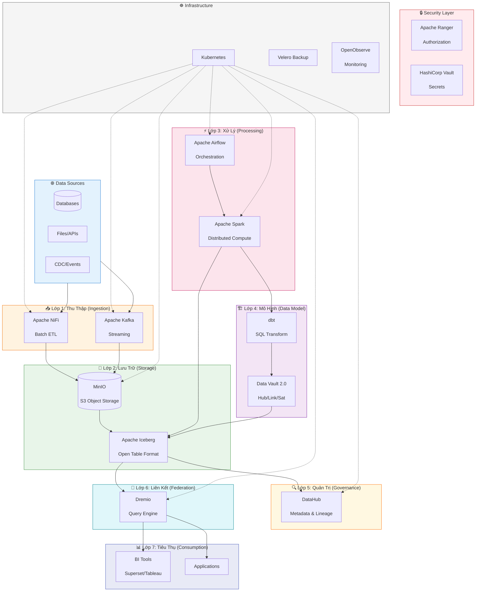
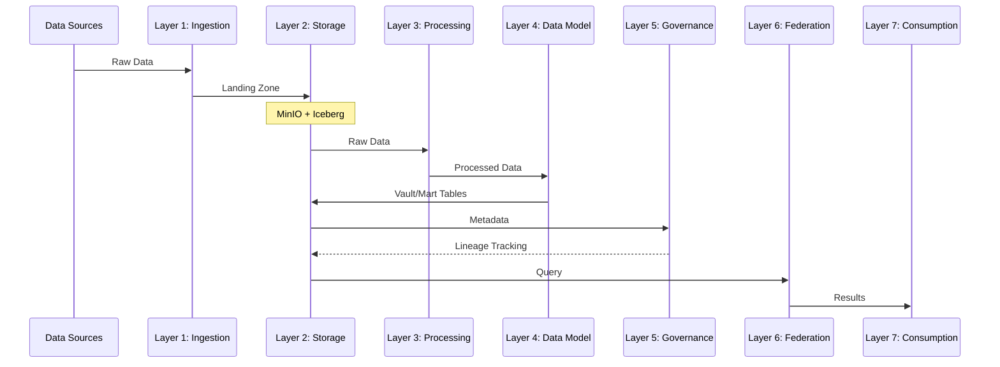

# Kiến Trúc Tổng Thể Hanas Data Platform

## Sơ Đồ Kiến Trúc Tổng Thể

## Mô Tả Các Lớp

### 1. Lớp Thu Thập Dữ Liệu (Data Ingestion)

Kéo dữ liệu thô từ các nguồn dữ liệu vào Data Lakehouse thông qua hai cơ chế:
- **Batch** (định kỳ): Apache NiFi xử lý ETL visual, kết nối đa nguồn
- **Streaming** (liên tục): Apache Kafka truyền phát dữ liệu real-time, độ trễ thấp

### 2. Lớp Lưu Trữ Dữ Liệu (Data Storage)

Dữ liệu sau thu thập được đưa vào vùng Landing trên Data Lake:
- **MinIO**: Object Storage phân tán, S3-compatible, lưu trữ tập trung
- **Apache Iceberg**: Open Table Format, ACID transactions, time travel, schema evolution

### 3. Lớp Xử Lý Dữ Liệu (Data Processing)

Điều phối và thực thi toàn bộ pipeline xử lý dữ liệu:
- **Apache Airflow**: Orchestration theo mô hình DAG, lập lịch, kiểm soát lỗi
- **Apache Spark**: Compute engine phân tán, xử lý batch và streaming quy mô lớn

### 4. Lớp Mô Hình Dữ Liệu (Data Model)

Tổ chức dữ liệu theo phương pháp Data Vault 2.0:
- **Raw Vault**: Hub, Link, Satellite — lưu trữ dữ liệu gốc đã chuẩn hóa
- **Business Vault**: Logic nghiệp vụ nâng cao (PIT, Bridge, Business Satellite)
- **Information Mart**: Star Schema, Wide Table phục vụ BI và báo cáo
- **dbt**: Công cụ transformation SQL-based, quản lý mô hình dữ liệu

### 5. Lớp Quản Trị Dữ Liệu (Data Governance)

- **DataHub**: Metadata management, data catalog, data lineage, business glossary, data quality tracking

### 6. Lớp Liên Kết Dữ Liệu (Data Federation)

- **Dremio**: Query engine thống nhất, semantic layer, virtual datasets, acceleration layer, BI connectivity (JDBC/ODBC/REST)

### 7. Lớp Quản Trị Hệ Thống (System Management)

- **OpenObserve**: Thu thập log, metrics, traces; dashboard giám sát; cảnh báo sự cố

## Các Thành Phần Bổ Trợ

| Thành phần | Vai trò |
|---|---|
| **Kubernetes** | Container orchestration, triển khai microservices |
| **Apache Ranger** | Authorization, phân quyền truy cập dữ liệu |
| **HashiCorp Vault** | Quản lý secrets, credentials |
| **Velero** | Backup & recovery cụm K8s |
| **MinIO Site Replication** | Đồng bộ dữ liệu DC-DR |

## Luồng Dữ Liệu End-to-End

## Nguyên Tắc Kiến Trúc

1. **Data Lakehouse hợp nhất**: Kết hợp Data Lake + Data Warehouse
2. **Open-source first**: Sử dụng công nghệ mã nguồn mở, không vendor lock-in
3. **Cloud-native**: Triển khai trên Kubernetes, container hóa
4. **Separation of concerns**: Tách biệt rõ ràng giữa các lớp
5. **Scalability**: Mở rộng theo chiều ngang (horizontal scaling)
6. **Security by design**: Bảo mật xuyên suốt từ thiết kế
