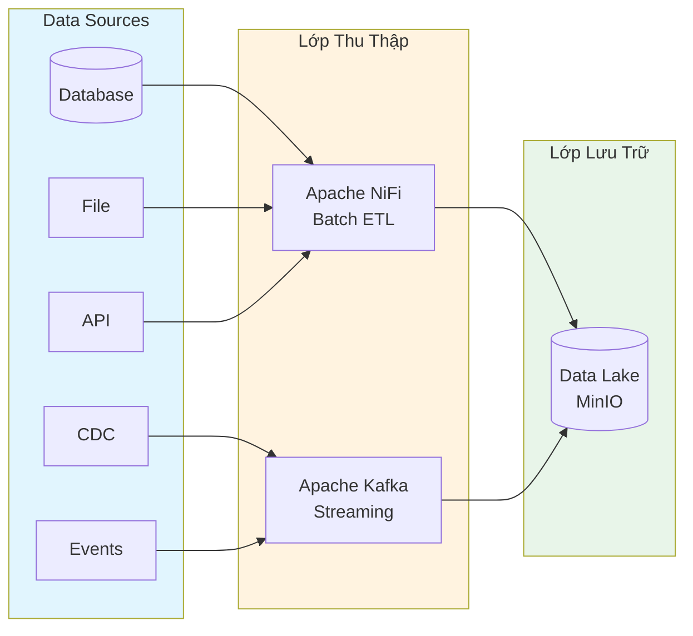

# Lớp Thu Thập Dữ Liệu (Data Ingestion)

## Tổng Quan

Lớp thu thập dữ liệu chịu trách nhiệm kéo dữ liệu thô từ các nguồn vào Data Lakehouse. Hệ thống hỗ trợ hai cơ chế thu thập song song:

| Cơ chế | Service | Mô tả |
|---|---|---|
| **Batch** | Apache NiFi | Thu thập định kỳ, ETL visual, kết nối đa nguồn |
| **Streaming** | Apache Kafka | Truyền phát thời gian thực, độ trễ thấp |

## Kiến Trúc

## Services

- [Apache NiFi](apache-nifi/README.md) — Thu thập batch, ETL visual
- [Apache Kafka](apache-kafka/README.md) — Streaming, real-time
