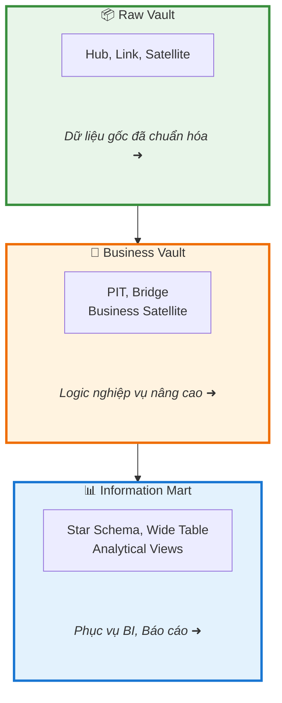

# Lớp Mô Hình Dữ Liệu (Data Model)

## Tổng Quan

Lớp mô hình dữ liệu chịu trách nhiệm tổ chức, cấu trúc hóa và chuẩn hóa dữ liệu nhằm đảm bảo tính nhất quán, toàn vẹn, khả năng mở rộng và truy xuất nguồn gốc. Kiến trúc áp dụng phương pháp **Data Vault 2.0** — phương pháp mô hình hóa cho hệ thống dữ liệu phân tán quy mô lớn.

## Kiến Trúc Ba Lớp

## Tại Sao Data Vault 2.0?

- **Schema Drift Tolerance**: Không bị phá vỡ khi nguồn thay đổi
- **Horizontal Scalability**: Hub/Link/Sat độc lập → xử lý song song
- **Full Historization**: Satellite append-only → giữ toàn bộ lịch sử
- **Metadata-driven**: Pipeline có thể tự động sinh từ metadata
- **Lakehouse-native**: Thiết kế append-only khớp với Iceberg/Parquet

## Tài Liệu

- [dbt](dbt/README.md) — Công cụ transformation SQL-based
- [Data Vault 2.0](data-vault/README.md) — Phương pháp mô hình hóa
- [Quy ước đặt tên](naming-conventions.md)
