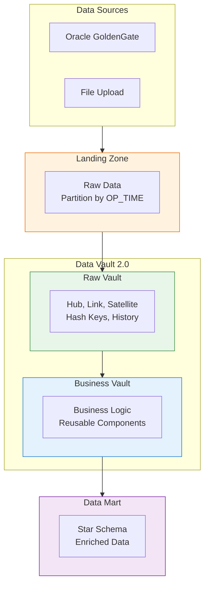
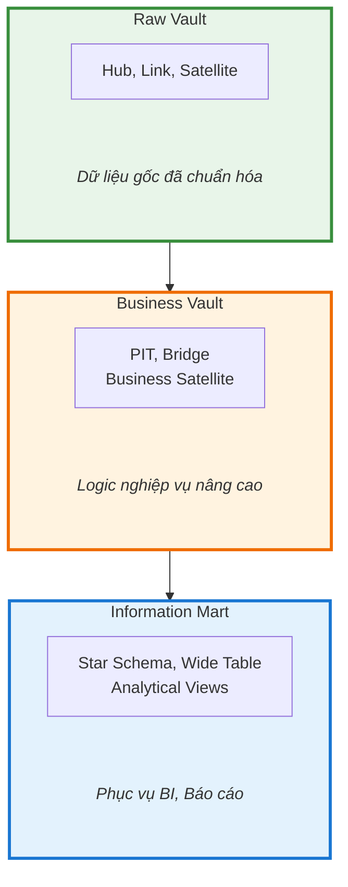
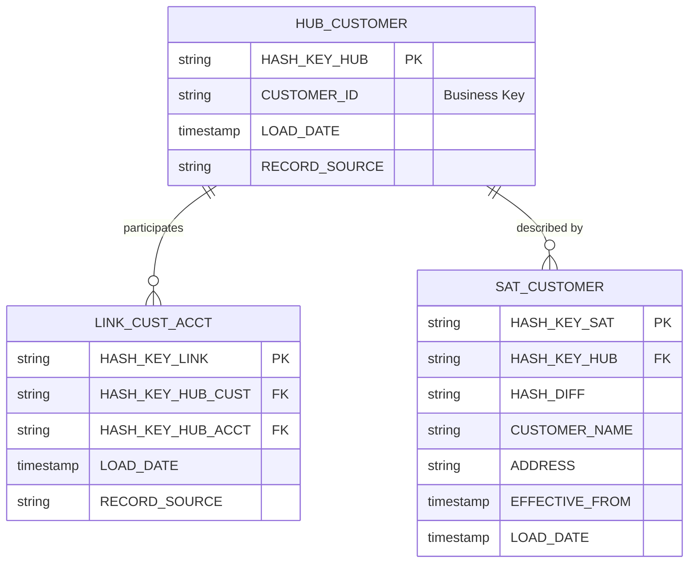

# Lớp Mô Hình Dữ Liệu (Data Model)

## Tổng Quan

Lớp mô hình dữ liệu chịu trách nhiệm tổ chức, cấu trúc hóa và chuẩn hóa dữ liệu nhằm đảm bảo tính nhất quán, toàn vẹn, khả năng mở rộng và truy xuất nguồn gốc. Kiến trúc áp dụng phương pháp **Data Vault 2.0** — phương pháp mô hình hóa cho hệ thống dữ liệu phân tán quy mô lớn.

## Luồng Dữ Liệu Tổng Quan



## Kiến Trúc Ba Lớp



## Thành Phần Chính

| Thành phần | Mô tả | Công nghệ |
|------------|-------|-----------|
| **Landing** | Vùng tiếp nhận dữ liệu thô từ source | OGG, File Upload |
| **Raw Vault** | Dữ liệu mô hình hóa theo kiến trúc Data Vault 2.0 | Oracle, dbt |
| **Business Vault** | Logic nghiệp vụ phức tạp, tái sử dụng | Oracle, dbt |
| **Information Mart** | Dữ liệu chuẩn hóa phục vụ phân tích | Oracle |
| **Airflow** | Công cụ điều phối luồng xử lý dữ liệu | Apache Airflow |
| **dbt** | Công cụ transform tự động cho Raw Vault | dbt |

## Tại Sao Data Vault 2.0?

- **Schema Drift Tolerance**: Không bị phá vỡ khi nguồn thay đổi
- **Horizontal Scalability**: Hub/Link/Sat độc lập, xử lý song song
- **Full Historization**: Satellite append-only, giữ toàn bộ lịch sử
- **Metadata-driven**: Pipeline có thể tự động sinh từ metadata
- **Lakehouse-native**: Thiết kế append-only khớp với Iceberg/Parquet

## Data Vault 2.0 là gì?

Data Vault 2.0 là phương pháp mô hình hóa dữ liệu được phát triển bởi **Dan Linstedt**, thiết kế tối ưu cho:

- **Agility**: Linh hoạt với thay đổi nguồn dữ liệu
- **Scalability**: Mở rộng ngang (horizontal scaling)
- **Auditability**: Truy vết đầy đủ lịch sử thay đổi
- **Parallel Processing**: Xử lý song song các thành phần độc lập

### Ba Thành Phần Cốt Lõi



## Landing Zone

### Mục Đích

Landing là nơi tiếp nhận dữ liệu thô từ các hệ thống nguồn mà **không có bất kỳ biến đổi nào**. Dữ liệu trong Landing Zone được lưu trữ tạm thờiphục vụ cho việc tải vào vùng Data Vault.

### Cột Hệ Thống Hỗ Trợ Truy Vết

| Cột | Mô tả | Nguồn |
|-----|-------|-------|
| `OP_TIME` | Thờigian phát sinh dữ liệu tại nguồn | Source |
| `OP_TYPE` | Loại thao tác CDC (INIT, INSERT, UPDATE, DELETE) | Source |
| `OP_NO` | System Change Number (SCN) | Source |
| `OP_RBA` | Redo Byte Address trong redo log | Source |

### Chiến Lược Partition

```sql
-- Partition theo ngày
PARTITION BY RANGE (OP_TIME) (
    PARTITION p20240101 VALUES LESS THAN (TO_DATE('2024-01-02', 'YYYY-MM-DD')),
    PARTITION p20240102 VALUES LESS THAN (TO_DATE('2024-01-03', 'YYYY-MM-DD')),
    ...
)
```

### Data Retention

- **Policy**: Xóa tự động dữ liệu cũ hơn 30 ngày
- **Method**: Partition drop hoặc truncate
- **Schedule**: Chạy hàng ngày qua Airflow

## So Sánh Với Các Phương Pháp Khác

| Tiêu chí | Kimball (Star Schema) | Inmon (3NF) | Data Vault 2.0 |
|----------|----------------------|-------------|----------------|
| **Flexibility** | Thấp | Trung bình | Cao |
| **Scalability** | Trung bình | Thấp | Cao |
| **Historization** | Phức tạp | Phức tạp | Tự nhiên |
| **Integration** | Khó khăn | Khó khăn | Dễ dàng |
| **Auditability** | Hạn chế | Hạn chế | Đầy đủ |
| **Agility** | Thấp | Thấp | Cao |

## Tài Liệu Chi Tiết

- [dbt](dbt/README.md) — Công cụ transformation SQL-based
- [Data Vault 2.0](data-vault/README.md) — Phương pháp mô hình hóa
- [Quy ước đặt tên](naming-conventions.md)

## Tài Liệu Tham Khảo

- [Data Vault 2.0](https://en.wikipedia.org/wiki/Data_vault_modeling) — Phương pháp mô hình hóa dữ liệu
- [AutomateDV](https://automate-dv.readthedocs.io/) — dbt package cho Data Vault 2.0
- [Data Vault Alliance](https://datavaultalliance.com/) — Tổ chức chuẩn hóa Data Vault
- [Dan Linstedt](https://danlinstedt.com/) — Tác giả Data Vault
