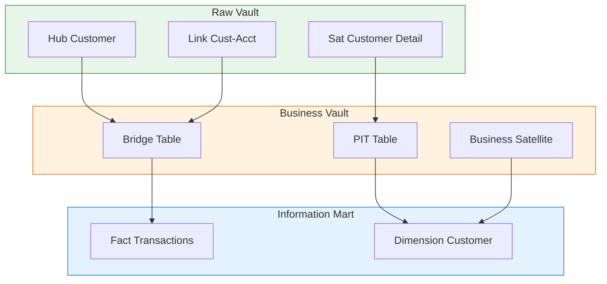

# Business Vault

## Tổng Quan

Business Vault là nơi áp dụng các quy tắc nghiệp vụ nâng cao mà Raw Vault không xử lý.

Business Vault đóng vai trò trung gian giữa Raw Vault và Information Mart, nơi:
- Gom logic nghiệp vụ phức tạp (tính SLA, phân nhóm, phân loại)
- Chuẩn hóa dữ liệu cho Information Mart
- Tối ưu truy vấn nhiều bảng và snapshot theo thờgian



## Logic Chuyển Đổi trong Business Vault

| Loại Logic | Mô tả | Ví dụ |
|------------|-------|-------|
| **Chuẩn hóa & Làm sạch** | Quy tắt chuẩn hóa dựa trên nghiệp vụ | Chuyển đổi đơn vị, chuẩn hóa tên địa lý |
| **Tổng hợp & Tính toán** | Tạo KPIs, thuộc tính phái sinh | Tổng dự thu kỳ, số lần giao dịch |

## Bridge Table

### Khác Biệt Với Link Table trong Raw Vault

| Đặc điểm | Link Table (Raw Vault) | Bridge Table (Business Vault) |
|----------|------------------------|-------------------------------|
| **Mục đích** | Quan hệ 2 Hub | Tổng hợp nhiều Hub/Link/Sat |
| **Pre-join** | Không | Pre-join các bảng |
| **Business Logic** | Không | Có logic nghiệp vụ |

### Chức Năng

- Mô hình hóa quan hệ nghiệp vụ phức tạp, đa chiều
- Tạo mối quan hệ "cầu nối" hiệu quả hơn cho truy vấn
- Tạo tập hợp dữ liệu con (subsets) theo nghiệp vụ

### Cấu Trúc Bridge Table

```sql
-- Ví dụ: Bridge Table cho các tài khoản có Transfer Limit
CREATE TABLE BRIDGE_ACCT_TRANSFER_LIMIT (
    -- Bridge Key
    BRIDGE_KEY VARCHAR2(64),
    
    -- References to Raw Vault
    HKEY_HUB_ACCOUNT VARCHAR2(64),
    HKEY_HUB_CUSTOMER VARCHAR2(64),
    HKEY_HUB_PRODUCT VARCHAR2(64),
    
    -- Business Calculated Fields
    TRANSFER_LIMIT_AMOUNT NUMBER,
    DAILY_LIMIT NUMBER,
    MONTHLY_LIMIT NUMBER,
    
    -- Flags/Indicators
    IS_VIP_ACCOUNT VARCHAR2(1),
    RISK_CATEGORY VARCHAR2(20),
    
    -- System Columns
    DV_LDT TIMESTAMP,
    
    CONSTRAINT PK_BRIDGE_ACCT_TL PRIMARY KEY (BRIDGE_KEY)
);

-- Index cho hiệu suất truy vấn
CREATE INDEX IDX_BRIDGE_ACCT ON BRIDGE_ACCT_TRANSFER_LIMIT(HKEY_HUB_ACCOUNT);
CREATE INDEX IDX_BRIDGE_CUST ON BRIDGE_ACCT_TRANSFER_LIMIT(HKEY_HUB_CUSTOMER);
```

### Loading Pattern

```sql
-- Tạo Bridge Table từ nhiều Hub/Satellite
WITH customer_data AS (
    SELECT 
        h.HKEY_HUB AS HKEY_HUB_CUSTOMER,
        s.CUSTOMER_SEGMENT,
        s.RISK_SCORE
    FROM HUB_CUSTOMER h
    JOIN SAT_CUSTOMER_KPI s ON h.HKEY_HUB = s.HKEY_HUB
    WHERE s.DV_LDT = (SELECT MAX(DV_LDT) FROM SAT_CUSTOMER_KPI)
),
account_data AS (
    SELECT 
        h.HKEY_HUB AS HKEY_HUB_ACCOUNT,
        s.ACCOUNT_TYPE,
        s.BALANCE,
        s.TRANSFER_LIMIT
    FROM HUB_ACCOUNT h
    JOIN SAT_ACCOUNT_DETAIL s ON h.HKEY_HUB = s.HKEY_HUB
    WHERE s.DV_LDT = (SELECT MAX(DV_LDT) FROM SAT_ACCOUNT_DETAIL)
),
product_data AS (
    SELECT 
        h.HKEY_HUB AS HKEY_HUB_PRODUCT,
        p.PRODUCT_CATEGORY
    FROM HUB_PRODUCT h
    JOIN REF_PRODUCT p ON h.PRODUCT_CODE = p.PRODUCT_CODE
)
INSERT INTO BRIDGE_ACCT_TRANSFER_LIMIT (
    BRIDGE_KEY, HKEY_HUB_ACCOUNT, HKEY_HUB_CUSTOMER, HKEY_HUB_PRODUCT,
    TRANSFER_LIMIT_AMOUNT, DAILY_LIMIT, MONTHLY_LIMIT,
    IS_VIP_ACCOUNT, RISK_CATEGORY, DV_LDT
)
SELECT 
    LOWER(STANDARD_HASH(
        a.HKEY_HUB_ACCOUNT || c.HKEY_HUB_CUSTOMER || p.HKEY_HUB_PRODUCT,
        'SHA256'
    )) AS BRIDGE_KEY,
    a.HKEY_HUB_ACCOUNT,
    c.HKEY_HUB_CUSTOMER,
    p.HKEY_HUB_PRODUCT,
    a.TRANSFER_LIMIT AS TRANSFER_LIMIT_AMOUNT,
    a.TRANSFER_LIMIT * 5 AS DAILY_LIMIT,
    a.TRANSFER_LIMIT * 100 AS MONTHLY_LIMIT,
    CASE WHEN c.CUSTOMER_SEGMENT = 'VIP' THEN 'Y' ELSE 'N' END AS IS_VIP_ACCOUNT,
    CASE 
        WHEN c.RISK_SCORE > 80 THEN 'HIGH'
        WHEN c.RISK_SCORE > 50 THEN 'MEDIUM'
        ELSE 'LOW'
    END AS RISK_CATEGORY,
    SYSTIMESTAMP AS DV_LDT
FROM account_data a
JOIN LNK_CUST_ACCT l ON a.HKEY_HUB_ACCOUNT = l.HKEY_HUB_ACCOUNT
JOIN customer_data c ON l.HKEY_HUB_CUSTOMER = c.HKEY_HUB_CUSTOMER
JOIN product_data p ON a.ACCOUNT_TYPE = p.PRODUCT_CATEGORY
WHERE a.TRANSFER_LIMIT IS NOT NULL;
```

## PIT (Point-In-Time) Table

### Mục Đích

- Bảng thờđiểm, snapshot theo thờgian
- Tối ưu truy vấn lấy trạng thái tại thờđiểm cụ thể
- Giảm độ phức tạp khi query nhiều Satellite

### Cấu Trúc PIT Table

```sql
-- PIT Table cho Customer
CREATE TABLE PIT_CUSTOMER (
    -- Key
    PIT_KEY VARCHAR2(64),
    SNAPSHOT_DATE DATE,
    
    -- Hub Reference
    HKEY_HUB_CUSTOMER VARCHAR2(64),
    
    -- Satellite Keys tại thờđiểm snapshot
    HKEY_SAT_DETAIL VARCHAR2(64),
    HKEY_SAT_ADDRESS VARCHAR2(64),
    HKEY_SAT_CONTACT VARCHAR2(64),
    HKEY_SAT_KPI VARCHAR2(64),
    
    -- Load Date của mỗi Satellite tại snapshot
    LDTS_SAT_DETAIL TIMESTAMP,
    LDTS_SAT_ADDRESS TIMESTAMP,
    LDTS_SAT_CONTACT TIMESTAMP,
    LDTS_SAT_KPI TIMESTAMP,
    
    -- System Columns
    DV_LDT TIMESTAMP,
    
    CONSTRAINT PK_PIT_CUSTOMER PRIMARY KEY (PIT_KEY, SNAPSHOT_DATE)
);

-- Index cho time-based queries
CREATE INDEX IDX_PIT_CUST_DATE ON PIT_CUSTOMER(SNAPSHOT_DATE);
CREATE INDEX IDX_PIT_CUST_HKEY ON PIT_CUSTOMER(HKEY_HUB_CUSTOMER);
```

### Loading Pattern

```sql
-- Tạo PIT Table hàng ngày
INSERT INTO PIT_CUSTOMER (
    PIT_KEY, SNAPSHOT_DATE, HKEY_HUB_CUSTOMER,
    HKEY_SAT_DETAIL, HKEY_SAT_ADDRESS, HKEY_SAT_CONTACT, HKEY_SAT_KPI,
    LDTS_SAT_DETAIL, LDTS_SAT_ADDRESS, LDTS_SAT_CONTACT, LDTS_SAT_KPI,
    DV_LDT
)
WITH latest_satellites AS (
    SELECT 
        h.HKEY_HUB AS HKEY_HUB_CUSTOMER,
        -- Latest Customer Detail
        (SELECT HKEY_SAT FROM SAT_CUSTOMER_DETAIL 
         WHERE HKEY_HUB = h.HKEY_HUB 
         AND DV_SRC_LDT <= TRUNC(SYSDATE)
         ORDER BY DV_SRC_LDT DESC, DV_SCN DESC 
         FETCH FIRST 1 ROW ONLY) AS HKEY_SAT_DETAIL,
        (SELECT DV_SRC_LDT FROM SAT_CUSTOMER_DETAIL 
         WHERE HKEY_HUB = h.HKEY_HUB 
         AND DV_SRC_LDT <= TRUNC(SYSDATE)
         ORDER BY DV_SRC_LDT DESC, DV_SCN DESC 
         FETCH FIRST 1 ROW ONLY) AS LDTS_SAT_DETAIL,
        
        -- Latest Address
        (SELECT HKEY_SAT FROM SAT_CUSTOMER_ADDRESS 
         WHERE HKEY_HUB = h.HKEY_HUB 
         AND DV_SRC_LDT <= TRUNC(SYSDATE)
         ORDER BY DV_SRC_LDT DESC, DV_SCN DESC 
         FETCH FIRST 1 ROW ONLY) AS HKEY_SAT_ADDRESS,
        (SELECT DV_SRC_LDT FROM SAT_CUSTOMER_ADDRESS 
         WHERE HKEY_HUB = h.HKEY_HUB 
         AND DV_SRC_LDT <= TRUNC(SYSDATE)
         ORDER BY DV_SRC_LDT DESC, DV_SCN DESC 
         FETCH FIRST 1 ROW ONLY) AS LDTS_SAT_ADDRESS,
        
        -- Latest Contact
        (SELECT HKEY_SAT FROM SAT_CUSTOMER_CONTACT 
         WHERE HKEY_HUB = h.HKEY_HUB 
         AND DV_SRC_LDT <= TRUNC(SYSDATE)
         ORDER BY DV_SRC_LDT DESC, DV_SCN_DESC 
         FETCH FIRST 1 ROW ONLY) AS HKEY_SAT_CONTACT,
        (SELECT DV_SRC_LDT FROM SAT_CUSTOMER_CONTACT 
         WHERE HKEY_HUB = h.HKEY_HUB 
         AND DV_SRC_LDT <= TRUNC(SYSDATE)
         ORDER BY DV_SRC_LDT DESC, DV_SCN DESC 
         FETCH FIRST 1 ROW ONLY) AS LDTS_SAT_CONTACT,
        
        -- Latest KPI
        (SELECT HKEY_SAT FROM SAT_CUSTOMER_KPI 
         WHERE HKEY_HUB = h.HKEY_HUB 
         AND DV_SRC_LDT <= TRUNC(SYSDATE)
         ORDER BY DV_SRC_LDT DESC, DV_SCN DESC 
         FETCH FIRST 1 ROW ONLY) AS HKEY_SAT_KPI,
        (SELECT DV_SRC_LDT FROM SAT_CUSTOMER_KPI 
         WHERE HKEY_HUB = h.HKEY_HUB 
         AND DV_SRC_LDT <= TRUNC(SYSDATE)
         ORDER BY DV_SRC_LDT DESC, DV_SCN DESC 
         FETCH FIRST 1 ROW ONLY) AS LDTS_SAT_KPI
    FROM HUB_CUSTOMER h
)
SELECT 
    LOWER(STANDARD_HASH(HKEY_HUB_CUSTOMER || TO_CHAR(TRUNC(SYSDATE), 'YYYYMMDD'), 'SHA256')) AS PIT_KEY,
    TRUNC(SYSDATE) AS SNAPSHOT_DATE,
    HKEY_HUB_CUSTOMER,
    HKEY_SAT_DETAIL,
    HKEY_SAT_ADDRESS,
    HKEY_SAT_CONTACT,
    HKEY_SAT_KPI,
    LDTS_SAT_DETAIL,
    LDTS_SAT_ADDRESS,
    LDTS_SAT_CONTACT,
    LDTS_SAT_KPI,
    SYSTIMESTAMP AS DV_LDT
FROM latest_satellites;
```

## Business Satellite Tables (sat_biz)

### Mục Đích

- Satellite chứa logic nghiệp vụ đã tính toán
- Kế thừa từ Raw Vault + thêm trường tính toán

### Cấu Trúc Business Satellite

```sql
CREATE TABLE SAT_BIZ_CUSTOMER_KPI (
    -- Keys
    HKEY_SAT VARCHAR2(64),
    HKEY_HUB VARCHAR2(64),
    HASH_DIFF VARCHAR2(64),
    
    -- Calculated Business Attributes
    TOTAL_TRANSACTIONS NUMBER,
    AVG_TRANSACTION_AMOUNT NUMBER,
    LAST_TRANSACTION_DATE DATE,
    CUSTOMER_SEGMENT VARCHAR2(50),
    RISK_SCORE NUMBER,
    LIFETIME_VALUE NUMBER,
    DAYS_SINCE_LAST_TRANSACTION NUMBER,
    
    -- System Columns
    DV_LDT TIMESTAMP,
    
    CONSTRAINT PK_SAT_BIZ_CUST_KPI PRIMARY KEY (HKEY_SAT)
);
```

### Loading Pattern

```sql
-- Tính toán KPIs cho Business Satellite
WITH transaction_summary AS (
    SELECT 
        HKEY_HUB_ACCOUNT,
        COUNT(*) AS TOTAL_TRANSACTIONS,
        AVG(AMOUNT) AS AVG_TRANSACTION_AMOUNT,
        MAX(TRANSACTION_DATE) AS LAST_TRANSACTION_DATE
    FROM FCT_TRANSACTIONS
    WHERE TRANSACTION_DATE >= ADD_MONTHS(TRUNC(SYSDATE), -12)
    GROUP BY HKEY_HUB_ACCOUNT
),
customer_kpis AS (
    SELECT 
        h.HKEY_HUB AS HKEY_HUB_CUSTOMER,
        h_cust.HKEY_HUB AS HKEY_HUB_ACCOUNT,
        COALESCE(ts.TOTAL_TRANSACTIONS, 0) AS TOTAL_TRANSACTIONS,
        COALESCE(ts.AVG_TRANSACTION_AMOUNT, 0) AS AVG_TRANSACTION_AMOUNT,
        ts.LAST_TRANSACTION_DATE,
        -- Customer Segmentation Logic
        CASE 
            WHEN COALESCE(ts.TOTAL_TRANSACTIONS, 0) > 100 
                 AND COALESCE(ts.AVG_TRANSACTION_AMOUNT, 0) > 10000000 THEN 'VIP'
            WHEN COALESCE(ts.TOTAL_TRANSACTIONS, 0) > 50 THEN 'PREMIUM'
            ELSE 'STANDARD'
        END AS CUSTOMER_SEGMENT,
        -- Risk Score Calculation
        CASE 
            WHEN COALESCE(ts.TOTAL_TRANSACTIONS, 0) = 0 THEN 100
            WHEN ts.LAST_TRANSACTION_DATE < ADD_MONTHS(TRUNC(SYSDATE), -3) THEN 80
            WHEN COALESCE(ts.AVG_TRANSACTION_AMOUNT, 0) > 50000000 THEN 70
            ELSE 30
        END AS RISK_SCORE,
        -- Lifetime Value
        COALESCE(ts.TOTAL_TRANSACTIONS, 0) * COALESCE(ts.AVG_TRANSACTION_AMOUNT, 0) AS LIFETIME_VALUE,
        -- Days Since Last Transaction
        CASE 
            WHEN ts.LAST_TRANSACTION_DATE IS NOT NULL 
            THEN TRUNC(SYSDATE) - ts.LAST_TRANSACTION_DATE 
            ELSE NULL 
        END AS DAYS_SINCE_LAST_TRANSACTION
    FROM HUB_CUSTOMER h_cust
    JOIN LNK_CUST_ACCT l ON h_cust.HKEY_HUB = l.HKEY_HUB_ACCOUNT
    JOIN HUB_CUSTOMER h ON l.HKEY_HUB_CUSTOMER = h.HKEY_HUB
    LEFT JOIN transaction_summary ts ON h_cust.HKEY_HUB = ts.HKEY_HUB_ACCOUNT
)
INSERT INTO SAT_BIZ_CUSTOMER_KPI (
    HKEY_SAT, HKEY_HUB, HASH_DIFF,
    TOTAL_TRANSACTIONS, AVG_TRANSACTION_AMOUNT, LAST_TRANSACTION_DATE,
    CUSTOMER_SEGMENT, RISK_SCORE, LIFETIME_VALUE, DAYS_SINCE_LAST_TRANSACTION,
    DV_LDT
)
SELECT 
    LOWER(STANDARD_HASH(
        HKEY_HUB_CUSTOMER || 
        TOTAL_TRANSACTIONS || AVG_TRANSACTION_AMOUNT || CUSTOMER_SEGMENT,
        'SHA256'
    )) AS HKEY_SAT,
    HKEY_HUB_CUSTOMER,
    LOWER(STANDARD_HASH(
        NVL(TO_CHAR(TOTAL_TRANSACTIONS), '') || '|' ||
        NVL(TO_CHAR(AVG_TRANSACTION_AMOUNT), '') || '|' ||
        NVL(CUSTOMER_SEGMENT, ''),
        'SHA256'
    )) AS HASH_DIFF,
    TOTAL_TRANSACTIONS,
    AVG_TRANSACTION_AMOUNT,
    LAST_TRANSACTION_DATE,
    CUSTOMER_SEGMENT,
    RISK_SCORE,
    LIFETIME_VALUE,
    DAYS_SINCE_LAST_TRANSACTION,
    SYSTIMESTAMP AS DV_LDT
FROM customer_kpis;
```

## Best Practices

### 1. Layer Isolation

- Business Vault **chỉ** đọc từ Raw Vault
- Không đọc trực tiếp từ Landing
- Dùng Satellite DER/SNP cho dữ liệu mới nhất

### 2. Business Logic Centralization

```sql
-- Tạo reusable business logic functions
CREATE OR REPLACE FUNCTION CALC_RISK_SCORE(
    p_total_transactions NUMBER,
    p_avg_amount NUMBER,
    p_last_transaction_date DATE
) RETURN NUMBER IS
BEGIN
    IF p_total_transactions = 0 THEN
        RETURN 100;
    ELSIF p_last_transaction_date < ADD_MONTHS(TRUNC(SYSDATE), -3) THEN
        RETURN 80;
    ELSIF p_avg_amount > 50000000 THEN
        RETURN 70;
    ELSE
        RETURN 30;
    END IF;
END;
/

-- Sử dụng trong Business Satellite
SELECT 
    CALC_RISK_SCORE(TOTAL_TRANSACTIONS, AVG_AMOUNT, LAST_TXN_DATE) AS RISK_SCORE
FROM ...;
```

### 3. Incremental Processing

```sql
-- Chỉ xử lý dữ liệu thay đổi
WITH changed_customers AS (
    SELECT DISTINCT HKEY_HUB
    FROM SAT_CUSTOMER_DETAIL
    WHERE DV_LDT > (SELECT MAX(DV_LDT) FROM SAT_BIZ_CUSTOMER_KPI)
)
SELECT ...
FROM HUB_CUSTOMER h
JOIN changed_customers c ON h.HKEY_HUB = c.HKEY_HUB
...;
```

### 4. Performance Optimization

```sql
-- Partition PIT table by snapshot date
PARTITION BY RANGE (SNAPSHOT_DATE) (
    PARTITION p202401 VALUES LESS THAN (TO_DATE('2024-02-01', 'YYYY-MM-DD')),
    PARTITION p202402 VALUES LESS THAN (TO_DATE('2024-03-01', 'YYYY-MM-DD')),
    ...
);

-- Index cho Bridge tables
CREATE INDEX IDX_BRIDGE_DATE ON BRIDGE_ACCT_TRANSFER_LIMIT(DV_LDT);
```

## Vai Trò Kỹ Thuật Tổng Quan

| Component | Vai Trò | Input | Output |
|-----------|---------|-------|--------|
| **Bridge Table** | Pre-join nhiều Hub/Sat | Raw Vault tables | Flattened relationship |
| **PIT Table** | Snapshot theo thờgian | Satellite LDTS | Time-based lookup |
| **Business Satellite** | Tính toán KPIs | Raw Satellites + Facts | Enriched attributes |

## Luồng Dữ Liệu

```
Raw Vault (Hub/Link/Sat) 
    ↓
Business Vault (Bridge/PIT/BizSat)
    ↓
Information Mart (Fact/Dimension)
```

## So Sánh Với Raw Vault

| Tiêu chí | Raw Vault | Business Vault |
|----------|-----------|----------------|
| **Business Logic** | Không | Có |
| **Aggregation** | Không | Có |
| **Calculation** | Không | Có |
| **Pre-join** | Không | Có |
| **Source của Mart** | Gián tiếp | Trực tiếp |
| **Change Frequency** | Theo source | Theo schedule |
