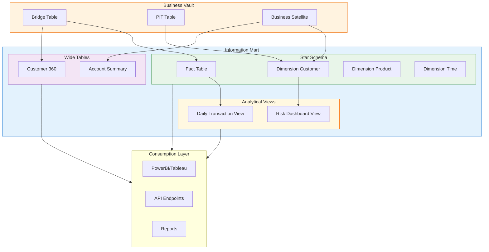

# Information Mart

## Tổng Quan

Information Mart là lớp dữ liệu cuối cùng phục vụ ngườ dùng cuối (BI, dashboard, báo cáo).

Information Mart cung cấp dữ liệu đã được tổ chức và tối ưu hóa cho các công cụ phân tích và báo cáo, giảm độ phức tạp so với Data Vault nhưng vẫn đảm bảo đầy đủ thông tin nghiệp vụ.



## Cấu Trúc Dữ Liệu

| Loại | Mô tả | Use Case |
|---|---|---|
| **Star Schema** | Fact + Dimension tables cho BI truyền thống | PowerBI, Tableau, Cognos |
| **Wide Table** | Bảng rộng denormalized cho phân tích | Ad-hoc analysis, Data Science |
| **Analytical Views** | View phân tích chuyên biệt | Dashboard, Monitoring |
| **Semantic Layer** | Lớp ngữ nghĩa chuẩn hóa logic | Business definitions |

## Star Schema

### Fact Table

Fact Table lưu trữ các số liệu định lượng (measures) và khóa ngoại đến các Dimension.

```sql
CREATE TABLE FCT_TRANSACTIONS (
    -- Surrogate Key
    TRANSACTION_KEY NUMBER GENERATED ALWAYS AS IDENTITY PRIMARY KEY,
    
    -- Dimension Keys (Foreign Keys)
    DIM_CUSTOMER_KEY NUMBER NOT NULL,
    DIM_ACCOUNT_KEY NUMBER NOT NULL,
    DIM_PRODUCT_KEY NUMBER NOT NULL,
    DIM_BRANCH_KEY NUMBER NOT NULL,
    DIM_DATE_KEY NUMBER NOT NULL,
    
    -- Degenerate Dimensions
    TRANSACTION_ID VARCHAR2(50),
    REFERENCE_NUMBER VARCHAR2(50),
    
    -- Measures
    TRANSACTION_AMOUNT NUMBER(18,2),
    TRANSACTION_FEE NUMBER(18,2),
    TAX_AMOUNT NUMBER(18,2),
    NET_AMOUNT NUMBER(18,2),
    
    -- Flags
    IS_REVERSAL VARCHAR2(1) DEFAULT 'N',
    IS_FEE_WAIVED VARCHAR2(1) DEFAULT 'N',
    
    -- Audit Columns
    CREATED_DATE TIMESTAMP DEFAULT SYSTIMESTAMP,
    SOURCE_SYSTEM VARCHAR2(50),
    
    -- Constraints
    CONSTRAINT FK_FCT_DIM_CUST FOREIGN KEY (DIM_CUSTOMER_KEY) 
        REFERENCES DIM_CUSTOMER(CUSTOMER_KEY),
    CONSTRAINT FK_FCT_DIM_ACCT FOREIGN KEY (DIM_ACCOUNT_KEY) 
        REFERENCES DIM_ACCOUNT(ACCOUNT_KEY),
    CONSTRAINT FK_FCT_DIM_PROD FOREIGN KEY (DIM_PRODUCT_KEY) 
        REFERENCES DIM_PRODUCT(PRODUCT_KEY),
    CONSTRAINT FK_FCT_DIM_BRN FOREIGN KEY (DIM_BRANCH_KEY) 
        REFERENCES DIM_BRANCH(BRANCH_KEY),
    CONSTRAINT FK_FCT_DIM_DATE FOREIGN KEY (DIM_DATE_KEY) 
        REFERENCES DIM_DATE(DATE_KEY)
);

-- Indexes for query performance
CREATE INDEX IDX_FCT_TXN_DATE ON FCT_TRANSACTIONS(DIM_DATE_KEY);
CREATE INDEX IDX_FCT_TXN_CUST ON FCT_TRANSACTIONS(DIM_CUSTOMER_KEY);
CREATE INDEX IDX_FCT_TXN_ACCT ON FCT_TRANSACTIONS(DIM_ACCOUNT_KEY);
```

### Dimension Table

Dimension Table lưu trữ các thuộc tính mô tả cho việc phân tích.

```sql
CREATE TABLE DIM_CUSTOMER (
    -- Surrogate Key (Primary Key)
    CUSTOMER_KEY NUMBER GENERATED ALWAYS AS IDENTITY PRIMARY KEY,
    
    -- Natural Key
    CUSTOMER_ID VARCHAR2(50) NOT NULL,
    
    -- Attributes
    CUSTOMER_NAME VARCHAR2(200),
    CUSTOMER_TYPE VARCHAR2(50),
    CUSTOMER_SEGMENT VARCHAR2(50),
    DATE_OF_BIRTH DATE,
    GENDER VARCHAR2(10),
    
    -- Address
    ADDRESS_LINE1 VARCHAR2(500),
    ADDRESS_LINE2 VARCHAR2(500),
    CITY VARCHAR2(100),
    PROVINCE VARCHAR2(100),
    COUNTRY VARCHAR2(100),
    POSTAL_CODE VARCHAR2(20),
    
    -- Contact
    PHONE_NUMBER VARCHAR2(20),
    EMAIL VARCHAR2(100),
    
    -- Business Attributes
    RISK_CATEGORY VARCHAR2(20),
    VIP_STATUS VARCHAR2(20),
    RELATIONSHIP_START_DATE DATE,
    
    -- SCD Type 2 Columns
    EFFECTIVE_DATE DATE,
    EXPIRY_DATE DATE,
    IS_CURRENT VARCHAR2(1) DEFAULT 'Y',
    
    -- Audit
    CREATED_DATE TIMESTAMP DEFAULT SYSTIMESTAMP,
    UPDATED_DATE TIMESTAMP,
    SOURCE_SYSTEM VARCHAR2(50)
);

-- Indexes
CREATE INDEX IDX_DIM_CUST_ID ON DIM_CUSTOMER(CUSTOMER_ID);
CREATE INDEX IDX_DIM_CUST_CURRENT ON DIM_CUSTOMER(IS_CURRENT) WHERE IS_CURRENT = 'Y';
```

### Time Dimension

```sql
CREATE TABLE DIM_DATE (
    DATE_KEY NUMBER PRIMARY KEY,
    FULL_DATE DATE NOT NULL,
    DAY_OF_WEEK NUMBER(1),
    DAY_NAME VARCHAR2(10),
    DAY_OF_MONTH NUMBER(2),
    DAY_OF_YEAR NUMBER(3),
    WEEK_OF_YEAR NUMBER(2),
    MONTH_NUMBER NUMBER(2),
    MONTH_NAME VARCHAR2(10),
    QUARTER NUMBER(1),
    YEAR NUMBER(4),
    FISCAL_QUARTER NUMBER(1),
    FISCAL_YEAR NUMBER(4),
    IS_WEEKEND VARCHAR2(1),
    IS_HOLIDAY VARCHAR2(1),
    HOLIDAY_NAME VARCHAR2(100)
);

-- Populate Date Dimension
INSERT INTO DIM_DATE
SELECT 
    TO_NUMBER(TO_DATE('2020-01-01', 'YYYY-MM-DD') + LEVEL - 1, 'YYYYMMDD') AS DATE_KEY,
    TO_DATE('2020-01-01', 'YYYY-MM-DD') + LEVEL - 1 AS FULL_DATE,
    TO_CHAR(TO_DATE('2020-01-01', 'YYYY-MM-DD') + LEVEL - 1, 'D') AS DAY_OF_WEEK,
    TO_CHAR(TO_DATE('2020-01-01', 'YYYY-MM-DD') + LEVEL - 1, 'DAY') AS DAY_NAME,
    TO_CHAR(TO_DATE('2020-01-01', 'YYYY-MM-DD') + LEVEL - 1, 'DD') AS DAY_OF_MONTH,
    TO_CHAR(TO_DATE('2020-01-01', 'YYYY-MM-DD') + LEVEL - 1, 'DDD') AS DAY_OF_YEAR,
    TO_CHAR(TO_DATE('2020-01-01', 'YYYY-MM-DD') + LEVEL - 1, 'IW') AS WEEK_OF_YEAR,
    TO_CHAR(TO_DATE('2020-01-01', 'YYYY-MM-DD') + LEVEL - 1, 'MM') AS MONTH_NUMBER,
    TO_CHAR(TO_DATE('2020-01-01', 'YYYY-MM-DD') + LEVEL - 1, 'MONTH') AS MONTH_NAME,
    CEIL(TO_CHAR(TO_DATE('2020-01-01', 'YYYY-MM-DD') + LEVEL - 1, 'MM') / 3) AS QUARTER,
    TO_CHAR(TO_DATE('2020-01-01', 'YYYY-MM-DD') + LEVEL - 1, 'YYYY') AS YEAR,
    -- Fiscal calendar logic here
    CEIL(TO_CHAR(TO_DATE('2020-01-01', 'YYYY-MM-DD') + LEVEL - 1, 'MM') / 3) AS FISCAL_QUARTER,
    CASE 
        WHEN TO_CHAR(TO_DATE('2020-01-01', 'YYYY-MM-DD') + LEVEL - 1, 'MM') >= 7 
        THEN TO_NUMBER(TO_CHAR(TO_DATE('2020-01-01', 'YYYY-MM-DD') + LEVEL - 1, 'YYYY')) + 1
        ELSE TO_NUMBER(TO_CHAR(TO_DATE('2020-01-01', 'YYYY-MM-DD') + LEVEL - 1, 'YYYY'))
    END AS FISCAL_YEAR,
    CASE 
        WHEN TO_CHAR(TO_DATE('2020-01-01', 'YYYY-MM-DD') + LEVEL - 1, 'D') IN ('1', '7') 
        THEN 'Y' ELSE 'N' 
    END AS IS_WEEKEND,
    'N' AS IS_HOLIDAY,
    NULL AS HOLIDAY_NAME
FROM DUAL
CONNECT BY LEVEL <= 3650; -- 10 years
```

## Wide Tables

Wide Tables (hay còn gọi là Flat Tables) là bảng denormalized chứa đầy đủ thông tin từ nhiều nguồn.

```sql
CREATE TABLE WIDE_CUSTOMER_360 (
    -- Customer Information
    CUSTOMER_ID VARCHAR2(50),
    CUSTOMER_NAME VARCHAR2(200),
    CUSTOMER_TYPE VARCHAR2(50),
    CUSTOMER_SEGMENT VARCHAR2(50),
    
    -- Contact Information
    EMAIL VARCHAR2(100),
    PHONE VARCHAR2(20),
    ADDRESS VARCHAR2(500),
    CITY VARCHAR2(100),
    
    -- Account Summary
    TOTAL_ACCOUNTS NUMBER,
    TOTAL_BALANCE NUMBER(18,2),
    PRIMARY_ACCOUNT_TYPE VARCHAR2(50),
    
    -- Transaction Summary (Last 12 months)
    TOTAL_TRANSACTIONS NUMBER,
    TOTAL_TRANSACTION_AMOUNT NUMBER(18,2),
    AVG_TRANSACTION_AMOUNT NUMBER(18,2),
    LAST_TRANSACTION_DATE DATE,
    
    -- Risk & KPIs
    RISK_SCORE NUMBER,
    RISK_CATEGORY VARCHAR2(20),
    VIP_STATUS VARCHAR2(20),
    CREDIT_RATING VARCHAR2(10),
    
    -- Product Holdings
    HAS_SAVINGS VARCHAR2(1),
    HAS_CHECKING VARCHAR2(1),
    HAS_LOAN VARCHAR2(1),
    HAS_CREDIT_CARD VARCHAR2(1),
    
    -- Dates
    RELATIONSHIP_START_DATE DATE,
    DAYS_SINCE_LAST_TRANSACTION NUMBER,
    
    -- Metadata
    SNAPSHOT_DATE DATE,
    LOAD_TIMESTAMP TIMESTAMP
);
```

### Loading Pattern for Wide Tables

```sql
-- Build Wide Table from Business Vault
INSERT INTO WIDE_CUSTOMER_360
WITH customer_base AS (
    SELECT 
        h.HKEY_HUB AS HKEY_HUB_CUSTOMER,
        h.CUSTOMER_ID,
        s.CUSTOMER_NAME,
        s.DATE_OF_BIRTH,
        a.EMAIL,
        a.PHONE,
        addr.ADDRESS_LINE1 || ', ' || addr.CITY AS ADDRESS,
        addr.CITY
    FROM HUB_CUSTOMER h
    JOIN SAT_CUSTOMER_DETAIL s ON h.HKEY_HUB = s.HKEY_HUB
    JOIN SAT_CUSTOMER_CONTACT a ON h.HKEY_HUB = a.HKEY_HUB
    JOIN SAT_CUSTOMER_ADDRESS addr ON h.HKEY_HUB = addr.HKEY_HUB
    WHERE s.DV_LDT = (SELECT MAX(DV_LDT) FROM SAT_CUSTOMER_DETAIL)
    AND a.DV_LDT = (SELECT MAX(DV_LDT) FROM SAT_CUSTOMER_CONTACT)
    AND addr.DV_LDT = (SELECT MAX(DV_LDT) FROM SAT_CUSTOMER_ADDRESS)
),
account_summary AS (
    SELECT 
        l.HKEY_HUB_CUSTOMER,
        COUNT(*) AS TOTAL_ACCOUNTS,
        SUM(s.BALANCE) AS TOTAL_BALANCE
    FROM LNK_CUST_ACCT l
    JOIN SAT_ACCOUNT_DETAIL s ON l.HKEY_HUB_ACCOUNT = s.HKEY_HUB
    WHERE s.DV_LDT = (SELECT MAX(DV_LDT) FROM SAT_ACCOUNT_DETAIL)
    GROUP BY l.HKEY_HUB_CUSTOMER
),
transaction_summary AS (
    SELECT 
        l.HKEY_HUB_CUSTOMER,
        COUNT(*) AS TOTAL_TRANSACTIONS,
        SUM(f.TRANSACTION_AMOUNT) AS TOTAL_TRANSACTION_AMOUNT,
        AVG(f.TRANSACTION_AMOUNT) AS AVG_TRANSACTION_AMOUNT,
        MAX(f.TRANSACTION_DATE) AS LAST_TRANSACTION_DATE
    FROM FCT_TRANSACTIONS f
    JOIN LNK_CUST_ACCT l ON f.DIM_ACCOUNT_KEY = l.HKEY_HUB_ACCOUNT
    WHERE f.TRANSACTION_DATE >= ADD_MONTHS(TRUNC(SYSDATE), -12)
    GROUP BY l.HKEY_HUB_CUSTOMER
),
kpi_data AS (
    SELECT 
        HKEY_HUB AS HKEY_HUB_CUSTOMER,
        RISK_SCORE,
        RISK_CATEGORY,
        CUSTOMER_SEGMENT,
        VIP_STATUS
    FROM SAT_BIZ_CUSTOMER_KPI
    WHERE DV_LDT = (SELECT MAX(DV_LDT) FROM SAT_BIZ_CUSTOMER_KPI)
)
SELECT 
    cb.CUSTOMER_ID,
    cb.CUSTOMER_NAME,
    k.CUSTOMER_SEGMENT,
    cb.EMAIL,
    cb.PHONE,
    cb.ADDRESS,
    cb.CITY,
    COALESCE(ac.TOTAL_ACCOUNTS, 0) AS TOTAL_ACCOUNTS,
    COALESCE(ac.TOTAL_BALANCE, 0) AS TOTAL_BALANCE,
    COALESCE(ts.TOTAL_TRANSACTIONS, 0) AS TOTAL_TRANSACTIONS,
    COALESCE(ts.TOTAL_TRANSACTION_AMOUNT, 0) AS TOTAL_TRANSACTION_AMOUNT,
    COALESCE(ts.AVG_TRANSACTION_AMOUNT, 0) AS AVG_TRANSACTION_AMOUNT,
    ts.LAST_TRANSACTION_DATE,
    k.RISK_SCORE,
    k.RISK_CATEGORY,
    k.VIP_STATUS,
    TRUNC(SYSDATE) - ts.LAST_TRANSACTION_DATE AS DAYS_SINCE_LAST_TRANSACTION,
    TRUNC(SYSDATE) AS SNAPSHOT_DATE,
    SYSTIMESTAMP AS LOAD_TIMESTAMP
FROM customer_base cb
LEFT JOIN account_summary ac ON cb.HKEY_HUB_CUSTOMER = ac.HKEY_HUB_CUSTOMER
LEFT JOIN transaction_summary ts ON cb.HKEY_HUB_CUSTOMER = ts.HKEY_HUB_CUSTOMER
LEFT JOIN kpi_data k ON cb.HKEY_HUB_CUSTOMER = k.HKEY_HUB_CUSTOMER;
```

## Analytical Views

```sql
-- Daily Transaction Summary View
CREATE OR REPLACE VIEW V_DAILY_TRANSACTION_SUMMARY AS
SELECT 
    d.FULL_DATE AS TRANSACTION_DATE,
    d.DAY_NAME,
    d.IS_WEEKEND,
    dc.CUSTOMER_SEGMENT,
    dp.PRODUCT_CATEGORY,
    db.BRANCH_NAME,
    COUNT(*) AS TRANSACTION_COUNT,
    SUM(f.TRANSACTION_AMOUNT) AS TOTAL_AMOUNT,
    SUM(f.TRANSACTION_FEE) AS TOTAL_FEE,
    AVG(f.TRANSACTION_AMOUNT) AS AVG_AMOUNT,
    SUM(CASE WHEN f.IS_REVERSAL = 'Y' THEN 1 ELSE 0 END) AS REVERSAL_COUNT
FROM FCT_TRANSACTIONS f
JOIN DIM_DATE d ON f.DIM_DATE_KEY = d.DATE_KEY
JOIN DIM_CUSTOMER dc ON f.DIM_CUSTOMER_KEY = dc.CUSTOMER_KEY
JOIN DIM_PRODUCT dp ON f.DIM_PRODUCT_KEY = dp.PRODUCT_KEY
JOIN DIM_BRANCH db ON f.DIM_BRANCH_KEY = db.BRANCH_KEY
WHERE dc.IS_CURRENT = 'Y'
GROUP BY 
    d.FULL_DATE, d.DAY_NAME, d.IS_WEEKEND,
    dc.CUSTOMER_SEGMENT, dp.PRODUCT_CATEGORY, db.BRANCH_NAME;

-- Risk Dashboard View
CREATE OR REPLACE VIEW V_RISK_DASHBOARD AS
SELECT 
    c.CUSTOMER_ID,
    c.CUSTOMER_NAME,
    c.CUSTOMER_SEGMENT,
    c.RISK_CATEGORY,
    c.RISK_SCORE,
    c.VIP_STATUS,
    ac.TOTAL_ACCOUNTS,
    ac.TOTAL_BALANCE,
    ts.TOTAL_TRANSACTIONS_12M,
    ts.LAST_TRANSACTION_DATE,
    CASE 
        WHEN ts.LAST_TRANSACTION_DATE IS NULL THEN 'NO_ACTIVITY'
        WHEN ts.LAST_TRANSACTION_DATE < ADD_MONTHS(TRUNC(SYSDATE), -6) THEN 'DORMANT'
        WHEN ts.LAST_TRANSACTION_DATE < ADD_MONTHS(TRUNC(SYSDATE), -3) THEN 'LOW_ACTIVITY'
        ELSE 'ACTIVE'
    END AS ACTIVITY_STATUS
FROM DIM_CUSTOMER c
LEFT JOIN (
    SELECT DIM_CUSTOMER_KEY, 
           COUNT(*) AS TOTAL_ACCOUNTS,
           SUM(CURRENT_BALANCE) AS TOTAL_BALANCE
    FROM DIM_ACCOUNT
    WHERE IS_CURRENT = 'Y'
    GROUP BY DIM_CUSTOMER_KEY
) ac ON c.CUSTOMER_KEY = ac.DIM_CUSTOMER_KEY
LEFT JOIN (
    SELECT DIM_CUSTOMER_KEY,
           COUNT(*) AS TOTAL_TRANSACTIONS_12M,
           MAX(TRANSACTION_DATE) AS LAST_TRANSACTION_DATE
    FROM FCT_TRANSACTIONS
    WHERE TRANSACTION_DATE >= ADD_MONTHS(TRUNC(SYSDATE), -12)
    GROUP BY DIM_CUSTOMER_KEY
) ts ON c.CUSTOMER_KEY = ts.DIM_CUSTOMER_KEY
WHERE c.IS_CURRENT = 'Y';
```

## Loading Patterns from Business Vault

### SCD Type 2 Loading

```sql
-- Type 2 SCD: Insert new record, expire old record
MERGE INTO DIM_CUSTOMER dim
USING (
    SELECT 
        h.CUSTOMER_ID,
        s.CUSTOMER_NAME,
        s.CUSTOMER_TYPE,
        k.CUSTOMER_SEGMENT,
        s.DATE_OF_BIRTH,
        a.EMAIL,
        a.PHONE,
        addr.ADDRESS_LINE1,
        addr.CITY,
        k.RISK_CATEGORY,
        k.VIP_STATUS,
        h.DV_LDT
    FROM HUB_CUSTOMER h
    JOIN SAT_CUSTOMER_DETAIL s ON h.HKEY_HUB = s.HKEY_HUB
    JOIN SAT_BIZ_CUSTOMER_KPI k ON h.HKEY_HUB = k.HKEY_HUB
    JOIN SAT_CUSTOMER_CONTACT a ON h.HKEY_HUB = a.HKEY_HUB
    JOIN SAT_CUSTOMER_ADDRESS addr ON h.HKEY_HUB = addr.HKEY_HUB
    WHERE s.DV_LDT = (SELECT MAX(DV_LDT) FROM SAT_CUSTOMER_DETAIL)
) src
ON (dim.CUSTOMER_ID = src.CUSTOMER_ID AND dim.IS_CURRENT = 'Y')
WHEN MATCHED THEN
    UPDATE SET 
        dim.EXPIRY_DATE = TRUNC(SYSDATE) - 1,
        dim.IS_CURRENT = 'N',
        dim.UPDATED_DATE = SYSTIMESTAMP
    WHERE dim.CUSTOMER_NAME != src.CUSTOMER_NAME
       OR dim.CUSTOMER_SEGMENT != src.CUSTOMER_SEGMENT
       OR dim.VIP_STATUS != src.VIP_STATUS
WHEN NOT MATCHED THEN
    INSERT (CUSTOMER_ID, CUSTOMER_NAME, CUSTOMER_TYPE, CUSTOMER_SEGMENT,
            DATE_OF_BIRTH, EMAIL, PHONE, ADDRESS_LINE1, CITY,
            RISK_CATEGORY, VIP_STATUS, EFFECTIVE_DATE, IS_CURRENT, CREATED_DATE)
    VALUES (src.CUSTOMER_ID, src.CUSTOMER_NAME, src.CUSTOMER_TYPE, src.CUSTOMER_SEGMENT,
            src.DATE_OF_BIRTH, src.EMAIL, src.PHONE, src.ADDRESS_LINE1, src.CITY,
            src.RISK_CATEGORY, src.VIP_STATUS, TRUNC(SYSDATE), 'Y', SYSTIMESTAMP);
```

## Vai Trò

| Vai trò | Mô tả |
|---------|-------|
| **Tối ưu truy vấn** | Cấu trúc đơn giản, dễ truy vấn cho BI |
| **Dễ hiểu** | Giảm độ phức tạp so với Data Vault |
| **Hiệu suất** | Denormalized cho query nhanh |
| **Phục vụ ngườ dùng cuối** | PowerBI, Tableau, Superset, Cognos |

## Best Practices

### 1. Indexing Strategy

```sql
-- Index for foreign keys
CREATE INDEX IDX_FACT_CUST ON FCT_TRANSACTIONS(DIM_CUSTOMER_KEY);
CREATE INDEX IDX_FACT_DATE ON FCT_TRANSACTIONS(DIM_DATE_KEY);

-- Index for common filters
CREATE INDEX IDX_FACT_AMOUNT ON FCT_TRANSACTIONS(TRANSACTION_AMOUNT);

-- Bitmap indexes for low cardinality columns
CREATE BITMAP INDEX IDX_FACT_TYPE ON FCT_TRANSACTIONS(TRANSACTION_TYPE);
```

### 2. Partitioning

```sql
-- Partition Fact table by date
PARTITION BY RANGE (DIM_DATE_KEY) (
    PARTITION p202401 VALUES LESS THAN (20240201),
    PARTITION p202402 VALUES LESS THAN (20240301),
    ...
);
```

### 3. Incremental Loading

```sql
-- Load only changed data
WHERE DV_LDT > (SELECT MAX(LOAD_TIMESTAMP) FROM target_table)
```

## Nguồn Dữ Liệu

```
Business Vault (Bridge/PIT/BizSat)
    ↓
Information Mart (Star Schema/Wide Tables/Views)
    ↓
BI Tools / Reports / APIs
```
