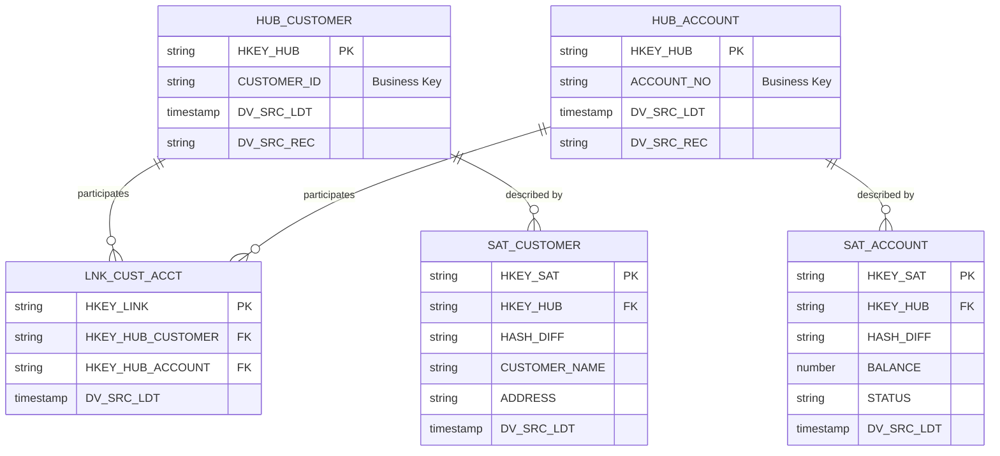

# Raw Vault

## Tổng Quan

Raw Vault là lớp nền tảng, nơi dữ liệu từ các nguồn được chuyển đổi vào mô hình chuẩn Data Vault. Không áp logic nghiệp vụ — chỉ chuẩn hóa cấu trúc.

### Đặc Trưng Kỹ Thuật

- Không áp logic nghiệp vụ, chỉ chuẩn hóa cấu trúc
- Dữ liệu nguyên gốc nhưng có tổ chức — ổn định
- Tối ưu cho xử lý phân tán (Spark)
- Đảm bảo truy vết toàn trình (source → vault → downstream)



## Hub — Khóa Nghiệp Vụ

### Mục Đích

- Đại diện cho các **thực thể kinh doanh cốt lõi** (core business entities)
- Lưu trữ các **khóa nghiệp vụ duy nhất** và không thay đổi

### Đặc Điểm

| Đặc điểm | Mô tả | Ví dụ |
|----------|-------|-------|
| **Business Key** | Khóa nghiệp vụ duy nhất từ source | Customer No, Account Number, Product Code |
| **Hash Key** | Giá trị băm SHA-256 từ business key | HKEY_HUB |
| **Attributes** | Không chứa thuộc tính mô tả | Chỉ key và metadata |

### Cấu Trúc Bảng Hub

```sql
CREATE TABLE HUB_CUSTOMER (
    -- Hash Key (Primary Key)
    HKEY_HUB VARCHAR2(64) NOT NULL,
    
    -- Business Key
    CUSTOMER_ID VARCHAR2(50) NOT NULL,
    
    -- System Columns (Data Vault)
    DV_CDC_OPS VARCHAR2(10),      -- OP_TYPE from Landing
    DV_SRC_LDT TIMESTAMP,          -- OP_TIME from Landing
    DV_SCN NUMBER,                 -- OP_NO from Landing
    DV_RBA VARCHAR2(50),           -- OP_RBA from Landing
    DV_SRC_REC VARCHAR2(100),      -- Landing table name
    DV_LDT TIMESTAMP,              -- Load timestamp
    DV_CCD VARCHAR2(10) DEFAULT 'NAB',  -- Collision code
    
    CONSTRAINT PK_HUB_CUSTOMER PRIMARY KEY (HKEY_HUB)
);
```

### Tạo Hash Key

```sql
-- Công thức tạo HKEY_HUB
HKEY_HUB = SHA256(BUSINESS_KEY || RECORD_SOURCE)

-- Ví dụ
HKEY_HUB = LOWER(STANDARD_HASH('CUST001' || 'FLEXLIVE', 'SHA256'))
```

### Loading Pattern

```sql
-- Multi-source incremental load
WITH stage_data AS (
    SELECT DISTINCT
        LOWER(STANDARD_HASH(CUSTOMER_ID || 'FLEXLIVE', 'SHA256')) AS HKEY_HUB,
        CUSTOMER_ID AS BIZ_KEY,
        OP_TIME AS DV_SRC_LDT,
        OP_TYPE AS DV_CDC_OPS,
        OP_NO AS DV_SCN,
        OP_RBA AS DV_RBA,
        'FLEXLIVE' AS DV_SRC_REC,
        SYSTIMESTAMP AS DV_LDT
    FROM LANDING_CUSTOMER
),
new_records AS (
    SELECT s.*
    FROM stage_data s
    LEFT JOIN HUB_CUSTOMER h ON s.HKEY_HUB = h.HKEY_HUB
    WHERE h.HKEY_HUB IS NULL
)
INSERT INTO HUB_CUSTOMER (HKEY_HUB, CUSTOMER_ID, DV_CDC_OPS, DV_SRC_LDT, 
                          DV_SCN, DV_RBA, DV_SRC_REC, DV_LDT, DV_CCD)
SELECT HKEY_HUB, BIZ_KEY, DV_CDC_OPS, DV_SRC_LDT, 
       DV_SCN, DV_RBA, DV_SRC_REC, DV_LDT, 'NAB'
FROM new_records;
```

## Link — Quan Hệ Nghiệp Vụ

### Mục Đích

- Đại diện cho các **mối quan hệ** giữa hai hoặc nhiều thực thể (Hub)
- Không có thuộc tính mô tả về bản thân mối quan hệ

### Đặc Điểm

| Đặc điểm | Mô tả |
|----------|-------|
| **HKEY_LINK** | Khóa băm tổ hợp các HKEY_HUB tham gia |
| **FK to Hubs** | Chứa các khóa ngoại (HKEY_HUB) trỏ đến Hub liên quan |
| **Driven Key** | Hub xác định tính duy nhất của mối quan hệ tại 1 thờđiểm |

### Driven Key Concept

**Định nghĩa**: Trong một số trường hợp, một hoặc nhiều Hub trong Link đóng vai trò xác định tính duy nhất của mối quan hệ tại 1 thờđiểm.

**Ví dụ**:

```
Link: LNK_DP_ACCT_BRN_CUST_CCY_ACLASS_GL
- Quan hệ: Account ↔ Branch ↔ Customer ↔ Currency ↔ Product ↔ GL
- Driven Key: ACCOUNT
- Logic: Tại 1 thờđiểm, 1 account chỉ thuộc 1 chi nhánh, 1 khách hàng, 1 sản phẩm
```

**Xác định Driven Key**:
- Xem xét primary key của bảng source
- Nếu Link có các column không nằm trong PK nhưng tham gia tạo Hub khác → xem xét driven key
- Mục đích: Tối ưu hiệu suất (không ảnh hưởng logic)

### Cấu Trúc Bảng Link

```sql
CREATE TABLE LNK_CUST_ACCT (
    -- Hash Key (Primary Key)
    HKEY_LINK VARCHAR2(64) NOT NULL,
    
    -- Foreign Keys to Hubs
    HKEY_HUB_CUSTOMER VARCHAR2(64) NOT NULL,
    HKEY_HUB_ACCOUNT VARCHAR2(64) NOT NULL,
    
    -- Optional: Driven Key indicator
    DRIVEN_KEY_HUB VARCHAR2(64),
    
    -- System Columns
    DV_CDC_OPS VARCHAR2(10),
    DV_SRC_LDT TIMESTAMP,
    DV_SCN NUMBER,
    DV_RBA VARCHAR2(50),
    DV_SRC_REC VARCHAR2(100),
    DV_LDT TIMESTAMP,
    
    CONSTRAINT PK_LNK_CUST_ACCT PRIMARY KEY (HKEY_LINK),
    CONSTRAINT FK_LNK_CUST FOREIGN KEY (HKEY_HUB_CUSTOMER) 
        REFERENCES HUB_CUSTOMER(HKEY_HUB),
    CONSTRAINT FK_LNK_ACCT FOREIGN KEY (HKEY_HUB_ACCOUNT) 
        REFERENCES HUB_ACCOUNT(HKEY_HUB)
);
```

### Loading Pattern

```sql
-- Link loading with driven key
WITH stage_data AS (
    SELECT DISTINCT
        LOWER(STANDARD_HASH(
            h_cust.HKEY_HUB || h_acct.HKEY_HUB, 'SHA256'
        )) AS HKEY_LINK,
        h_cust.HKEY_HUB AS HKEY_HUB_CUSTOMER,
        h_acct.HKEY_HUB AS HKEY_HUB_ACCOUNT,
        h_acct.HKEY_HUB AS DRIVEN_KEY_HUB,  -- Account is driven key
        l.OP_TYPE AS DV_CDC_OPS,
        l.OP_TIME AS DV_SRC_LDT,
        l.OP_NO AS DV_SCN,
        l.OP_RBA AS DV_RBA,
        'LANDING_CUST_ACCT' AS DV_SRC_REC,
        SYSTIMESTAMP AS DV_LDT
    FROM LANDING_CUST_ACCT l
    JOIN HUB_CUSTOMER h_cust ON l.CUSTOMER_ID = h_cust.CUSTOMER_ID
    JOIN HUB_ACCOUNT h_acct ON l.ACCOUNT_NO = h_acct.ACCOUNT_NO
),
new_records AS (
    SELECT s.*
    FROM stage_data s
    LEFT JOIN LNK_CUST_ACCT l ON s.HKEY_LINK = l.HKEY_LINK
    WHERE l.HKEY_LINK IS NULL
)
INSERT INTO LNK_CUST_ACCT (...)
SELECT ... FROM new_records;
```

## Satellite — Thuộc Tính & Lịch Sử

### Mục Đích

- Lưu trữ các **thuộc tính thay đổi theo thờgian** của thực thể (Hub) hoặc mối quan hệ (Link)
- **Naming**: SAT* cho Hub, LSAT* cho Link

### Đặc Điểm

| Đặc điểm | Mô tả |
|----------|-------|
| **Single Parent** | Mỗi Satellite chỉ liên kết với **một** bảng Hub hoặc Link |
| **Hash Diff** | Giá trị băm tất cả các cột (trừ key và system columns) để phát hiện thay đổi |
| **Dependent Key** | Cột tham gia vào PK của source nhưng không phải business key |
| **Append-Only** | Chỉ insert, không update/delete → đầy đủ lịch sử |

### Hash Diff

```sql
-- Công thức tạo HASH_DIFF
HASH_DIFF = SHA256(
    ATTR_1 || '|' || ATTR_2 || '|' || ATTR_3 || ... || ATTR_N
)

-- Oracle implementation
HASH_DIFF = LOWER(STANDARD_HASH(
    NVL(CUSTOMER_NAME, '') || '|' || 
    NVL(ADDRESS, '') || '|' || 
    NVL(PHONE, ''), 'SHA256'
))

-- Mục đích: So sánh nhanh để phát hiện thay đổi
-- Nếu HASH_DIFF thay đổi → Insert dòng mới
```

### Các Loại Satellite

#### 1. SAT/LSAT (Main) - Lưu Trữ Lịch Sử

```sql
-- Cơ chế: Append Only
-- Insert khi: Có thay đổi trên bất kỳ thuộc tính nào
-- Không insert khi: Không có thay đổi

CREATE TABLE SAT_CUSTOMER_DETAIL (
    HKEY_SAT VARCHAR2(64) NOT NULL,
    HKEY_HUB VARCHAR2(64) NOT NULL,
    HASH_DIFF VARCHAR2(64) NOT NULL,
    
    -- Dependent Key (nếu có)
    DEPENDENT_KEY VARCHAR2(50),
    
    -- Attribute Columns
    CUSTOMER_NAME VARCHAR2(200),
    ADDRESS VARCHAR2(500),
    PHONE VARCHAR2(20),
    EMAIL VARCHAR2(100),
    DATE_OF_BIRTH DATE,
    
    -- System Columns
    DV_CDC_OPS VARCHAR2(10),
    DV_SRC_LDT TIMESTAMP,
    DV_SCN NUMBER,
    DV_RBA VARCHAR2(50),
    DV_LDT TIMESTAMP,
    
    CONSTRAINT PK_SAT_CUST_DETAIL PRIMARY KEY (HKEY_SAT, DEPENDENT_KEY)
);
```

#### 2. SAT_DER/LSAT_DER - View Dữ Liệu Mới Nhất

- **Type**: View (không phải bảng)
- **Purpose**: Lấy dòng dữ liệu mới nhất theo key, phát sinh trong ngày `cob_date`
- **Auto-generation**: Được sinh tự động qua dbt service
- **Refresh**: Mỗi lần Airflow call API dbt → sinh metadata mới

```sql
-- Ví dụ cấu trúc view
CREATE OR REPLACE VIEW SAT_CUSTOMER_DETAIL_DER AS
SELECT *
FROM (
    SELECT *,
           ROW_NUMBER() OVER (
               PARTITION BY HKEY_HUB 
               ORDER BY DV_SRC_LDT DESC, DV_SCN DESC
           ) AS RN
    FROM SAT_CUSTOMER_DETAIL
    WHERE TRUNC(DV_SRC_LDT) = TRUNC(SYSDATE)
)
WHERE RN = 1;
```

#### 3. SAT_SNP/LSAT_SNP - Snapshot Dữ Liệu

- **Purpose**: Lưu phiên bản mới nhất của dữ liệu tại ngày xử lý
- **Mechanism**: MERGE (không cần so sánh từng cột)
- **Usage**: Dùng trong ETL từ Raw Vault → Biz Vault → Fact

```sql
-- Cơ chế MERGE
MERGE INTO SAT_CUSTOMER_DETAIL_SNP target
USING (
    SELECT * FROM SAT_CUSTOMER_DETAIL_DER
) source
ON (target.HKEY_HUB = source.HKEY_HUB)
WHEN MATCHED THEN
    UPDATE SET 
        target.CUSTOMER_NAME = source.CUSTOMER_NAME,
        target.ADDRESS = source.ADDRESS,
        target.HASH_DIFF = source.HASH_DIFF,
        target.DV_LDT = SYSTIMESTAMP
WHEN NOT MATCHED THEN
    INSERT (HKEY_SAT, HKEY_HUB, HASH_DIFF, CUSTOMER_NAME, ADDRESS, DV_LDT)
    VALUES (source.HKEY_SAT, source.HKEY_HUB, source.HASH_DIFF, 
            source.CUSTOMER_NAME, source.ADDRESS, SYSTIMESTAMP);
```

### Loading Pattern

```sql
-- Satellite loading with change detection
WITH stage_data AS (
    SELECT 
        LOWER(STANDARD_HASH(HKEY_HUB || TO_CHAR(OP_TIME, 'YYYYMMDDHH24MISS'), 'SHA256')) AS HKEY_SAT,
        HKEY_HUB,
        LOWER(STANDARD_HASH(
            NVL(CUSTOMER_NAME, '') || '|' || 
            NVL(ADDRESS, '') || '|' || 
            NVL(PHONE, ''), 'SHA256'
        )) AS HASH_DIFF,
        CUSTOMER_NAME,
        ADDRESS,
        PHONE,
        OP_TYPE AS DV_CDC_OPS,
        OP_TIME AS DV_SRC_LDT,
        OP_NO AS DV_SCN,
        OP_RBA AS DV_RBA,
        SYSTIMESTAMP AS DV_LDT
    FROM LANDING_CUSTOMER_DETAIL l
    JOIN HUB_CUSTOMER h ON l.CUSTOMER_ID = h.CUSTOMER_ID
),
latest_existing AS (
    SELECT HKEY_HUB, HASH_DIFF
    FROM (
        SELECT *,
               ROW_NUMBER() OVER (PARTITION BY HKEY_HUB ORDER BY DV_LDT DESC) AS RN
        FROM SAT_CUSTOMER_DETAIL
    )
    WHERE RN = 1
),
changed_records AS (
    SELECT s.*
    FROM stage_data s
    LEFT JOIN latest_existing l ON s.HKEY_HUB = l.HKEY_HUB
    WHERE l.HASH_DIFF IS NULL OR s.HASH_DIFF != l.HASH_DIFF
)
INSERT INTO SAT_CUSTOMER_DETAIL (...)
SELECT ... FROM changed_records;
```

## Satellite của Link với Driven Key

| Loại | Mô tả | Use Case |
|------|-------|----------|
| **LSAT thông thường** | Quan hệ nhiều-nhiều | Một link có nhiều bản ghi theo thờgian |
| **LSAT Effective** | Quan hệ một-một tại 1 thờđiểm | Lưu ngày hiệu lực của mối quan hệ |

## Danh Sách Đầy Đủ Các Loại Cột

| Loại cột | Mô tả | HUB | LNK | SAT | LSAT | LSATE |
|----------|-------|:---:|:---:|:---:|:----:|:-----:|
| **HKEY_HUB** | Hash key của Hub, từ business key | ✓ | ✓ | ✓ | | ✓ |
| **HKEY_LNK** | Hash key của Link, từ tổ hợp HKEY_HUB | | ✓ | | ✓ | ✓ |
| **HKEY_SAT** | Hash key của Satellite, từ HKEY + load date | | | ✓ | | |
| **HKEY_LSAT** | Hash key của Link Satellite | | | | ✓ | |
| **HASH_DIFF** | Hash của tất cả thuộc tính mô tả | | | ✓ | ✓ | |
| **BIZ_KEY** | Business Key từ hệ thống nguồn | ✓ | | | | |
| **DEPENDENT_KEY** | Khóa phụ thuộc trong Satellite | | | ✓ | ✓ | |
| **ATTR_COLUMN** | Cột thuộc tính mô tả | | | ✓ | ✓ | ✓ |
| **DV_CDC_OPS** | Loại thao tác CDC (INIT/INSERT/UPDATE/DELETE) | ✓ | ✓ | ✓ | ✓ | ✓ |
| **DV_SRC_LDT** | Thờgian phát sinh tại nguồn (OP_TIME) | ✓ | ✓ | ✓ | ✓ | ✓ |
| **DV_SCN** | System Change Number (OP_NO) | ✓ | ✓ | ✓ | ✓ | ✓ |
| **DV_RBA** | Redo Byte Address (OP_RBA) | ✓ | ✓ | ✓ | ✓ | ✓ |
| **DV_SRC_REC** | Tên bảng Landing nguồn | ✓ | ✓ | ✓ | ✓ | ✓ |
| **DV_LDT** | Load Date Timestamp | ✓ | ✓ | ✓ | ✓ | ✓ |
| **DV_CCD** | Collision Code (default: 'NAB') | ✓ | | | | |

## Best Practices

### Partitioning Strategy

```sql
-- Partition Satellite by load date for performance
PARTITION BY RANGE (DV_LDT) (
    PARTITION p202401 VALUES LESS THAN (TO_DATE('2024-02-01', 'YYYY-MM-DD')),
    PARTITION p202402 VALUES LESS THAN (TO_DATE('2024-03-01', 'YYYY-MM-DD')),
    ...
)
```

### Indexing

```sql
-- Index on foreign keys for join performance
CREATE INDEX IDX_SAT_CUST_HKEY ON SAT_CUSTOMER_DETAIL(HKEY_HUB);
CREATE INDEX IDX_LNK_CUST ON LNK_CUST_ACCT(HKEY_HUB_CUSTOMER);
CREATE INDEX IDX_LNK_ACCT ON LNK_CUST_ACCT(HKEY_HUB_ACCOUNT);

-- Index on load date for time-based queries
CREATE INDEX IDX_SAT_CUST_LDT ON SAT_CUSTOMER_DETAIL(DV_SRC_LDT);
```

### Parallel Processing

```sql
-- Enable parallel processing for large tables
ALTER TABLE HUB_CUSTOMER PARALLEL 4;
ALTER TABLE SAT_CUSTOMER_DETAIL PARALLEL 8;

-- Parallel insert
INSERT /*+ APPEND PARALLEL(4) */ INTO HUB_CUSTOMER
SELECT /*+ PARALLEL(4) */ * FROM stage_data;
```
