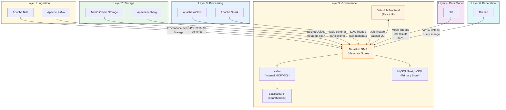

# DataHub

## Tổng Quan

DataHub là nền tảng quản lý metadata, data catalog và data governance tập trung của Hanas Data Platform. Trong kiến trúc 7 lớp, DataHub đóng vai trò **Lớp 5: Quản Trị Dữ Liệu (Governance)** — thu thập, tổ chức và truy vết toàn bộ metadata từ các services khác trong platform.

> DataHub được phát triển bởi LinkedIn (open-source từ 2020), hiện là dự án thuộc **LF AI & Data Foundation**. Version 1.0 ra mắt đầu 2025 đánh dấu bản enterprise-ready đầu tiên.

## Kiến Trúc Trong Platform



## Kiến Trúc Nội Bộ DataHub

DataHub gồm các thành phần chính:

| Thành phần | Công nghệ | Vai trò |
|---|---|---|
| **GMS (Metadata Store)** | Java Spring Boot | API server chính, xử lý CRUD metadata, GraphQL/Rest.li API |
| **Frontend** | React | Giao diện web: search, browse, lineage visualization |
| **MAE Consumer** | Java | Xử lý Metadata Audit Events, cập nhật search index |
| **MCE Consumer** | Java | Xử lý Metadata Change Events, ghi vào storage |
| **Kafka (Internal)** | Apache Kafka | Message bus nội bộ cho MCP/MCL/MCE streams |
| **Elasticsearch** | Elasticsearch/OpenSearch | Search index, full-text search, graph queries |
| **MySQL/PostgreSQL** | RDBMS | Primary metadata storage, aspect versioning |

### Luồng Metadata

```
Source → Ingestion (Pull/Push) → GMS API → Kafka (MCE/MCP) → MAE Consumer → Elasticsearch
                                    ↓
                              MySQL (persist)
                                    ↓
                            Frontend (query & display)
```

## Tích Hợp Với Hanas Platform

DataHub tích hợp với **tất cả services** trong Hanas Platform thông qua 2 cơ chế:

| Service | Cơ chế | Metadata thu thập | Ghi chú |
|---|---|---|---|
| **Apache NiFi** | Pull (Ingestion Recipe) | NiFi flows, processor lineage, provenance events | NiFi site URL + auth |
| **Apache Kafka** | Pull (Ingestion Recipe) | Topics, schemas (Schema Registry), consumer groups | Kafka Connect metadata |
| **MinIO** | Pull (via Iceberg/Hive) | Bucket metadata, object paths | Thông qua Iceberg catalog |
| **Apache Iceberg** | Pull (Ingestion Recipe) | Table schemas, partitions, snapshots | Dùng `pyiceberg` library |
| **Apache Airflow** | Push (Plugin) | DAG lineage, task metadata, run status | Airflow Plugin + TaskGroup |
| **Apache Spark** | Push (Java Agent) | Job lineage, dataset I/O, SQL queries | Spark agent tự emit |
| **dbt** | Push (Airflow TaskGroup) | Model lineage, column-level lineage, test results, docs | Qua `publish_datahub` TaskGroup |
| **Dremio** | Pull (Ingestion Recipe) | Virtual datasets, reflections, query lineage | Dremio REST API |

### Tích Hợp Hiện Tại — ktl_airflow_utils Package

Hanas Platform sử dụng package **`ktl_airflow_utils`** (Katalyst) để mapping và publish metadata lên DataHub:

```
package/ktl_airflow_utils/
├── datahub/
│   ├── publishers.py         # publish_dbt_to_datahub, publish_iceberg_from_catalog,
│   │                         # publish_test_results_to_datahub
│   ├── utils.py              # URN builders, GMS API helpers, lineage emission
│   └── emit_lineage.py       # BI lineage: Dremio→Iceberg, Superset→Dremio
└── taskgroups/
    └── datahub_publish.py    # create_unified_publish_to_datahub_taskgroup
```

#### ETL Pipeline — Publish Metadata

Trong mỗi ETL pipeline, `create_unified_publish_to_datahub_taskgroup` tạo 4 bước **tuần tự** (sequential):

```
ETL TaskGroup
├── load_and_logging
│   ├── load_job (dbt run → S3 run artifacts)
│   ├── test_job (dbt test → S3 test artifacts)
│   └── logging_job (metrics)
└── publish_datahub                          ← Sequential flow
    ├── 1. extract_dbt_catalog               → Validate catalog.json từ S3
    ├── 2. publish_dbt_transformation        → dbt lineage via acryl-datahub Pipeline
    ├── 3. publish_iceberg_metadata          → Iceberg schemas via GMS MCP API
    └── 4. publish_dbt_tests                 → dbt test assertions (trigger_rule=all_done)
```

> Mỗi task chạy trong `PythonVirtualenvOperator` với Python 3.12 và dependencies riêng.

#### BI Lineage — Dremio & Superset

Ngoài ETL pipeline, package cung cấp **BI lineage emission** cho lớp Federation/Consumption:

```
emit_dremio_lineage:    Dremio View → Iceberg Table  (table + column level)
emit_superset_dataset_lineage:  Superset Dataset → Dremio View  (column level)
```

#### Airflow Variables Cần Thiết

| Variable | Default | Mô tả |
|---|---|---|
| `DATAHUB_GMS_HOST` | — | DataHub GMS URL (`http://datahub-gms:8080`) |
| `DATAHUB_TOKEN` | `""` | DataHub bearer token |
| `DATAHUB_ENV` | `PROD` | Environment cho URNs |
| `DATAHUB_PLATFORM_INSTANCE` | `demo` | dbt platform instance |
| `DATAHUB_ICEBERG_PLATFORM_INSTANCE` | `LakeHouse` | Iceberg platform instance |
| `DATAHUB_ASSET_TAG_NAME` | `data platform demo` | Tag mặc định cho assets |
| `DBT_ARTIFACTS_BUCKET` | `data` | S3 bucket chứa dbt artifacts |

## Tính Năng Chính

| Tính năng | Mô tả |
|---|---|
| **Data Catalog** | Tìm kiếm dataset theo tên, tag, domain, owner; browse theo platform |
| **Data Lineage** | Trực quan hóa luồng dữ liệu end-to-end (table-level, column-level) |
| **Business Glossary** | Quản lý thuật ngữ nghiệp vụ, liên kết business term ↔ technical metadata |
| **Data Quality** | Hiển thị kết quả dbt tests, assertions, xu hướng chất lượng theo thời gian |
| **Domains** | Phân nhóm dữ liệu theo nghiệp vụ (Finance, Risk, Operations, ...) |
| **RBAC** | Data Owner, Data Steward, Data Custodian; Platform & Metadata policies |
| **Search & Discovery** | Full-text search, faceted filters, recommendations |
| **Schema History** | Theo dõi schema evolution, so sánh versions |
| **Incidents & Announcements** | Quản lý sự cố dữ liệu, thông báo cho downstream consumers |
| **API & SDK** | REST, GraphQL, Python SDK cho tự động hóa |

## Tài Liệu

- [Cài đặt & Triển khai](installation.md)
- [Cấu hình](configuration.md)
- [Hướng dẫn sử dụng](user-guide.md)
- [Best Practices](best-practices.md)
- [Thông tin Version](version-info.md)
