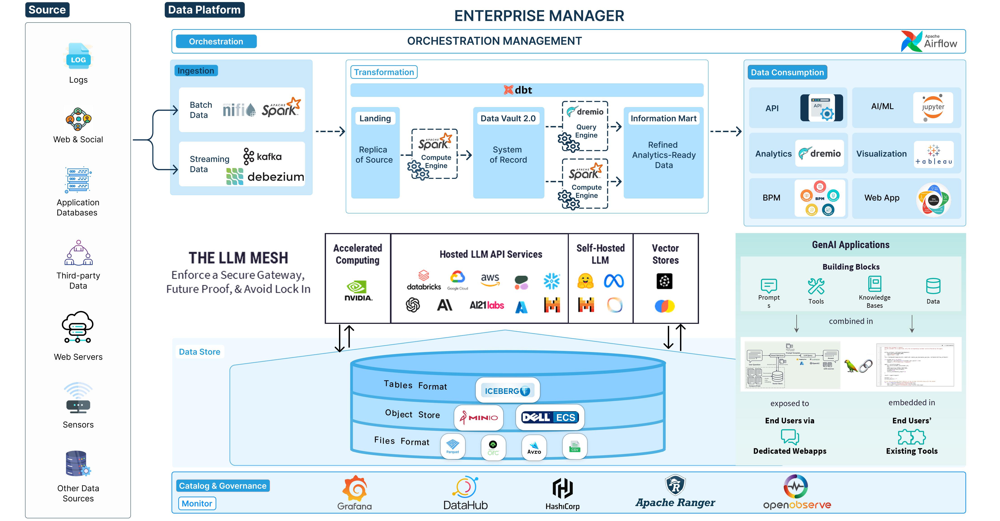

# Tổng Quan Hanas Data Platform

## Giới Thiệu

Hanas Data Platform là nền tảng dữ liệu hợp nhất (Data Lakehouse) tích hợp AI Service, được thiết kế để tiếp nhận, lưu trữ, xử lý, quản trị dữ liệu và cung cấp dữ liệu cho BI, ứng dụng nghiệp vụ và AI. Nền tảng tách biệt storage, compute, catalog và consumption để dữ liệu được dùng lại mà không phải sao chép giữa các hệ thống.

## Mô hình năng lực

| # | Lớp | Mô Tả | Services |
|---|---|---|---|
| 1 | **Thu thập dữ liệu** (Data Ingestion) | Kéo dữ liệu từ các nguồn vào Lakehouse (batch & streaming) | NiFi, Kafka |
| 2 | **Lưu trữ dữ liệu** (Data Storage) | Lưu trữ tập trung, đa định dạng, mở rộng linh hoạt | MinIO, Iceberg |
| 3 | **Xử lý dữ liệu** (Data Processing) | Thực thi batch/stream processing phân tán | Spark |
| 4 | **Mô hình dữ liệu** (Data Model) | Tổ chức dữ liệu theo Data Vault 2.0 | dbt |
| 5 | **Quản trị dữ liệu** (Data Governance) | Metadata, catalog, lineage, data quality | DataHub |
| 6 | **Liên kết dữ liệu** (Data Federation) | Query engine, semantic layer, BI connectivity | Dremio |
| 7 | **Khai thác & trực quan hóa** (Consumption) | Dashboard, báo cáo, self-service analytics | Superset, BI tools |
| 8 | **Dịch vụ AI** (AI Service) | Workflow, inference, RAG và quan sát LLM | Dify, vLLM, Langfuse |

### Năng lực xuyên suốt

| Năng lực | Thành phần | Mục đích |
|---|---|---|
| Điều phối | Apache Airflow | Lập lịch, quản lý phụ thuộc, retry, backfill và audit pipeline |
| Hạ tầng & khôi phục | Kubernetes, Velero, MinIO Site Replication | Triển khai, mở rộng, backup và phục hồi |
| Bảo mật | Apache Ranger, HashiCorp Vault, IdP/SSO | Xác thực, phân quyền, secrets, masking và audit |
| Vận hành | OpenObserve | Thu thập log, metrics, traces, dashboard và cảnh báo |

## Luồng giá trị dữ liệu

1. **Tiếp nhận:** dữ liệu từ database, file, API, CDC hoặc event đi vào NiFi/Kafka.
2. **Lưu giữ nguyên bản:** dữ liệu được ghi vào Landing trên MinIO; metadata và trạng thái được quản lý theo catalog đã chọn.
3. **Xử lý và mô hình hóa:** Spark thực thi các job do Airflow điều phối; dbt xây dựng Raw Vault, Business Vault và Information Mart.
4. **Quản trị:** DataHub ghi nhận schema, owner, glossary, quality và lineage.
5. **Cung cấp:** Dremio tạo lớp truy vấn/semantic; Superset hoặc ứng dụng kết nối qua SQL/API.
6. **Mở rộng AI:** Dify khai thác dữ liệu/tài liệu, vLLM cung cấp inference và Langfuse theo dõi trace, token, latency và chất lượng.

## Các profile catalog

| Profile | Mục đích | Catalog | Trạng thái |
|---|---|---|---|
| **Quickstart/dev** | Lab, demo, kiểm thử tích hợp | Hive Metastore, Thrift `9083` | Đơn giản, không phải baseline production |
| **Production** | Vận hành nhiều engine, RBAC và REST API | Apache Polaris, Iceberg REST API | Chỉ dùng khi đã triển khai và nghiệm thu Polaris |

Không dùng Hive Metastore và Polaris đồng thời để quản lý cùng một namespace/table nếu chưa có thiết kế catalog rõ ràng. Xem [Baseline triển khai](platform-baseline.md).

## Tài liệu liên quan

- [Kiến trúc tổng thể](architecture.md)
- [Mục tiêu Data Platform](objectives.md)
- [Từ điển thuật ngữ](glossary.md)
- [Baseline triển khai và bàn giao](platform-baseline.md)
