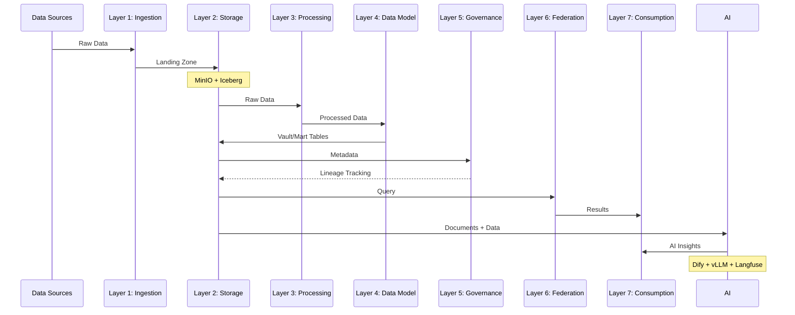

# Kiến Trúc Tổng Thể Hanas Data Platform

## Mô Tả Các Lớp

### [1. Lớp Thu Thập Dữ Liệu (Data Ingestion)](../01-ingestion/README.md)

Kéo dữ liệu thô từ các nguồn dữ liệu vào Data Lakehouse thông qua hai cơ chế:
- **Batch** (định kỳ): [Apache NiFi](../01-ingestion/apache-nifi/README.md) xử lý ETL visual, kết nối đa nguồn
- **Streaming** (liên tục): [Apache Kafka](../01-ingestion/apache-kafka/README.md) truyền phát dữ liệu real-time, độ trễ thấp

### [2. Lớp Lưu Trữ Dữ Liệu (Data Storage)](../02-storage/README.md)

Dữ liệu sau thu thập được đưa vào vùng Landing trên Data Lake:
- **[MinIO](../02-storage/minio/README.md)**: Object Storage phân tán, S3-compatible, lưu trữ tập trung
- **[Apache Iceberg](../02-storage/apache-iceberg/README.md)**: Open Table Format, ACID transactions, time travel, schema evolution

### [3. Lớp Xử Lý Dữ Liệu (Data Processing)](../03-processing/README.md)

Điều phối và thực thi toàn bộ pipeline xử lý dữ liệu:
- **[Apache Airflow](../03-processing/apache-airflow/README.md)**: Orchestration theo mô hình DAG, lập lịch, kiểm soát lỗi
- **[Apache Spark](../03-processing/apache-spark/README.md)**: Compute engine phân tán, xử lý batch và streaming quy mô lớn

### [4. Lớp Mô Hình Dữ Liệu (Data Model)](../04-data-model/README.md)

Tổ chức dữ liệu theo phương pháp Data Vault 2.0:
- **[Raw Vault](../04-data-model/data-vault/raw-vault.md)**: Hub, Link, Satellite — lưu trữ dữ liệu gốc đã chuẩn hóa
- **[Business Vault](../04-data-model/data-vault/business-vault.md)**: Logic nghiệp vụ nâng cao (PIT, Bridge, Business Satellite)
- **[Information Mart](../04-data-model/data-vault/information-mart.md)**: Star Schema, Wide Table phục vụ BI và báo cáo
- **[dbt](../04-data-model/dbt/README.md)**: Công cụ transformation SQL-based, quản lý mô hình dữ liệu

### [5. Lớp Quản Trị Dữ Liệu (Data Governance)](../05-governance/README.md)

- **[DataHub](../05-governance/datahub/README.md)**: Metadata management, data catalog, data lineage, business glossary, data quality tracking

### [6. Lớp Liên Kết Dữ Liệu (Data Federation)](../06-federation/README.md)

- **[Dremio](../06-federation/dremio/README.md)**: Query engine thống nhất, semantic layer, virtual datasets, acceleration layer, BI connectivity (JDBC/ODBC/REST)

### [7. Lớp Quản Trị Hệ Thống (System Management)](../07-system-management/README.md)

- **[OpenObserve](../07-system-management/openobserve/README.md)**: Thu thập log, metrics, traces; dashboard giám sát; cảnh báo sự cố

### [AI Service Layer](../12-ai-service/README.md)

Lớp AI Service mở rộng nền tảng với khả năng trí tuệ nhân tạo, khai thác dữ liệu từ Lakehouse:

- **[vLLM](../12-ai-service/vllm/README.md)**: Inference engine cho LLM, Embedding và Reranker models — OpenAI-compatible API
- **[Dify](../12-ai-service/dify/README.md)**: AI Workflow Platform — visual builder cho chatbot, RAG, agent, workflow AI
- **[Langfuse](../12-ai-service/langfuse/README.md)**: LLM Observability — tracing, evaluation, prompt management

Chi tiết tại [AI Service Documentation](../12-ai-service/README.md).

## Các Thành Phần Bổ Trợ

| Thành phần | Vai trò |
|---|---|
| **[Kubernetes](../08-infrastructure/kubernetes/README.md)** | Container orchestration, triển khai microservices |
| **[Apache Ranger](../09-security/apache-ranger/README.md)** | Authorization, phân quyền truy cập dữ liệu |
| **[HashiCorp Vault](../09-security/hashicorp-vault/README.md)** | Quản lý secrets, credentials |
| **Velero** | Backup & recovery cụm K8s |
| **MinIO Site Replication** | Đồng bộ dữ liệu DC-DR |

## Luồng Dữ Liệu End-to-End

## Nguyên Tắc Kiến Trúc

1. **Data Lakehouse hợp nhất**: Kết hợp Data Lake + Data Warehouse
2. **Open-source first**: Sử dụng công nghệ mã nguồn mở, không vendor lock-in
3. **Cloud-native**: Triển khai trên Kubernetes, container hóa
4. **Separation of concerns**: Tách biệt rõ ràng giữa các lớp
5. **Scalability**: Mở rộng theo chiều ngang (horizontal scaling)
6. **Security by design**: Bảo mật xuyên suốt từ thiết kế
7. **AI-ready**: Tích hợp sẵn AI Service layer, khai thác dữ liệu Lakehouse cho ứng dụng AI
