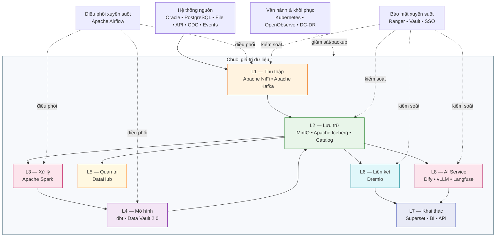
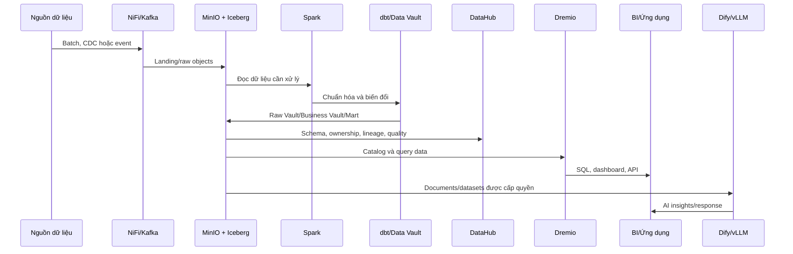

# Kiến Trúc Tổng Thể Hanas Data Platform

## 1. Phạm vi kiến trúc

Hanas được tổ chức thành tám lớp năng lực dữ liệu/AI và các năng lực xuyên suốt. Mỗi lớp có trách nhiệm riêng, giao tiếp bằng giao thức chuẩn và có thể mở rộng độc lập. Kiến trúc dưới đây là mô hình tham chiếu; namespace, số replica, endpoint và chính sách cụ thể phải lấy từ [Baseline triển khai](platform-baseline.md).

## 2. Trách nhiệm của từng lớp

### L1 — Thu thập dữ liệu

- **NiFi:** batch ingestion từ file, SFTP, API và JDBC; routing, validation, retry và provenance.
- **Kafka:** streaming/CDC, buffering, consumer group và replay theo retention.
- **OGG/ODI:** có thể được giữ lại khi dự án đang sử dụng Oracle GoldenGate for Big Data hoặc Oracle Data Integrator; đây là tích hợp nguồn, không phải service bắt buộc của mọi deployment.

Chi tiết: [Ingestion](../01-ingestion/README.md).

### L2 — Lưu trữ dữ liệu

- **MinIO:** object storage S3-compatible cho dữ liệu và artifact.
- **Iceberg:** table format, snapshot isolation, schema/partition evolution và time travel.
- **Catalog:** chọn một profile đã phê duyệt — Hive Metastore cho quickstart/dev hoặc Apache Polaris cho production đa engine.

Chi tiết: [Storage](../02-storage/README.md).

### L3 — Xử lý dữ liệu

Apache Spark thực thi batch/stream processing, đọc ghi dữ liệu trên object storage và Iceberg. Resource request/limit, executor sizing, partitioning và retry phải được định nghĩa theo workload thực tế.

Chi tiết: [Processing](../03-processing/README.md).

### L4 — Mô hình dữ liệu

dbt và Data Vault 2.0 tạo ra các vùng `raw-vault`, `business-vault` và `information-mart`. Raw Vault bảo toàn lịch sử nguồn; Business Vault áp dụng logic nghiệp vụ; Information Mart cung cấp mô hình dễ dùng cho BI và ứng dụng.

Chi tiết: [Data Model](../04-data-model/README.md).

### L5 — Quản trị dữ liệu

DataHub quản lý catalog, owner, domain, glossary, schema, lineage và kết quả data quality. Metadata không thay thế quyền truy cập; quyền vẫn phải được thực thi tại service dữ liệu và query layer.

Chi tiết: [Governance](../05-governance/README.md).

### L6 — Liên kết dữ liệu

Dremio cung cấp catalog logic, SQL endpoint, virtual dataset, semantic layer và query acceleration. BI/ứng dụng nên truy cập qua Dremio thay vì kết nối trực tiếp vào nhiều nguồn, trừ khi có ngoại lệ được phê duyệt.

Chi tiết: [Federation](../06-federation/README.md).

### L7 — Khai thác và trực quan hóa

Apache Superset hoặc BI tool kết nối Dremio qua JDBC/ODBC/Arrow Flight tùy driver. Lớp này chịu trách nhiệm dashboard, báo cáo, self-service analytics và data export theo chính sách.

Chi tiết: [Visualization](../13-visualization/README.md).

### L8 — AI Service

- **Dify:** workflow, chatbot, RAG và agent.
- **vLLM:** inference API cho LLM, embedding và reranker.
- **Langfuse:** trace, prompt, evaluation, token, latency và cost observability.

AI chỉ được truy cập dữ liệu đã được phân loại, cấp quyền và log; không mặc định cho phép đưa toàn bộ Raw Vault vào prompt hoặc knowledge base.

Chi tiết: [AI Service](../12-ai-service/README.md).

## 3. Năng lực xuyên suốt

| Năng lực | Thành phần | Trách nhiệm |
|---|---|---|
| Điều phối | Apache Airflow | Lập lịch, dependency, retry, backfill, alert và audit pipeline |
| Hạ tầng | Kubernetes | Scheduling, isolation, resource quota, service discovery, rollout |
| Bảo mật | Apache Ranger, HashiCorp Vault, IdP | Authentication, authorization, secrets, masking, audit |
| Vận hành | OpenObserve | Logs, metrics, traces, dashboard và alert |
| Khôi phục | Velero, MinIO Site Replication | Backup resource/PV, replicate object data, DR exercise |

## 4. Luồng dữ liệu end-to-end

## 5. Nguyên tắc thiết kế

1. **Tách storage và compute:** dữ liệu dùng chung, compute scale độc lập.
2. **Open formats:** ưu tiên S3-compatible, Parquet và Iceberg để giảm phụ thuộc vendor.
3. **Metadata-driven:** data contract, schema, owner và lineage là một phần của pipeline.
4. **Idempotency:** mỗi pipeline phải có watermark hoặc business key để chạy lại không tạo dữ liệu trùng.
5. **Security by design:** least privilege, mã hóa in-transit/at-rest, secrets ngoài code, audit đầy đủ.
6. **Observable by default:** service và pipeline có health check, metric, log, trace và alert.
7. **Backup được kiểm thử:** backup thành công chưa đủ; phải có restore test và biên bản.
8. **Profile rõ ràng:** không dùng đồng thời Hive Metastore và Polaris cho cùng namespace/table nếu chưa có thiết kế migration.

## 6. Ranh giới trách nhiệm

| Phạm vi | Hanas cung cấp | Khách hàng cần cung cấp/xác nhận |
|---|---|---|
| Hạ tầng | Thiết kế sizing và manifest tham chiếu | Node, network, storage, DNS, firewall, registry |
| Nguồn dữ liệu | Connector/template và quy trình tích hợp | Owner nguồn, quyền truy cập, data contract, lịch load |
| Mô hình/KPI | Khung Data Vault, dbt và mẫu mart | Định nghĩa nghiệp vụ, KPI, quy tắc đối soát |
| Bảo mật | Pattern SSO/RBAC/Vault/Ranger | IdP, nhóm người dùng, phân loại dữ liệu, phê duyệt quyền |
| Vận hành | Runbook, dashboard, alert và DR procedure | Owner, escalation và policy vận hành |

Các mục chưa được xác nhận phải được ghi tại [Baseline triển khai](platform-baseline.md), không suy đoán từ tài liệu mẫu.
