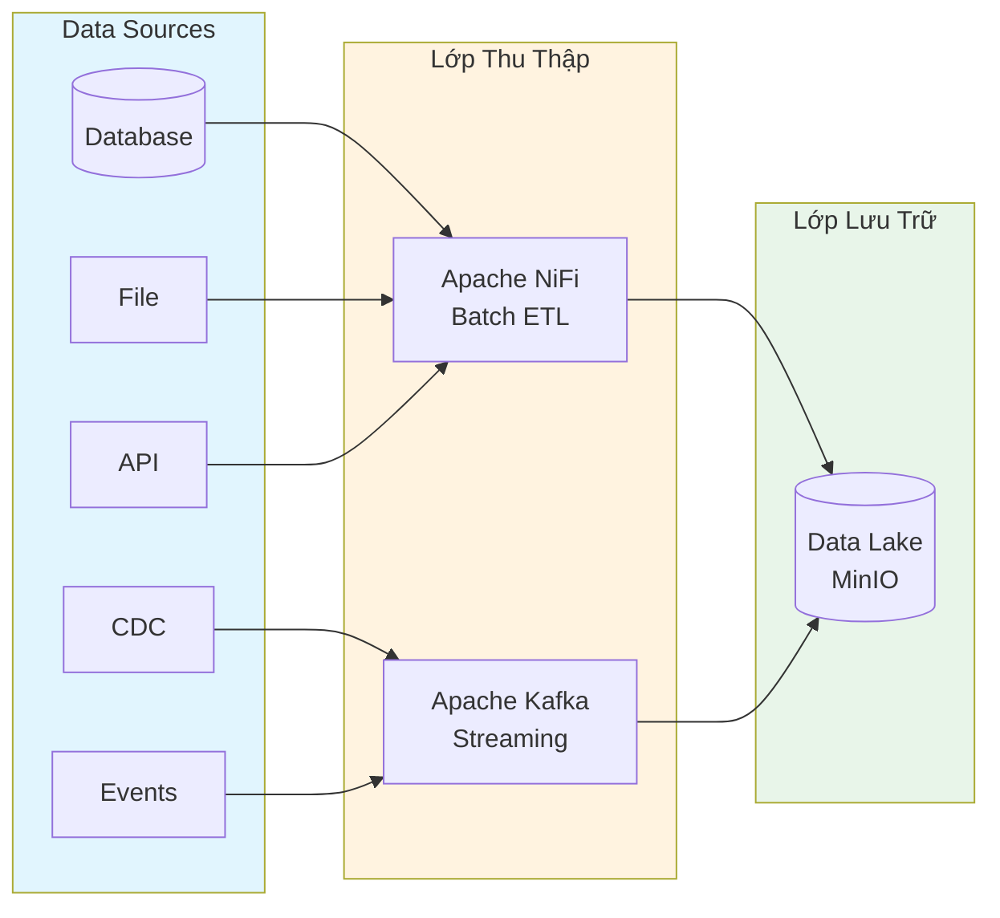

# Lớp Thu Thập Dữ Liệu (Data Ingestion)

## Tổng Quan

Lớp thu thập dữ liệu chịu trách nhiệm kéo dữ liệu thô từ các nguồn vào Data Lakehouse. Hệ thống hỗ trợ hai cơ chế thu thập song song:

| Cơ chế | Service | Mô tả |
|---|---|---|
| **Batch** | Apache NiFi | Thu thập định kỳ, ETL visual, kết nối đa nguồn |
| **Streaming** | Apache Kafka | Truyền phát thời gian thực, độ trễ thấp |
| **Oracle enterprise (tùy dự án)** | Oracle GoldenGate for Big Data / ODI | CDC, replication hoặc tích hợp theo chuẩn Oracle hiện hữu |

## Kiến Trúc

## Services

- [Apache NiFi](apache-nifi/README.md) — Thu thập batch, ETL visual
- [Apache Kafka](apache-kafka/README.md) — Streaming, real-time

## Tích hợp Oracle enterprise

Một số dự án có sẵn Oracle GoldenGate for Big Data (OGG) hoặc Oracle Data Integrator (ODI). Hai thành phần này là adapter/tích hợp nguồn tùy phạm vi, không phải service bắt buộc của mọi deployment Hanas. Trước khi thiết kế pipeline cần chốt:

| Hạng mục | Thông tin cần chốt |
|---|---|
| Công cụ được chọn | `<OGG / ODI / NiFi / Kafka CDC / kết hợp>` |
| Oracle version/PDB và topology | `<CẦN ĐIỀN>` |
| CDC/full-load strategy | `<CẦN ĐIỀN>` |
| Điểm bàn giao | `<Kafka topic / Landing bucket / staging>` |
| Schema evolution/replay | `<CẦN ĐIỀN>` |
| Owner license và vận hành | `<CẦN ĐIỀN>` |

Không chạy đồng thời nhiều cơ chế capture cho cùng bảng nếu chưa có thiết kế chống duplicate, ordering và reconciliation.
