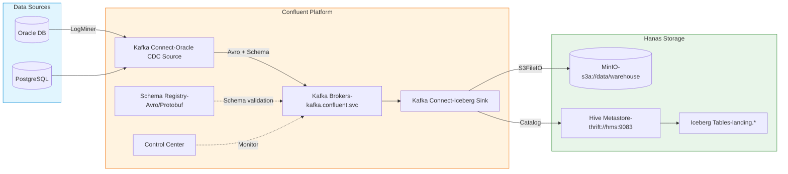
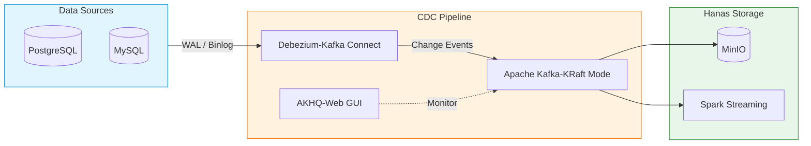
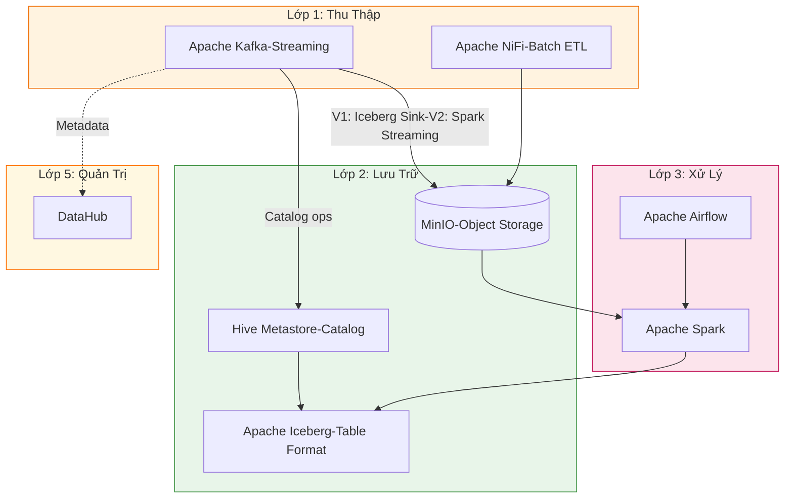

# Apache Kafka

## 1. Tổng Quan

Apache Kafka là nền tảng truyền phát sự kiện phân tán (distributed event streaming platform), thiết kế cho các hệ thống dữ liệu thời gian thực với thông lượng cao, độ trễ thấp, và khả năng chịu lỗi cao.

Trong Hanas Data Platform, Kafka đóng vai trò **Lớp 1 — Thu Thập Dữ Liệu Streaming**, tiếp nhận các luồng dữ liệu real-time từ nguồn vào Data Lakehouse (MinIO + Iceberg).

## 2. Hai Phiên Bản Triển Khai

| # | Phiên Bản | Thành Phần | Use Case |
|---|-----------|------------|----------|
| **V1** | Confluent Platform | Kafka Broker, Schema Registry, Control Center, Kafka Connect (Oracle CDC, Iceberg Sink) | Enterprise CDC, Oracle source, Avro schema governance |
| **V2** | Apache Kafka + Debezium + AKHQ | Kafka KRaft, Debezium CDC (PostgreSQL/MySQL), AKHQ GUI | Open-source CDC, lightweight management |

### 2.1 V1 — Confluent Platform



**Luồng thực tế trong platform:**

```
Oracle DB → Oracle CDC Source Connector → Kafka Topic (Avro) → Iceberg Sink Connector → Iceberg Table (MinIO)
```

| Bước | Chi Tiết |
|------|----------|
| 1. Capture | Oracle CDC Source Connector đọc redo log via LogMiner |
| 2. Serialize | Messages serialize dạng Avro, schema lưu trên Schema Registry |
| 3. Topic | Dữ liệu ghi vào topic theo pattern `ORACLE.<schema>.<table>` |
| 4. Transform | SMT transforms: thêm offset, cast timestamp, insert metadata |
| 5. Sink | Iceberg Sink Connector ghi trực tiếp vào Iceberg table trên MinIO |
| 6. Table | Iceberg table tự động tạo, schema evolution enabled |

**Đặc điểm V1:**
- **Schema Registry**: Quản lý schema Avro/Protobuf cho mọi message, đảm bảo tính nhất quán
- **Oracle CDC Source**: Confluent proprietary connector, hỗ trợ LogMiner, PDB, LOB
- **Iceberg Sink**: Ghi trực tiếp Kafka → Iceberg (bypass Spark), auto-create table, schema evolution
- **Control Center**: GUI monitoring cluster, consumer lag, connector health
- **Enterprise Security**: RBAC, LDAP, audit logging

### 2.2 V2 — Apache Kafka + Debezium + AKHQ



**Đặc điểm V2:**
- **Debezium CDC**: Open-source, hỗ trợ PostgreSQL (WAL), MySQL (binlog), SQL Server
- **KRaft Mode**: Kafka chạy không cần ZooKeeper, giảm độ phức tạp
- **AKHQ**: Giao diện web quản lý — browse topics, consumer groups, connector status
- **100% Open-source**: Apache 2.0 license, chi phí thấp

---

## 3. Kiến Trúc Trong Hanas Platform



### Hai Đường Dẫn Dữ Liệu Kafka → Iceberg

| Đường dẫn | Cách thức | Khi nào dùng |
|-----------|-----------|-------------|
| **Kafka → Iceberg Sink → Iceberg** (V1) | Connector ghi trực tiếp, không cần Spark | Real-time CDC, low latency |
| **Kafka → Spark Streaming → Iceberg** (V2) | Spark đọc Kafka, transform, ghi Iceberg | Complex transformations |

---

## 4. Kiến Trúc Lõi Kafka

| Thành Phần | Mô Tả |
|------------|--------|
| **Broker** | Máy chủ Kafka, lưu trữ và phục vụ partition data |
| **Topic** | Đơn vị logic nhóm messages (ví dụ: `ORACLE.DEMO_LAKE.TBL_TRANSACTION`) |
| **Partition** | Chia nhỏ topic để xử lý song song |
| **Producer** | Service gửi message (Oracle CDC, Debezium) |
| **Consumer** | Service đọc message (Iceberg Sink, Spark) |
| **Consumer Group** | Nhóm consumers chia partition, mỗi message chỉ xử lý 1 lần |
| **Schema Registry** | Quản lý schema Avro/Protobuf, đảm bảo compatibility |

---

## 5. Tính Năng Chính

| # | Tính Năng | Mô Tả |
|---|-----------|--------|
| 1 | **Thông lượng cao** | Hàng trăm nghìn events/giây |
| 2 | **Độ trễ thấp** | Millisecond-level latency |
| 3 | **Mở rộng ngang** | Thêm broker, thêm partition không downtime |
| 4 | **High Availability** | Replication, ISR, leader election tự động |
| 5 | **Event Replay** | Đọc lại từ bất kỳ offset |
| 6 | **Log Compaction** | Giữ latest state theo key — hoàn hảo cho CDC |
| 7 | **Exactly-once** | Idempotent producer + transactional consumer |
| 8 | **Bảo mật** | TLS, SASL, ACL |

---

## 6. So Sánh Hai Phiên Bản

| Tiêu Chí | V1 — Confluent | V2 — Apache Kafka + Debezium + AKHQ |
|----------|----------------|--------------------------------------|
| **Source DB** | Oracle, PostgreSQL, MySQL | PostgreSQL, MySQL, SQL Server |
| **CDC Connector** | Confluent Oracle CDC Source | Debezium Connectors |
| **Sink** | Iceberg Sink (trực tiếp) | Spark Structured Streaming |
| **Serialization** | Avro + Schema Registry | JSON / Avro |
| **GUI** | Control Center | AKHQ |
| **License** | Commercial | Apache 2.0 |
| **K8s Operator** | Confluent for Kubernetes | Strimzi |
| **Chi phí** | License fee | Miễn phí |
| **Phù hợp** | Enterprise, Oracle CDC | Open-source, PostgreSQL/MySQL |

## Tài Liệu

- [Cài đặt & Triển khai](installation.md)
- [Cấu hình](configuration.md)
- [Hướng dẫn sử dụng](user-guide.md)
- [Best Practices](best-practices.md)
- [Thông tin Version](version-info.md)
