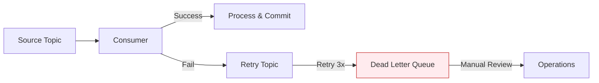

# Apache Kafka - Best Practices

## Thiết Kế Topic

### Naming Convention

Sử dụng quy tắc đặt tên nhất quán:

```
<prefix>.<source>.<schema>.<table>      # CDC
<prefix>.<domain>.<event-type>          # Events
```

| Quy tắc | Ví dụ | Mô tả |
|---------|-------|-------|
| Lowercase only | `cdc.postgres.public.orders` | Không dùng UPPERCASE |
| Dấu chấm phân cách | `events.order.created` | Không dùng underscore hoặc dash |
| Có prefix | `cdc.*`, `events.*`, `dlq.*` | Phân loại dễ dàng |
| Tên rõ ràng | `cdc.postgres.public.customers` | Truy vết được nguồn dữ liệu |

### Partition Strategy

| Chiến Lược | Khi Nào Dùng | Ví dụ |
|------------|-------------|-------|
| **Message key** | Cần thứ tự theo entity | Key = `customer_id` → cùng customer luôn vào cùng partition |
| **Round-robin** | Không cần thứ tự, cần throughput cao | Events giám sát, logs |
| **Custom partitioner** | Logic phân vùng đặc biệt | Phân theo region, tenant |

**Số lượng partitions:**

| Loại Topic | Partitions | Lý Do |
|------------|------------|-------|
| CDC table nhỏ (< 1M rows) | 3–6 | Đủ parallelism cho consumer |
| CDC table lớn (> 10M rows) | 12–24 | Song song hóa cao |
| Event topic throughput cao | 12–48 | Tối đa consumer parallelism |
| Internal/config topics | 1–3 | Ít dữ liệu, ordering quan trọng |

> **Lưu ý**: Tăng partitions → tăng parallelism nhưng cũng tăng resource. Không nên vượt quá **2× số consumer** trong group.

---

## Reliability

### Replication

```
Production minimum:
- replication.factor = 3
- min.insync.replicas = 2
- acks = all (producer)
```

| Cấu hình | Dev | Staging | Production |
|-----------|-----|---------|------------|
| `replication.factor` | 1 | 2 | 3 |
| `min.insync.replicas` | 1 | 1 | 2 |
| `acks` (producer) | 1 | all | all |
| `enable.idempotence` | false | true | true |

### Exactly-Once Semantics

```
Producer: enable.idempotence=true + acks=all
Consumer: enable.auto.commit=false + manual commit after processing
→ At-least-once delivery (thực tế đủ cho hầu hết use case)

Transactional API (nếu cần exactly-once):
- transactional.id=<unique-id>
- isolation.level=read_committed (consumer)
```

### Dead Letter Queue (DLQ)

Khi consumer gặp message không xử lý được, gửi vào DLQ thay vì block pipeline:

```
Topic gốc:     cdc.postgres.public.orders
DLQ topic:     dlq.cdc.postgres.public.orders
Retry topic:   retry.cdc.postgres.public.orders
```

Luồng xử lý:



---

## Performance

### Producer Tuning

| Tham Số | Giá Trị | Ảnh Hưởng |
|---------|---------|-----------|
| `batch.size` | `32768` (32KB) | Gom nhiều message → giảm network overhead |
| `linger.ms` | `5–20` | Chờ gom batch → tăng throughput, tăng nhẹ latency |
| `compression.type` | `lz4` | Tốt nhất cho throughput; `zstd` nếu cần nén mạnh |
| `buffer.memory` | `67108864` (64MB) | Buffer cho producer, tăng nếu throughput cao |
| `max.in.flight.requests.per.connection` | `5` | Giữ ≤5 khi `enable.idempotence=true` |

### Consumer Tuning

| Tham Số | Giá Trị | Ảnh Hưởng |
|---------|---------|-----------|
| `fetch.min.bytes` | `1024` | Chờ đủ 1KB mới fetch → giảm request, tăng throughput |
| `fetch.max.wait.ms` | `500` | Max wait time nếu chưa đủ min.bytes |
| `max.poll.records` | `500` | Records per poll, adjust theo processing speed |
| `max.partition.fetch.bytes` | `1048576` | Max data per partition per fetch |

### Compression Comparison

| Compression | CPU Cost | Compression Ratio | Throughput Impact |
|-------------|----------|-------------------|-------------------|
| `none` | 0 | 1:1 | Baseline |
| `lz4` | Low | ~2:1 | **Recommended** — best throughput |
| `snappy` | Low | ~1.7:1 | Good, slightly less compression |
| `zstd` | Medium | ~3:1 | Best ratio, higher CPU |
| `gzip` | High | ~2.5:1 | Not recommended for high throughput |

---

## Debezium Best Practices

### Snapshot Mode

| Mode | Mô Tả | Khi Nào Dùng |
|------|--------|-------------|
| `initial` | Snapshot toàn bộ + streaming | Lần đầu triển khai |
| `initial_only` | Chỉ snapshot, không streaming | Migration một lần |
| `no_data` | Chỉ schema, không data | Chỉ cần capture thay đổi mới |
| `when_needed` | Snapshot nếu offset không tồn tại | Recovery scenario |
| `never` | Không snapshot | Khi đã có snapshot trước đó |

### PostgreSQL Specific

```sql
-- Đảm bảo wal_level = logical
ALTER SYSTEM SET wal_level = 'logical';
-- Restart PostgreSQL sau khi thay đổi

-- Kiểm tra replication slots
SELECT * FROM pg_replication_slots;

-- Kiểm tra publications
SELECT * FROM pg_publication_tables;

-- Dọn dẹp replication slot cũ (nếu connector bị xóa)
SELECT pg_drop_replication_slot('debezium_hanas');
```

### Monitor Debezium Health

| Metric | Mô Tả | Alert |
|--------|--------|-------|
| Connector state | `RUNNING` / `PAUSED` / `FAILED` | Alert nếu `FAILED` |
| Task state | `RUNNING` / `FAILED` | Alert nếu `FAILED` |
| Replication slot lag | WAL lag trên PostgreSQL | > 1GB |
| Snapshot completion | % snapshot hoàn thành | Monitor trong lần đầu |
| Change event latency | Thời gian từ DB commit → Kafka | > 10s alert |

> **Quan trọng**: Luôn monitor PostgreSQL replication slot. Nếu Debezium dừng lâu, WAL files tích tụ và có thể đầy disk PostgreSQL.

---

## Operations

### Broker Maintenance

```bash
# Rolling restart (không downtime)
# Restart từng broker một, chờ ISR sync trước khi restart broker tiếp

# Kiểm tra ISR trước khi restart
kafka-topics.sh --bootstrap-server kafka:9092 \
  --describe \
  --under-replicated-partitions

# Nếu output trống → safe to restart next broker
```

### Log Retention

| Loại | retention.ms | cleanup.policy | Lý do |
|------|-------------|----------------|-------|
| CDC topics | 604800000 (7d) | compact | Giữ latest state, replay 7 ngày |
| Event topics | 259200000 (3d) | delete | Xóa sau 3 ngày |
| Log topics | 86400000 (1d) | delete | Chỉ giữ 1 ngày |
| Schema changes | -1 (∞) | compact | Giữ vĩnh viễn |

### Backup Strategy

| Thành phần | Cách backup | Tần suất |
|------------|-------------|----------|
| Topic config | Kafka ConfigMap / GitOps | Mỗi khi thay đổi |
| Connector config | JSON files / GitOps | Mỗi khi thay đổi |
| Consumer offsets | Tự động (internal topic) | Liên tục |
| Cluster metadata | KRaft metadata log | Tự động |

---

## Security

### Checklist Bảo Mật

- [ ] Bật TLS encryption cho inter-broker và client communication
- [ ] Sử dụng SASL/SCRAM hoặc mTLS cho authentication
- [ ] Cấu hình ACL cho từng topic (tối thiểu principle of least privilege)
- [ ] Quản lý credentials qua HashiCorp Vault (tích hợp Kubernetes secrets)
- [ ] Bật audit logging (V1 — Confluent)
- [ ] Restrict AKHQ access với RBAC groups (V2)
- [ ] Network policies trên Kubernetes

### Phân Quyền ACL Theo Vai Trò

| Vai Trò | Topic Pattern | Quyền |
|---------|---------------|-------|
| **Debezium** | `cdc.*` | Write, Describe |
| **Spark Consumer** | `cdc.*`, `events.*` | Read, Describe |
| **NiFi Consumer** | `cdc.*` | Read, Describe |
| **Application Producer** | `events.*` | Write, Describe |
| **Admin** | `*` | All |

---

## Tích Hợp Với Hanas Platform

### Kafka → MinIO (Landing Zone)

```
Kafka Topic → Kafka Connect S3 Sink → MinIO
                                       ├── raw/cdc/postgres/customers/
                                       │   ├── year=2026/month=03/
                                       │   │   ├── part-00000.json
                                       │   │   └── part-00001.json
                                       └── raw/events/order/
                                           └── year=2026/month=03/
```

### Kafka → Spark Structured Streaming → Iceberg

```python
# Spark Structured Streaming đọc từ Kafka
df = spark.readStream \
    .format("kafka") \
    .option("kafka.bootstrap.servers", "kafka:9092") \
    .option("subscribe", "cdc.postgres.public.customers") \
    .option("startingOffsets", "earliest") \
    .load()

# Parse CDC message
from pyspark.sql.functions import from_json, col
parsed = df.select(
    from_json(col("value").cast("string"), cdc_schema).alias("data")
).select("data.payload.after.*")

# Ghi vào Iceberg table
parsed.writeStream \
    .format("iceberg") \
    .outputMode("append") \
    .option("checkpointLocation", "s3a://data/checkpoints/customers") \
    .toTable("demo.raw_vault.h_customer")
```

### Kafka → Airflow (Trigger DAG)

```python
# Airflow KafkaSensor chờ message
from airflow.providers.apache.kafka.sensors.kafka import AwaitMessageSensor

wait_for_cdc = AwaitMessageSensor(
    task_id='wait_for_customer_cdc',
    kafka_config_id='kafka_default',
    topics=['cdc.postgres.public.customers'],
    apply_function='airflow.providers.apache.kafka.hooks.kafka.AwaitMessageTriggerEvent',
)
```
