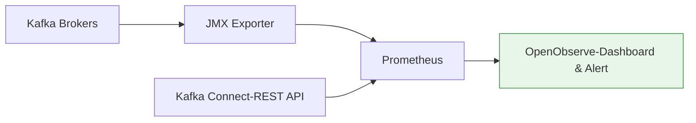

# Apache Kafka - Hướng Dẫn Sử Dụng

## 1. Quản Lý Topic

### 1.1 Tạo Topic

```bash
# CDC Topic — log compaction
kafka-topics.sh --bootstrap-server kafka.confluent.svc.cluster.local:9071 \
  --create --topic ORACLE.DEMO_LAKE.TBL_TRANSACTION \
  --partitions 6 --replication-factor 3 \
  --config cleanup.policy=compact

# Redo log topic
kafka-topics.sh --bootstrap-server kafka.confluent.svc.cluster.local:9071 \
  --create --topic REDO_GROUP3 \
  --partitions 1 --replication-factor 3

# Heartbeat topic
kafka-topics.sh --bootstrap-server kafka.confluent.svc.cluster.local:9071 \
  --create --topic HEARTBEAT_TOPIC_GROUP3 \
  --partitions 1 --replication-factor 3
```

### 1.2 Liệt Kê & Mô Tả

```bash
# Liệt kê
kafka-topics.sh --bootstrap-server kafka:9092 --list

# Chi tiết topic
kafka-topics.sh --bootstrap-server kafka:9092 \
  --describe --topic ORACLE.DEMO_LAKE.TBL_TRANSACTION

# Liệt kê topics under-replicated
kafka-topics.sh --bootstrap-server kafka:9092 \
  --describe --under-replicated-partitions
```

### 1.3 Sửa & Xóa Topic

```bash
# Thay đổi retention
kafka-configs.sh --bootstrap-server kafka:9092 \
  --entity-type topics \
  --entity-name ORACLE.DEMO_LAKE.TBL_TRANSACTION \
  --alter --add-config retention.ms=259200000

# Tăng partitions (chỉ tăng, không giảm)
kafka-topics.sh --bootstrap-server kafka:9092 \
  --alter --topic events.order.created --partitions 24

# Xóa topic (KHÔNG THỂ HOÀN TÁC)
kafka-topics.sh --bootstrap-server kafka:9092 \
  --delete --topic test-topic
```

---

## 2. Kafka Connect — Quản Lý Connector

### 2.1 Đăng Ký Connector

```bash
# Đăng ký Oracle CDC Source
curl -X POST http://connect.confluent.svc.cluster.local:8083/connectors/ \
  -H "Content-Type: application/json" \
  -d @connector_DEMO_GROUP3_config.json

# Đăng ký Iceberg Sink
curl -X POST http://connect.confluent.svc.cluster.local:8083/connectors/ \
  -H "Content-Type: application/json" \
  -d @connector_DEMO_SINK_GROUP2_config.json
```

### 2.2 Kiểm Tra Status

```bash
# Liệt kê connectors
curl -s http://connect:8083/connectors | jq .

# Status connector
curl -s http://connect:8083/connectors/DEMO_GROUP3/status | jq .

# Output mong đợi:
# {
# "name": "DEMO_GROUP3",
# "connector": { "state": "RUNNING", "worker_id": "connect:8083" },
# "tasks": [{ "id": 0, "state": "RUNNING" }]
# }

# Config hiện tại
curl -s http://connect:8083/connectors/DEMO_GROUP3/config | jq .
```

### 2.3 Vận Hành Connector

```bash
# Pause (tạm dừng, giữ offset)
curl -X PUT http://connect:8083/connectors/DEMO_GROUP3/pause

# Resume (tiếp tục từ offset cuối)
curl -X PUT http://connect:8083/connectors/DEMO_GROUP3/resume

# Restart task (khi task FAILED)
curl -X POST http://connect:8083/connectors/DEMO_GROUP3/tasks/0/restart

# Cập nhật config (thêm table mới)
curl -X PUT http://connect:8083/connectors/DEMO_GROUP3/config \
  -H "Content-Type: application/json" \
  -d '{ "table.inclusion.regex": "DATALAKE[.]DEMO_LAKE[.](TBL_TRANSACTION|TBL_CUSTOMER)" }'

# Xóa connector (giải phóng resource)
curl -X DELETE http://connect:8083/connectors/DEMO_GROUP3
```

### 2.4 Liệt Kê Available Connector Plugins

```bash
curl -s http://connect:8083/connector-plugins | jq '.[].class'

# Output:
# "io.confluent.connect.oracle.cdc.OracleCdcSourceConnector"
# "io.tabular.iceberg.connect.IcebergSinkConnector"
# "io.confluent.connect.avro.AvroConverter"
# ...
```

---

## 3. Luồng CDC End-to-End (V1)

### 3.1 Oracle → Kafka → Iceberg

```
Bước 1: Tạo Oracle CDC Source connector
     → Oracle LogMiner bắt thay đổi từ redo log
     → Serialize Avro, gửi vào topic ORACLE.DEMO_LAKE.TBL_TRANSACTION

Bước 2: Tạo Iceberg Sink connector
     → Đọc từ topic ORACLE.DEMO_LAKE.TBL_TRANSACTION
     → Apply SMT transforms (thêm offset, timestamp, partition metadata)
     → Ghi vào Iceberg table landing.corebank_tbl_transaction trên MinIO

Bước 3: Verify dữ liệu
     → Kiểm tra Iceberg table qua Spark/Dremio
```

### 3.2 Verify Dữ Liệu Đã Sink

```bash
# Kiểm tra messages trong topic
kafka-console-consumer.sh --bootstrap-server kafka:9092 \
  --topic ORACLE.DEMO_LAKE.TBL_TRANSACTION \
  --from-beginning --max-messages 5

# Kiểm tra Iceberg table (qua Spark SQL)
spark-sql --master local \
  -e "SELECT COUNT(*) FROM landing.corebank_tbl_transaction"

# Kiểm tra files trên MinIO
mc ls hanas/data/warehouse/landing/corebank_tbl_transaction/data/
```

---

## 4. Consumer Group Management

### 4.1 Kiểm Tra Consumer Lag

```bash
# Consumer group detail
kafka-consumer-groups.sh --bootstrap-server kafka:9092 \
  --describe --group consum_sink_demo_group2

# Output:
# GROUP TOPIC PARTITION CURRENT-OFFSET LOG-END-OFFSET LAG
# consum_sink_demo_group2 ORACLE.DEMO_LAKE.TBL_TRANSACTION 0 1500 1520 20
# consum_sink_demo_group2 ORACLE.DEMO_LAKE.TBL_TRANSACTION 1 1480 1480 0
```

### 4.2 Reset Offset

```bash
# Reset về earliest (reprocess toàn bộ)
kafka-consumer-groups.sh --bootstrap-server kafka:9092 \
  --group consum_sink_demo_group2 \
  --topic ORACLE.DEMO_LAKE.TBL_TRANSACTION \
  --reset-offsets --to-earliest --execute

# Reset về thời điểm cụ thể
kafka-consumer-groups.sh --bootstrap-server kafka:9092 \
  --group consum_sink_demo_group2 \
  --topic ORACLE.DEMO_LAKE.TBL_TRANSACTION \
  --reset-offsets --to-datetime "2026-03-01T00:00:00.000" --execute
```

> **Cảnh báo:** **Phải stop connector/consumer trước khi reset offset.** Nếu không, offset sẽ bị overwrite bởi consumer đang chạy.

---

## 5. Sử Dụng AKHQ (V2)

Truy cập: `http://akhq.hanas.local` hoặc `http://localhost:8080`

| Tab | Chức Năng |
|-----|-----------|
| **Topics** | Xem danh sách, tạo/xóa, xem config |
| **Topic Data** | Browse messages, filter by key/time, live tail |
| **Consumer Groups** | Xem lag, members, reset offset |
| **Kafka Connect** | Quản lý Debezium connectors |
| **Nodes** | Cluster info, broker config |

### Thao Tác Phổ Biến

1. **Kiểm tra CDC data**: Topics → `cdc.postgres.public.customers` → Data → xem messages
2. **Monitor lag**: Consumer Groups → chọn group → xem LAG per partition
3. **Restart connector**: Kafka Connect → chọn connector → Restart
4. **Live tail**: Topic Data → Live Tail button → xem real-time messages

---

## 6. Schema Registry (V1)

### 6.1 Quản Lý Schema

```bash
# Liệt kê subjects
curl -s http://schemaregistry.confluent.svc.cluster.local:8081/subjects | jq .

# Lấy schema mới nhất
curl -s http://schemaregistry.confluent.svc.cluster.local:8081/subjects/ORACLE.DEMO_LAKE.TBL_TRANSACTION-value/versions/latest | jq .

# Kiểm tra compatibility
curl -X POST http://schemaregistry.confluent.svc.cluster.local:8081/compatibility/subjects/ORACLE.DEMO_LAKE.TBL_TRANSACTION-value/versions/latest \
  -H "Content-Type: application/vnd.schemaregistry.v1+json" \
  -d '{"schema": "{...new schema...}"}'
```

---

## 7. Monitoring

### 7.1 Metrics Quan Trọng

| Metric | Mô Tả | Alert |
|--------|--------|-------|
| Under-replicated partitions | Partitions không đủ replicas | > 0 (warning) |
| Offline partitions | Partitions không có leader | > 0 (**critical**) |
| Consumer lag | Số messages chưa xử lý | > 10,000 (warning) |
| Connector state | RUNNING / FAILED | FAILED (**critical**) |
| Request rate | Requests/sec per broker | Monitoring |

### 7.2 Kiểm Tra Nhanh

```bash
# Cluster health
kafka-metadata.sh --snapshot /var/lib/kafka/data/__cluster_metadata-0/00000000000000000000.log --cluster-id

# Under-replicated partitions
kafka-topics.sh --bootstrap-server kafka:9092 --describe --under-replicated-partitions

# Consumer lag (tất cả groups)
kafka-consumer-groups.sh --bootstrap-server kafka:9092 --describe --all-groups

# Connector health
curl -s http://connect:8083/connectors/DEMO_GROUP3/status | jq '.connector.state'
curl -s http://connect:8083/connectors/DEMO_SINK_GROUP2/status | jq '.connector.state'
```

### 7.3 Tích Hợp OpenObserve


