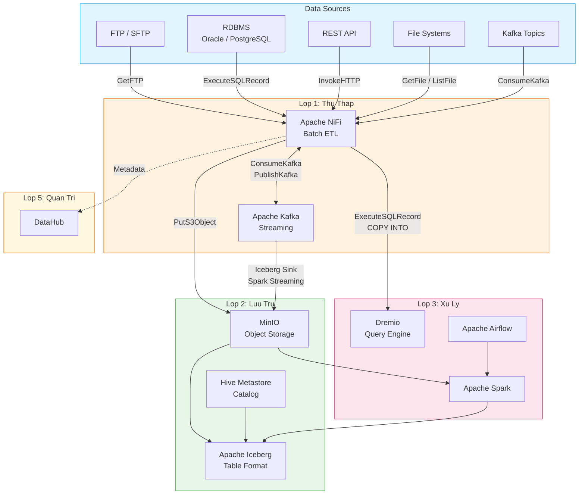
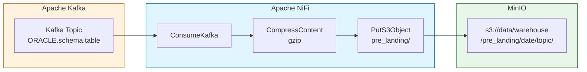
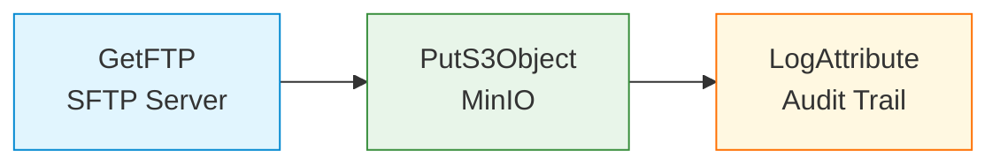
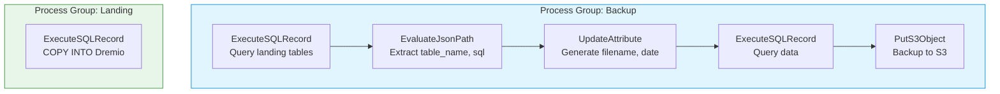

# Apache NiFi

## 1. Tổng Quan

Apache NiFi là nền tảng tự động hóa luồng dữ liệu theo mô hình flow-based programming, cung cấp giao diện đồ họa trực quan (web-based UI) giúp thiết kế, quản lý và giám sát pipeline dữ liệu end-to-end.

Trong Hanas Data Platform, NiFi đóng vai trò **Lớp 1 — Thu Thập Dữ Liệu Batch**, xử lý các luồng dữ liệu file-based, API, RDBMS trước khi đưa vào Data Lakehouse (MinIO + Iceberg). NiFi hoạt động song song với Apache Kafka (streaming) để đảm bảo platform hỗ trợ đầy đủ cả batch và real-time ingestion.

## 2. NiFi vs Kafka — Hai Trụ Cột Thu Thập

| Tiêu Chí | Apache NiFi (Batch) | Apache Kafka (Streaming) |
|----------|---------------------|--------------------------|
| **Mô hình** | Flow-based, visual pipeline | Distributed event streaming |
| **Use case** | File transfer, ETL batch, API polling | CDC, real-time events, log streaming |
| **Latency** | Seconds → minutes | Milliseconds |
| **Giao diện** | Web UI drag-and-drop | CLI / AKHQ / Control Center |
| **Data sources** | SFTP, FTP, JDBC, HTTP, S3, Kafka | Database WAL/Binlog (Debezium) |
| **Xử lý lỗi** | FlowFile retry, Data Provenance | Consumer offset replay |
| **Tích hợp** | ConsumeKafka / PublishKafka processors | Kafka Connect (Source/Sink) |

> **Nguyên tắc**: Dùng **NiFi** khi cần thu thập file, chạy SQL batch, hoặc ETL visual. Dùng **Kafka** khi cần CDC real-time hoặc event streaming. Cả hai tích hợp qua ConsumeKafka/PublishKafka processors.

## 3. Kiến Trúc Trong Hanas Platform



### Luồng Dữ Liệu Chính Qua NiFi

| # | Luồng | Mô Tả |
|---|-------|--------|
| 1 | **FTP/SFTP → S3** | `GetFTP` → `PutS3Object` → dữ liệu lưu MinIO |
| 2 | **RDBMS → S3 (Backup)** | `ExecuteSQLRecord` → `EvaluateJsonPath` → `UpdateAttribute` → `PutS3Object` |
| 3 | **S3 → Dremio (Landing)** | `ExecuteSQLRecord` chạy `COPY INTO lakehouse.landing.*` từ MinIO vào Dremio |
| 4 | **Kafka → S3** | `ConsumeKafka` → `CompressContent` → `PutS3Object` (pre-landing) |
| 5 | **NiFi → Kafka** | `PublishKafka` — chuyển dữ liệu batch sang Kafka topic |

## 4. Tích Hợp NiFi ↔ Kafka

NiFi tích hợp chặt chẽ với Kafka trong Hanas Platform qua hai hướng:

### 4.1 NiFi Đọc Từ Kafka (ConsumeKafka)



- NiFi consume Kafka messages từ CDC topics
- Compress thành gzip, lưu vào MinIO theo cấu trúc `pre_landing/{date}/{topic}/{file}.json.gz`
- Sau đó NiFi chạy `COPY INTO` để load vào Dremio Iceberg tables

### 4.2 NiFi Ghi Lên Kafka (PublishKafka)

```
Source (FTP/RDBMS/API) → NiFi Transform → PublishKafka → Kafka Topic → Downstream consumers
```

- Dùng khi batch data cần được publish lên Kafka cho real-time consumers
- Hỗ trợ message key, compression, transactional delivery

## 5. Process Groups Mẫu (Templates Thực Tế)

### 5.1 Template: FTP → S3



| Processor | Cấu Hình Chính |
|-----------|---------------|
| **GetFTP** | `Hostname`, `Port: 21`, `Remote Path`, `Polling Interval: 50 sec`, `Transfer Mode: Binary`, `Execution: PRIMARY` |
| **PutS3Object** | `Bucket: data`, `Object Key: warehouse/upload_file/${filename}`, `Endpoint Override URL`, `AWS Credentials Provider` |
| **LogAttribute** | Ghi log toàn bộ FlowFile attributes để audit |

### 5.2 Template: Project Template (Backup + Landing)



**Backup Group** — Sao lưu dữ liệu landing sang S3:
1. Query danh sách tables từ Dremio `information_schema`
2. Parse JSON để lấy `table_name` và `sql_select`
3. Tạo filename theo pattern: `{yyyyMMddHHmmssSSS}_{table_name}`
4. Execute SQL query và ghi kết quả vào S3 backup

**Landing Group** — Load dữ liệu từ S3 vào Dremio:
- Chạy theo CRON schedule: `0 0/5 4-23 ? * *` (mỗi 5 phút, 4h-23h)
- SQL: `COPY INTO lakehouse.landing.{table} FROM '@Minio/{bucket}/warehouse/pre_landing/{date}/{topic}/{file}'`

## 6. Processors Chính Trong Hanas Platform

| Processor | Bundle | Vai Trò |
|-----------|--------|---------|
| **GetFTP** | nifi-standard-nar | Thu thập file từ FTP/SFTP server |
| **PutS3Object** | nifi-aws-nar | Ghi file lên MinIO/S3 |
| **ExecuteSQLRecord** | nifi-standard-nar | Chạy SQL query, output records |
| **EvaluateJsonPath** | nifi-standard-nar | Parse JSON, extract fields thành attributes |
| **UpdateAttribute** | nifi-update-attribute-nar | Tạo/cập nhật FlowFile attributes (filename, date) |
| **CompressContent** | nifi-standard-nar | Nén dữ liệu (gzip) trước khi lưu S3 |
| **LogAttribute** | nifi-standard-nar | Ghi log attributes cho audit trail |
| **ConsumeKafka** | nifi-kafka-nar | Đọc messages từ Kafka topics |
| **PublishKafka** | nifi-kafka-nar | Ghi messages lên Kafka topics |

> **NiFi Version**: Hanas Platform sử dụng **Apache NiFi 2.7.2**

## 7. Tính Năng Chính

| # | Tính Năng | Mô Tả |
|---|-----------|--------|
| 1 | **Flow-based Programming** | Thiết kế pipeline visual bằng drag-and-drop |
| 2 | **Data Provenance** | Truy vết toàn bộ hành trình dữ liệu từ nguồn đến đích |
| 3 | **Back Pressure** | Kiểm soát tốc độ xử lý, tránh overload (10,000 objects / 1 GB) |
| 4 | **FlowFile Replay** | Chạy lại pipeline khi có lỗi mà không mất dữ liệu |
| 5 | **Multi-source** | 300+ processors kết nối JDBC, SFTP, HTTP, S3, Kafka, API |
| 6 | **NiFi Registry** | Version control cho data flows (Git-like) |
| 7 | **Python API** | Viết custom processors bằng Python (NiFi 2.x) |
| 8 | **Kubernetes Native** | Chạy trên K8s với ConfigMaps, leader election không cần ZooKeeper |
| 9 | **Bảo Mật** | TLS, OIDC SSO, RBAC, sensitive property encryption |

---

## Tài Liệu

- [Cài đặt & Triển khai](installation.md)
- [Cấu hình](configuration.md)
- [Hướng dẫn sử dụng](user-guide.md)
- [Best Practices](best-practices.md)
- [Thông tin Version](version-info.md)
