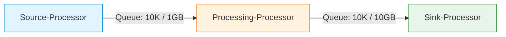
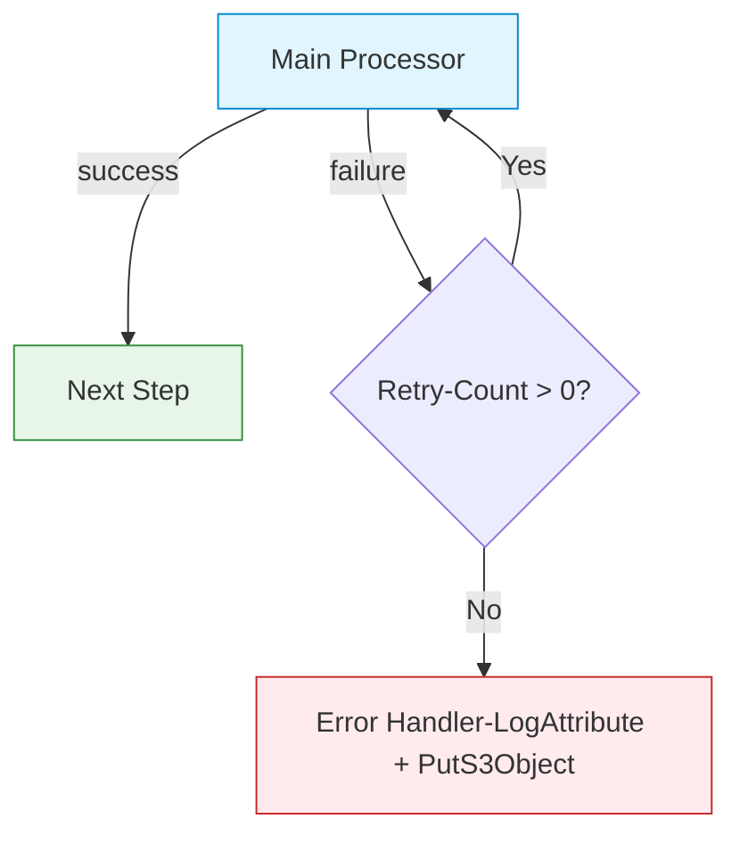

# Apache NiFi - Best Practices

## 1. Thiết Kế Flow

### Process Group Hierarchy

```
Root Canvas
├── project_template          ← Mỗi project là 1 Process Group
│   ├── Backup                ← Sub-group theo chức năng
│   ├── Landing               ← Sub-group theo chức năng
│   └── Monitoring            ← Sub-group cho logging/alerting
├── get_file_from_ftp_push_s3 ← Flow riêng biệt
└── shared_services           ← Common flows tái sử dụng
```

### Quy Tắc Đặt Tên

| Thành Phần | Convention | Ví Dụ |
|-----------|-----------|-------|
| **Process Group** | `snake_case`, mô tả mục đích | `project_template`, `backup_landing_data` |
| **Processor** | Verb + Object hoặc function name | `GetFTP`, `putS3_backup`, `landing_group_a` |
| **Connection** | Label theo relationship | `success`, `failure`, `matched` |
| **Controller Service** | Type + Target | `DremioJDBC`, `MinIO_Credentials` |
| **Parameter Context** | `project_` prefix | `project_hanas`, `project_demo` |

### Nguyên Tắc Thiết Kế

1. **Một Process Group cho mỗi use case** — Tách biệt Backup, Landing, FTP Import
2. **Không đặt processor trực tiếp trên root canvas** — Luôn wrap trong Process Group
3. **Sử dụng Funnels** cho merge nhiều relationships vào 1 đường
4. **Label và Comment** cho mọi processor phức tạp
5. **Version Control** mọi Process Group qua NiFi Registry

---

## 2. Quản Lý Back Pressure

### Cấu Hình Khuyến Nghị

| Tham Số | Mặc Định | Khuyến Nghị | Khi Nào Điều Chỉnh |
|---------|----------|-------------|---------------------|
| **Object Threshold** | 10,000 | 10,000 | Tăng nếu processors xử lý nhanh |
| **Size Threshold** | 1 GB | 1–10 GB | Tăng cho file lớn (backup) |
| **FlowFile Expiration** | 0 sec (never) | 0 sec | Đặt > 0 nếu data có TTL |

### Back Pressure Strategy



- Khi queue đạt threshold → source processor tự động **pause**
- Đây là cơ chế bảo vệ tự nhiên, **không cần can thiệp thủ công**
- Monitor: Queue hiển thị **màu vàng** khi gần threshold, **màu đỏ** khi đạt threshold

### Template Thực Tế

Trong `project_template.json`, back pressure mặc định:
- Backup connections: **10,000 objects / 1 GB** (standard)
- Backup data transfer: **10,000 objects / 10 GB** (cho ExecuteSQLRecord output lớn)

---

## 3. Xử Lý Lỗi

### Retry Strategy

| Cấu Hình | Giá Trị Nhẹ | Giá Trị Nặng | Mô Tả |
|----------|------------|-------------|--------|
| **Retry Count** | 3 | 10 | Số lần retry |
| **Retried Relationships** | `failure` | `failure` | Relationship sẽ retry |
| **Backoff Mechanism** | `PENALIZE_FLOWFILE` | `PENALIZE_FLOWFILE` | Penalize trước khi retry |
| **Max Backoff Period** | `3 mins` | `10 mins` | Thời gian chờ tối đa |

### Error Routing Pattern



### Best Practices Xử Lý Lỗi

1. **Không auto-terminate `failure`** cho processors quan trọng — route đến error handler
2. **Auto-terminate `failure`** cho processors cuối cùng (PutS3Object backup) khi đã có retry
3. **LogAttribute** cho mọi failure path — ghi lại context để debug
4. **PutS3Object error path** — lưu failed FlowFiles vào `s3://data/errors/` để xử lý sau

---

## 4. Hiệu Năng

### Scheduling Strategy

| Strategy | Cú Pháp | Khi Nào Dùng |
|---------|---------|-------------|
| **TIMER_DRIVEN** | `30 sec`, `5 sec` | Polling liên tục (GetFTP, ConsumeKafka) |
| **CRON_DRIVEN** | `0 0/5 4-23 ? * *` | Chạy theo lịch (Landing COPY INTO) |
| **EVENT_DRIVEN** | — | Processors phản ứng khi có FlowFile (không cần schedule) |

### Concurrent Tasks

| Processor Type | Concurrent Tasks | Lý Do |
|---------------|-----------------|-------|
| **GetFTP** | 1 | Tránh duplicate file fetching |
| **ExecuteSQLRecord** (query) | 6 | Parallel query execution |
| **PutS3Object** | 1–4 | Tùy bandwidth, tránh quá tải MinIO |
| **ConsumeKafka** | = Số partitions | 1 task per partition tối ưu nhất |
| **CompressContent** | 2–4 | CPU-bound, tùy cores |
| **EvaluateJsonPath** | 1 | Nhẹ, không cần parallel |

### Execution Node

| Setting | Mô Tả | Khi Nào Dùng |
|---------|--------|-------------|
| **ALL** | Chạy trên tất cả nodes | Xử lý song song (CompressContent, Transform) |
| **PRIMARY** | Chỉ chạy trên primary node | Source processors (GetFTP, ExecuteSQLRecord lấy table list) |

### Connection Pooling

```
DBCPConnectionPool:
├── Max Total Connections: 20     ← Tối đa connections đồng thời
├── Max Idle Connections: 10      ← Connections giữ sẵn
├── Min Idle Connections: 5       ← Connections luôn mở
├── Max Wait Time: 500 millis     ← Timeout lấy connection
└── Validation Query: SELECT 1    ← Health check
```

---

## 5. Bảo Mật

### Sensitive Properties

- **Không hardcode** passwords, API keys trong processor properties
- Sử dụng **Parameter Contexts** với sensitive parameters
- Hoặc sử dụng **Controller Services** (AWSCredentialsProvider, DBCPConnectionPool)

### RBAC Policies

| Role | Permissions | Đối Tượng |
|------|------------|-----------|
| **Admin** | Full access | Tất cả resources |
| **DE Team** | Read/Write | Process Groups, Processors, Controller Services |
| **Viewer** | Read only | Flow status, Provenance |
| **Operator** | Start/Stop | Processors, Process Groups |

### Secrets Management

```
# Kubernetes Secrets cho NiFi
kubectl create secret generic nifi-secrets \
  --namespace nifi \
  --from-literal=sensitive-props-key="hanas-secret-key" \
  --from-literal=admin-username="admin" \
  --from-literal=admin-password="Hanas@NiFi2024" \
  --from-literal=minio-access-key="minioadmin" \
  --from-literal=minio-secret-key="minioadmin"
```

---

## 6. NiFi ↔ Kafka Best Practices

### ConsumeKafka Optimization

| Tip | Chi Tiết |
|-----|----------|
| **Concurrent Tasks = Partitions** | Đặt concurrent tasks bằng số Kafka partitions |
| **Message Demarcator** | Để trống → 1 FlowFile/message. Đặt `-` → batch nhiều messages |
| **Group ID** | Dùng naming convention: `nifi-<project>-<flow>` |
| **Auto Offset Reset** | `earliest` cho lần đầu, sau đó consumer tự quản lý offset |
| **Max Poll Records** | Tăng nếu cần throughput cao |

### PublishKafka Optimization

| Tip | Chi Tiết |
|-----|----------|
| **Batch FlowFiles** | Gom nhiều records vào 1 FlowFile trước PublishKafka |
| **Compression** | `snappy` cho tốc độ, `gzip` cho tỉ lệ nén |
| **Delivery Guarantee** | `Guarantee Replicated Delivery` cho production |
| **Message Key** | Set key nếu cần partition ordering |

---

## 7. Vận Hành Production

### Monitoring

| Metric | Công Cụ | Ngưỡng Cảnh Báo |
|--------|---------|-----------------|
| **Queue size** | NiFi UI | > 80% back pressure threshold |
| **Bulletin errors** | NiFi UI | Bất kỳ ERROR bulletin |
| **JVM Heap usage** | Prometheus + Grafana | > 80% max heap |
| **Content repo disk** | Node Exporter | > 85% capacity |
| **Processor run time** | NiFi Status History | > 2x trung bình |

### Backup Strategy

1. **NiFi Registry** — Version control tất cả flows, commit trước mỗi thay đổi
2. **Flow Definition Export** — Export JSON periodically (Menu → Download Flow Definition)
3. **Parameter Context Export** — Document tất cả parameters
4. **Controller Services** — Document cấu hình trong NiFi docs

### Maintenance Windows

| Task | Tần Suất | Mô Tả |
|------|----------|--------|
| **Provenance cleanup** | Tự động (30 days) | NiFi tự xóa provenance cũ |
| **Content repo cleanup** | Tự động | NiFi tự xóa content không dùng |
| **Flow review** | Hàng tuần | Kiểm tra error bulletins, stale queues |
| **Version snapshot** | Trước mỗi deploy | Commit flow lên NiFi Registry |
| **JDBC driver update** | Hàng quý | Cập nhật Dremio/PostgreSQL drivers |
