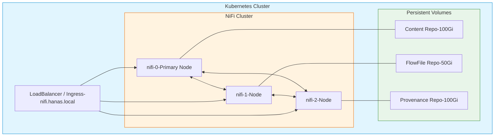

# Apache NiFi - Cấu Hình

## 1. Cấu Hình Cơ Bản (nifi.properties)

### Web Server

```properties
# HTTPS (NiFi 2.x bắt buộc HTTPS)
nifi.web.https.host=0.0.0.0
nifi.web.https.port=8443

# Proxy settings cho Ingress
nifi.web.proxy.host=nifi.hanas.local
nifi.web.proxy.context.path=/
```

### Repository Paths

```properties
# Content Repository — lưu nội dung FlowFile
nifi.content.repository.directory.default=/opt/nifi/nifi-current/content_repository

# FlowFile Repository — metadata của FlowFile đang xử lý  
nifi.flowfile.repository.directory=/opt/nifi/nifi-current/flowfile_repository

# Provenance Repository — audit trail
nifi.provenance.repository.directory.default=/opt/nifi/nifi-current/provenance_repository
nifi.provenance.repository.max.storage.time=30 days
nifi.provenance.repository.max.storage.size=10 GB

# State management
nifi.state.management.embedded.zookeeper.start=false
```

### JVM Settings (bootstrap.conf)

```properties
# JVM Heap — khuyến nghị 4-8 GB cho production
java.arg.2=-Xms4g
java.arg.3=-Xmx8g

# GC settings (G1GC recommended cho NiFi 2.x + Java 21)
java.arg.13=-XX:+UseG1GC
java.arg.14=-XX:MaxGCPauseMillis=200
```

---

## 2. Cấu Hình Cluster

### NiFi 2.x Native Kubernetes Cluster

NiFi 2.x hỗ trợ Kubernetes native cluster không cần ZooKeeper:

```properties
# Cluster configuration
nifi.cluster.is.node=true
nifi.cluster.node.address=${HOSTNAME}
nifi.cluster.node.protocol.port=11443

# Kubernetes leader election (NiFi 2.x)
nifi.cluster.leader.election.implementation=kubernetes
nifi.cluster.leader.election.kubernetes.lease.prefix=nifi-leader

# Cluster flow election
nifi.cluster.flow.election.max.wait.time=1 min
nifi.cluster.flow.election.max.candidates=3
```

### Multi-Node Architecture



---

## 3. Cấu Hình Bảo Mật

### TLS/HTTPS

```properties
# Keystore (NiFi 2.x hỗ trợ PEM certificates)
nifi.security.keystore=/opt/nifi/nifi-current/conf/keystore.p12
nifi.security.keystoreType=PKCS12
nifi.security.keystorePasswd=${KEYSTORE_PASSWORD}

# Truststore
nifi.security.truststore=/opt/nifi/nifi-current/conf/truststore.p12
nifi.security.truststoreType=PKCS12
nifi.security.truststorePasswd=${TRUSTSTORE_PASSWORD}
```

### OIDC Single Sign-On (NiFi 2.x)

```properties
# OpenID Connect configuration
nifi.security.user.oidc.discovery.url=https://keycloak.hanas.local/realms/hanas/.well-known/openid-configuration
nifi.security.user.oidc.client.id=nifi
nifi.security.user.oidc.client.secret=${OIDC_CLIENT_SECRET}
nifi.security.user.oidc.preferred.jwsalgorithm=RS256
```

### Authorization Policies

```xml
<!-- authorizations.xml -->
<policies>
  <!-- Admin group - full access -->
  <policy identifier="admin-policy" resource="/" action="R">
    <group identifier="admin-group" />
  </policy>
  
  <!-- DE team - read/write data flows -->
  <policy identifier="de-policy" resource="/process-groups" action="RW">
    <group identifier="de-team" />
  </policy>
  
  <!-- Read-only users - monitor only -->
  <policy identifier="viewer-policy" resource="/flow" action="R">
    <group identifier="viewers" />
  </policy>
</policies>
```

---

## 4. Controller Services

### 4.1 DBCP Connection Pool — Dremio

```
Service: DBCPConnectionPoolLookup
├── Service Name: DremioJDBC
├── Database Connection URL: jdbc:dremio:direct=dremio-master:31010
├── Database Driver Class Name: com.dremio.jdbc.Driver
├── Database Driver Location: /opt/nifi/nifi-current/drivers/dremio-jdbc-driver.jar
├── Database User: ${dremio.username}
├── Max Wait Time: 500 millis
└── Max Total Connections: 20
```

### 4.2 DBCP Connection Pool — PostgreSQL (Source DB)

```
Service: DBCPConnectionPool
├── Service Name: PostgreSQL_Source
├── Database Connection URL: jdbc:postgresql://<host>:5432/<database>
├── Database Driver Class Name: org.postgresql.Driver
├── Database Driver Location: /opt/nifi/nifi-current/drivers/postgresql-42.7.jar
├── Database User: ${pg.username}
├── Max Wait Time: 500 millis
└── Max Total Connections: 10
```

### 4.3 AWS Credentials Provider — MinIO/S3

```
Service: AWSCredentialsProviderControllerService
├── Service Name: MinIO_Credentials
├── Access Key ID: ${minio.access.key}
├── Secret Access Key: ${minio.secret.key}
├── Use Default Credentials: false
└── Use Anonymous Credentials: false
```

### 4.4 Record Writer/Reader

```
Service: JsonRecordSetWriter
├── Service Name: JsonWriter
├── Schema Write Strategy: Set 'avro.schema' Attribute
└── Output Grouping: OUTPUT_ARRAY

Service: JsonTreeReader  
├── Service Name: JsonReader
└── Schema Access Strategy: Infer Schema
```

---

## 5. Parameter Contexts

Parameter Contexts cho phép tham số hóa cấu hình, sử dụng cú pháp `#{parameter_name}` trong properties:

### Hanas Project Parameters

| Parameter | Mô Tả | Ví Dụ |
|-----------|--------|-------|
| `p_s3_endpoint` | MinIO/S3 endpoint URL | `http://minio.storage.svc:9000` |
| `p_s3_bucket` | Bucket name | `data` |
| `p_backup_start_date` | Ngày bắt đầu backup | `2024-01-01` |
| `p_dremio_host` | Dremio JDBC host | `dremio-master:31010` |
| `p_kafka_brokers` | Kafka bootstrap servers | `hanas-kafka-kafka-bootstrap:9092` |

### Sử Dụng Trong Processor

```
# PutS3Object
Endpoint Override URL: #{p_s3_endpoint}
Bucket: #{p_s3_bucket}

# ExecuteSQLRecord — COPY INTO
SQL Query: COPY INTO lakehouse.landing.${pp_tenbang} 
           FROM '@Minio/#{p_s3_bucket}/warehouse/pre_landing/${pp_date}/${kafka.topic}/${filename}.json.gz'
           FILE_FORMAT 'json'
```

> **Lưu ý**: `#{param}` = Parameter Context value (resolve lúc start). `${attr}` = FlowFile attribute (resolve runtime).

---

## 6. NiFi Registry Configuration

### Kết Nối NiFi → NiFi Registry

```
NiFi UI → Controller Settings → Registry Clients → Add (+)
├── Name: Hanas NiFi Registry
├── URL: http://nifi-registry:18080
└── Type: NifiRegistryFlowRegistryClient
```

### Tạo Bucket Trên Registry

```bash
# Tạo bucket cho mỗi project
curl -X POST http://localhost:18080/nifi-registry-api/buckets \
  -H 'Content-Type: application/json' \
  -d '{"name": "hanas-platform", "description": "Hanas Data Platform flows"}'
```

### Version Control Flow

```
NiFi UI → Process Group → Right-click → Version → Start Version Control
├── Registry: Hanas NiFi Registry
├── Bucket: hanas-platform
├── Flow Name: project_template
└── Comments: Initial version
```

---

## 7. Tham Số Quan Trọng

| Tham Số | Mặc Định | Khuyến Nghị (Production) | Mô Tả |
|---------|----------|--------------------------|--------|
| `nifi.queue.backpressure.count` | 10,000 | 10,000 | Số FlowFiles tối đa trong queue |
| `nifi.queue.backpressure.size` | 1 GB | 1 GB | Dung lượng tối đa queue |
| `nifi.content.claim.max.appendable.size` | 10 MB | 50 MB | Kích thước tối đa content claim |
| `nifi.provenance.repository.max.storage.time` | 30 days | 30 days | Thời gian lưu provenance |
| `nifi.provenance.repository.max.storage.size` | 10 GB | 50 GB | Dung lượng tối đa provenance |
| `nifi.bored.yield.duration` | 10 millis | 10 millis | Yield khi processor không có việc |
| `nifi.cluster.flow.election.max.wait.time` | 5 mins | 1 min | Thời gian chờ flow election |
