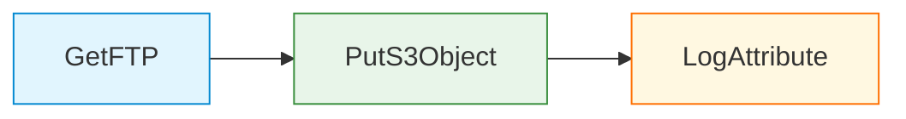
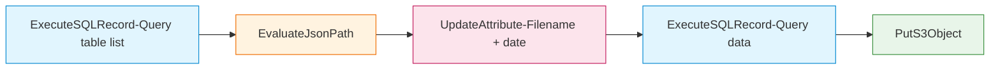
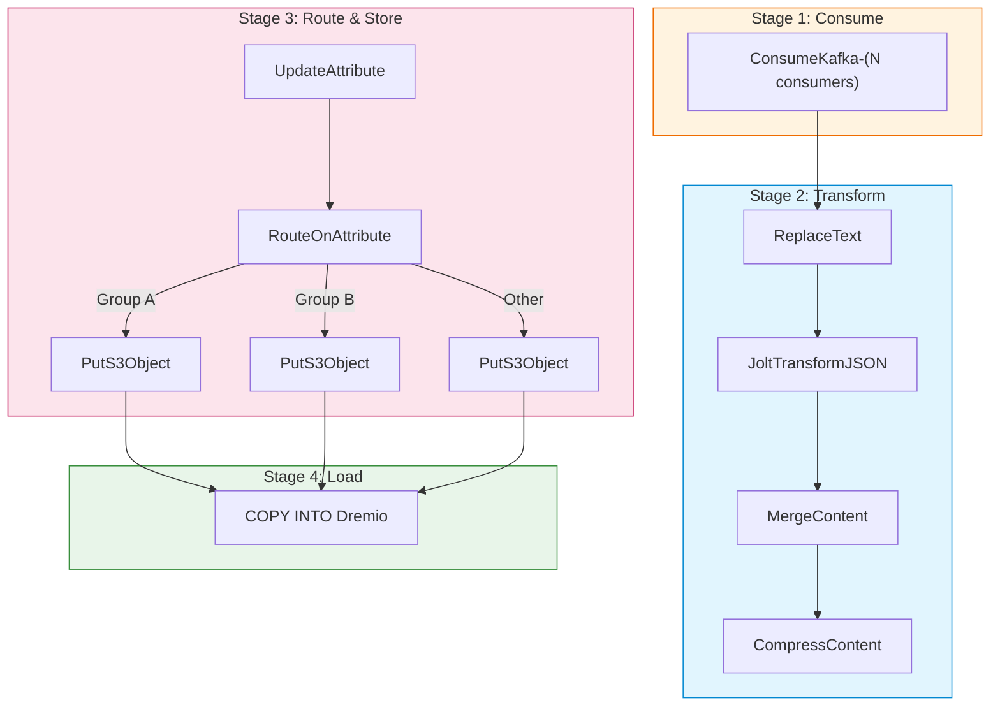
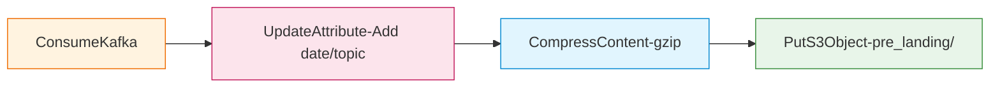

# Apache NiFi - Hướng Dẫn Sử Dụng

## 1. Truy Cập Giao Diện Web

### URL Truy Cập

| Môi Trường | URL | Tài Khoản |
|-----------|-----|-----------|
| **Development** | https://localhost:8443/nifi | admin / Hanas@NiFi2024 |
| **Kubernetes** | https://nifi.hanas.local/nifi | OIDC SSO |
| **NiFi Registry** | http://localhost:18080/nifi-registry | — |

### Navigation

NiFi 2.x UI (Angular 18) gồm các thành phần chính:

| Thành Phần | Vị Trí | Mô Tả |
|-----------|--------|--------|
| **Canvas** | Trung tâm | Khu vực thiết kế data flow |
| **Toolbar** | Trên cùng | Kéo Processor, Input/Output Port, Process Group, Funnel |
| **Operate Panel** | Trái | Start/Stop, Enable/Disable processors |
| **Navigation Panel** | Dưới trái | Minimap tổng quan flow |
| **Breadcrumb** | Trên cùng | Đường dẫn Process Group hierarchy |
| **Hamburger Menu** | Trái trên | Controller Settings, Flow Configuration History, Users |

---

## 2. Tạo Luồng Dữ Liệu (Data Flow)

### Bước 1: Tạo Process Group

```
Canvas → Drag "Process Group" icon → Đặt tên (ví dụ: "FTP_to_S3")
```

> **Best Practice**: Luôn đặt flow trong Process Group, không đặt trực tiếp trên root canvas.

### Bước 2: Thêm Processors

```
Double-click Process Group → Drag "Processor" icon → Tìm processor cần dùng
```

### Bước 3: Cấu Hình Processor

```
Right-click Processor → Configure
├── Tab SETTINGS: Name, Penalty Duration, Yield Duration
├── Tab SCHEDULING: Strategy (TIMER_DRIVEN / CRON_DRIVEN), Run Schedule, Concurrent Tasks
├── Tab PROPERTIES: Cấu hình processor-specific properties
└── Tab RELATIONSHIPS: Auto-terminate hoặc kết nối
```

### Bước 4: Kết Nối Processors

```
Hover Processor A → Kéo mũi tên → Thả vào Processor B
→ Chọn Relationship: success / failure / matched / unmatched
→ Configure Back Pressure: Object Threshold, Size Threshold
```

### Bước 5: Cấu Hình Controller Services

```
Process Group → Right-click → Configure → Controller Services tab
→ (+) Add Service → Chọn loại (DBCP, AWS Credentials, Record Writer...)
→ Configure properties → Enable (⚡ icon)
```

### Bước 6: Start Flow

```
Select all processors → Right-click → Start
Hoặc: Operate Panel → ▶ Start
```

---

## 3. Template 1 — FTP → MinIO/S3

Thu thập file từ FTP server và đẩy lên MinIO/S3.



| Processor | Property chính | Giá Trị |
|-----------|---------------|---------|
| **GetFTP** | Hostname / Port | `#{p_ftp_host}` / `21` |
| | Remote Path | `#{p_ftp_path}` |
| | Transfer Mode | `Binary` / Connection Mode: `Passive` |
| | Schedule | `50 sec`, TIMER_DRIVEN, **PRIMARY** node |
| **PutS3Object** | Bucket / Object Key | `#{p_s3_bucket}` / `warehouse/upload_file/${filename}` |
| | Endpoint Override URL | `#{p_s3_endpoint}` |
| | AWS Credentials Provider | `AWSCredentialsProvider` (Controller Service) |
| **LogAttribute** | Log Level | `info`, Log Payload: `false` |

> **Lưu ý**: Sử dụng NiFi Parameters (`#{param}`) cho các giá trị thay đổi theo môi trường.

---

## 4. Template 2 — Project Template (Backup + Landing)

Template chính trên Hanas Platform gồm 2 Process Groups: **Backup** (sao lưu dữ liệu) và **Landing** (thu thập từ Kafka vào Lakehouse).

### 4.1 Backup Process Group

Sao lưu dữ liệu từ Dremio landing tables sang MinIO/S3 theo lịch hàng ngày.



**Bước 1 — Lấy danh sách bảng** (ExecuteSQLRecord):

```sql
SELECT table_name, 
       'SELECT * FROM lakehouse.landing.' || table_name 
       || ' WHERE kafka_ldt >= timestamp ''' || '#{p_backup_start_date}' || '''' AS sql_select  
FROM information_schema."TABLES" WHERE table_schema = 'landing';
```

Schedule: `1440 min` (mỗi ngày), PRIMARY node, Output: `JsonRecordSetWriter`, 1 FlowFile/table.

**Bước 2–3 — Extract & Generate attributes**:

| Attribute | Nguồn | Ví Dụ |
|-----------|-------|-------|
| `pp_table_name` | JSONPath `$.table_name` | `tbl_users` |
| `pp_sql` | JSONPath `$.sql_select` | `SELECT * FROM lakehouse.landing.tbl_users ...` |
| `filename` | Expression Language | `20240301143000123_tbl_users` |
| `pp_date` | `${now():format('yyyyMMdd','Asia/Ho_Chi_Minh')}` | `20240301` |

**Bước 4–5 — Query & Backup**:

| Processor | Cấu Hình | Giá Trị |
|-----------|----------|---------|
| ExecuteSQLRecord | SQL / Concurrent Tasks | `${pp_sql}` / `6` |
| PutS3Object | Object Key | `/backup/${filename}` |
| | Bucket / Endpoint | `#{p_s3_bucket}` / `#{p_s3_endpoint}` |
| | Back Pressure | 10,000 objects / 10 GB |

### 4.2 Landing Process Group

Pipeline thu thập dữ liệu từ **Kafka → Transform → MinIO → Dremio Iceberg**, chia thành 4 stages:



#### Stage 1: ConsumeKafka

Tạo nhiều Kafka consumers theo nhóm topic. Cấu hình chung:

```
Kafka Brokers:     #{p_kafka_broker}
SASL Username:     #{p_kafka_user}
Schedule:          0 sec (TIMER_DRIVEN — liên tục)
Retry Count:       10
```

> **Tip**: Tạo N consumers tùy throughput. Đặt `Execution: ALL` cho consumer chính, `PRIMARY` cho reference/low-volume topics.

#### Stage 2: Transform Pipeline

| Processor | Vai trò | Cấu hình quan trọng |
|-----------|---------|---------------------|
| **ReplaceText** | Xóa 5-byte schema prefix từ Kafka message | Regex: `(?s)^\\x00.{4}` → *(empty)*, Concurrent: `5` |
| **JoltTransformJSON** | Transform JSON structure | Concurrent: `10`, Back Pressure: **1M objects / 5 GB** |
| **MergeContent** | Gom records thành JSON array (bin-packing) | Min/Max Size: `112–500 MB`, Entries: `1K–10K`, Max Bin Age: `30 min`, Correlation: `kafka.topic`, Header/Footer: `[`/`]`, Demarcator: `,` |
| **CompressContent** | Nén gzip trước khi lưu S3 | Format: `gzip`, Level: `1` (fastest) |

#### Stage 3: Route & Store

**UpdateAttribute** — Tạo routing attribute và tên bảng động:

```
# Routing — phân loại topic vào group (tuỳ chỉnh theo project)
pp_kafka_group_route = ${kafka.topic:matches('<pattern_group_b>'):ifElse('GROUP_B',
                        ${kafka.topic:matches('<pattern_group_a>'):ifElse('GROUP_A','OTHER')})}

# Tên bảng Dremio — map topic sang table name (tuỳ chỉnh theo project)
pp_tenbang = ${kafka.topic:toLower():prepend('<project_prefix>_')}

# Timestamp attributes
filename   = ${kafka.topic}_${now():format('yyyyMMddHHmmssSSS','Asia/Ho_Chi_Minh')}_${uuid}
pp_date    = ${now():format('yyyyMMdd','Asia/Ho_Chi_Minh')}
```

**RouteOnAttribute** — Phân luồng theo `pp_kafka_group_route`:

| Route | Expression | Đích |
|-------|-----------|------|
| GROUP_A | `${pp_kafka_group_route:equals('GROUP_A')}` | PutS3Object → COPY INTO |
| GROUP_B | `${pp_kafka_group_route:equals('GROUP_B')}` | PutS3Object → COPY INTO |
| OTHER | `${pp_kafka_group_route:equals('OTHER')}` | PutS3Object → COPY INTO |

#### Stage 4: PutS3Object → COPY INTO Dremio

Mỗi route group có cặp processor: **PutS3Object** → **ExecuteSQLRecord (COPY INTO)**.

**Lưu S3:**
```
Object Key:  /warehouse/pre_landing/${pp_date}/${kafka.topic}/${filename}.json.gz
Bucket:      #{p_s3_bucket}
Endpoint:    #{p_s3_endpoint}
```

**Load vào Dremio:**
```sql
COPY INTO lakehouse.landing.${pp_tenbang} 
FROM '@Minio/#{p_s3_bucket}/warehouse/pre_landing/${pp_date}/${kafka.topic}/${filename}.json.gz'
FILE_FORMAT 'json'
```

| Cấu Hình | Giá Trị |
|----------|---------|
| Schedule | `0 0/5 4-23 ? * *` (CRON — mỗi 5 phút, 4h–23h) |
| Retry Count | 3, Backoff max 3 mins |

#### Tổng Kết

```
Kafka → ConsumeKafka (N consumers)
  → ReplaceText (strip schema prefix)
    → JoltTransformJSON
      → MergeContent (bin-pack 1K–10K records)
        → CompressContent (gzip)
          → RouteOnAttribute (phân group)
            → PutS3Object (MinIO)
              → COPY INTO lakehouse.landing.<table>
```

---

## 5. Tích Hợp NiFi ↔ Kafka

### 5.1 ConsumeKafka — Đọc Từ Kafka

```
Processor: ConsumeKafka
├── Kafka Brokers: hanas-kafka-kafka-bootstrap:9092
├── Topic Name(s): ORACLE.DEMO_LAKE.TBL_TRANSACTION
├── Group ID: nifi-consumer-group
├── Output Strategy: Use Content as Value
├── Message Demarcator: (empty — 1 FlowFile per message)
├── Security Protocol: PLAINTEXT
└── Auto Offset Reset: earliest
```

**Luồng hoàn chỉnh: Kafka → NiFi → MinIO**



### 5.2 PublishKafka — Ghi Lên Kafka  

```
Processor: PublishKafka
├── Kafka Brokers: hanas-kafka-kafka-bootstrap:9092
├── Topic Name: processed-data
├── Delivery Guarantee: Guarantee Replicated Delivery
├── Compression Type: snappy
├── Message Key Field: (optional — set record key)
└── Security Protocol: PLAINTEXT
```

---

## 6. Giám Sát & Quản Lý

### 6.1 Flow Metrics

Trên mỗi connection (queue) giữa processors, NiFi hiển thị:

| Metric | Ý Nghĩa |
|--------|---------|
| **Queued** | Số FlowFiles đang chờ xử lý |
| **In** | Tốc độ FlowFile đi vào (files/sec, bytes/sec) |
| **Out** | Tốc độ FlowFile đi ra |
| **Read/Written** | Bytes đọc/ghi bởi processor |
| **Tasks/Time** | Số tasks đã chạy / thời gian trung bình |

### 6.2 Data Provenance

```
Right-click Processor → View Data Provenance
```

Provenance cho phép:
- Xem toàn bộ hành trình của mỗi FlowFile
- Tra cứu theo thời gian, processor, FlowFile UUID
- Xem nội dung FlowFile tại mỗi bước
- Download FlowFile content để debug

### 6.3 Bulletin System

```
NiFi UI → Top-right corner → Bulletin Board
```

- **WARNING** (vàng): Connection timeout, slow processing
- **ERROR** (đỏ): Processor failure, connection refused
- View chi tiết: Right-click Processor → View Status History

---

## 7. Chạy Lại Pipeline (Replay)

### Replay Từ Provenance

```
1. View Data Provenance → Tìm FlowFile cần replay
2. Click icon "Replay" (↻)  
3. FlowFile sẽ được đưa lại vào đầu processor để xử lý lại
```

### Replay Từ Queue

```
1. Right-click Connection (queue) → List Queue
2. Chọn FlowFile cần xử lý lại
3. FlowFile vẫn nằm trong queue chờ processor xử lý
```

### Retry Tự Động

Cấu hình retry trên mỗi processor:

| Cấu Hình | Khuyến Nghị | Mô Tả |
|----------|-------------|--------|
| Retry Count | 3–10 | Số lần retry |
| Retried Relationships | `failure` | Relationships sẽ retry |
| Backoff Mechanism | `PENALIZE_FLOWFILE` | Penalize FlowFile trước khi retry |
| Max Backoff Period | `3 mins` — `10 mins` | Thời gian chờ tối đa giữa retries |
