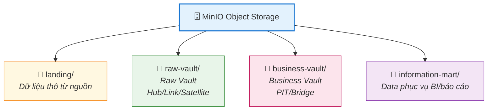

# Lớp Lưu Trữ Dữ Liệu (Data Storage)

## Tổng Quan

Lớp lưu trữ dữ liệu là nền tảng lưu trữ tập trung cho toàn bộ Data Lakehouse, đảm bảo khả năng lưu trữ dữ liệu lớn, đa dạng và mở rộng linh hoạt.

| Thành phần | Vai trò |
|---|---|
| **MinIO** | Object Storage phân tán, S3-compatible, lưu trữ vật lý |
| **Apache Iceberg** | Open Table Format, quản lý bảng transactional trên Data Lake |
| **Apache Polaris** | REST Catalog cho Iceberg, quản lý metadata tập trung, RBAC, credential vending |

## Tổ Chức Vùng Dữ Liệu

| Vùng | Mục đích | Nội dung |
|------|----------|----------|
| **landing/** | Dữ liệu thô từ nguồn | Files gốc từ NiFi/Kafka |
| **raw-vault/** | Raw Vault | Hub, Link, Satellite tables |
| **business-vault/** | Business Vault | PIT, Bridge, Business Satellite |
| **information-mart/** | Data Mart | Star Schema, Wide Tables cho BI |

## Services

- [MinIO](minio/README.md) — Object Storage
- [Apache Iceberg](apache-iceberg/README.md) — Open Table Format
- [Apache Polaris](data-catalog/README.md) — Data Catalog (REST Catalog cho Iceberg)
