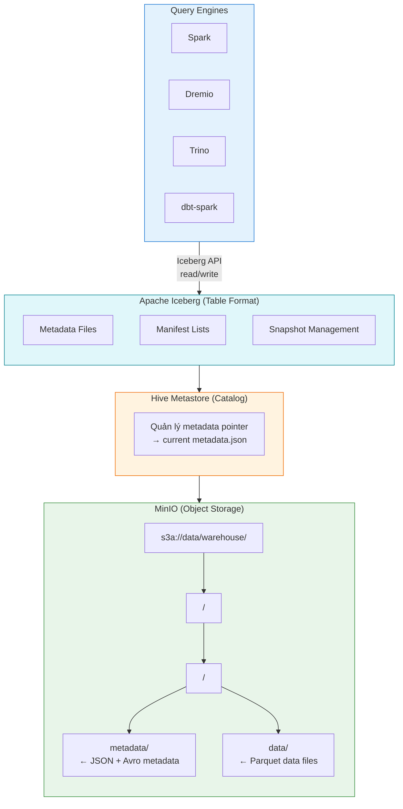

# Apache Iceberg

## Tổng Quan

Apache Iceberg là định dạng bảng mở (open table format) cho Data Lake/Lakehouse, hỗ trợ quản lý dữ liệu quy mô lớn với ACID transactions, time travel và schema evolution.

Trong Hanas Data Platform, Iceberg là **lớp table format** nằm giữa compute engine (Spark) và object storage (MinIO), cung cấp quản lý bảng transactional trên Data Lake.

## Kiến Trúc Trong Platform

## Vai Trò Trong Platform

- **Quản lý bảng transactional** trên MinIO với ACID guarantees
- **Multi-engine access**: Spark, Dremio, Trino đều đọc/ghi cùng bảng
- **Time travel**: Truy vấn dữ liệu tại thời điểm quá khứ, rollback khi cần
- **Schema evolution**: Thay đổi cấu trúc bảng không cần rewrite dữ liệu
- **Hidden partitioning**: Tối ưu truy vấn tự động, user không cần biết partition layout
- **Table maintenance tự động**: Compaction, snapshot expiration qua Airflow DAG

## Tính Năng Chính

| Tính năng | Mô tả |
|---|---|
| **ACID Transactions** | Snapshot-based isolation, concurrent read/write an toàn |
| **Time Travel** | Truy vấn/rollback snapshot bất kỳ |
| **Schema Evolution** | Thêm/xóa/đổi tên/reorder cột mà không rewrite data |
| **Hidden Partitioning** | Partition transforms (year, month, day, hour, bucket, truncate) |
| **Partition Evolution** | Thay đổi partition scheme mà không rewrite data |
| **Row-level Deletes** | Format V2: position deletes, equality deletes |
| **Metadata Pruning** | File-level min/max statistics, partition pruning |
| **Multi-engine** | Spark, Dremio, Trino, Flink, Hive |

## Catalogs Trong Platform

| Catalog | Type | Vai trò |
|---|---|---|
| `demo` (default) | Hive | Raw Vault, Business Vault, Data Mart |
| `LakeHouse` | Hive | ETL admin logging (`etladmin`) |
| `spark_catalog` | Hive | Default Spark catalog (non-Iceberg tables) |

> **Lưu ý:** Tất cả catalogs sử dụng Hive Metastore làm backend và `S3FileIO` để đọc/ghi file trên MinIO.

## Tài Liệu

- [Cài đặt & Triển khai](installation.md)
- [Cấu hình](configuration.md)
- [Hướng dẫn sử dụng](user-guide.md)
- [Best Practices](best-practices.md)
- [Thông tin Version](version-info.md)
