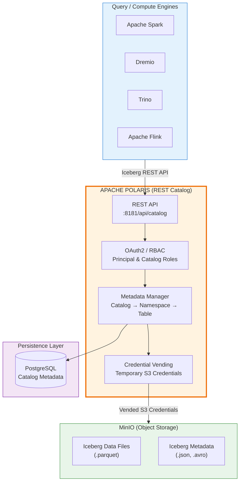
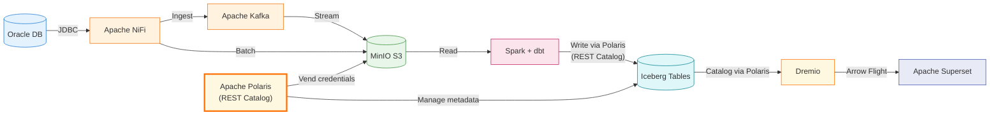

# Apache Polaris (Data Catalog)

## Tổng Quan

Apache Polaris là **dịch vụ catalog mã nguồn mở** dành riêng cho Apache Iceberg, triển khai đầy đủ Iceberg REST API. Polaris cung cấp quản lý metadata tập trung, phân quyền chi tiết (RBAC), credential vending, và khả năng tương tác đa engine — cho phép nhiều công cụ xử lý dữ liệu (Spark, Dremio, Trino, Flink) cùng truy cập một bản sao dữ liệu duy nhất một cách an toàn.

Trong Hanas Data Platform, Polaris đóng vai trò là **lớp catalog tập trung** trong Layer 2 (Lưu Trữ), thay thế/bổ sung Hive Metastore làm REST Catalog cho toàn bộ Iceberg tables trên MinIO. Polaris quản lý metadata pointer, kiểm soát truy cập, và cấp phát credentials tạm thời cho các compute engines.

> **Lưu ý:** Apache Polaris đã tốt nghiệp (graduated) thành top-level project của Apache Software Foundation vào tháng 2/2026, khẳng định sự trưởng thành về kỹ thuật và quản trị cộng đồng.

## Kiến Trúc Trong Platform

## Vai Trò Trong Platform

| # | Vai trò | Mô tả |
|---|---|---|
| 1 | **REST Catalog** | Catalog tập trung triển khai Iceberg REST API, thay thế Hive Metastore thrift protocol |
| 2 | **Metadata Management** | Quản lý metadata pointer (current metadata.json), schema versions, partition layout |
| 3 | **RBAC** | Phân quyền 2 lớp: Principal Roles → Catalog Roles → Privileges (table/namespace/catalog level) |
| 4 | **Credential Vending** | Cấp phát temporary credentials cho engines truy cập MinIO, không cần hardcode credentials |
| 5 | **Multi-engine Interop** | Spark, Dremio, Trino, Flink cùng đọc/ghi Iceberg tables qua API chuẩn |
| 6 | **Catalog Federation** | Tích hợp external catalogs (Hive Metastore, Glue) vào Polaris dưới dạng read-only |
| 7 | **Generic Table API** | Hỗ trợ đăng ký table formats khác ngoài Iceberg (Delta, Hudi) |

## Tính Năng Chính

| Tính năng | Mô tả |
|---|---|
| **Iceberg REST Catalog** | Triển khai đầy đủ Iceberg REST API specification |
| **OAuth2 Authentication** | Xác thực qua client credentials (client_id:client_secret) |
| **Role-Based Access Control** | Principal Roles, Catalog Roles, granular privileges (TABLE_READ_DATA, NAMESPACE_CREATE, ...) |
| **Credential Vending** | Cấp phát short-lived S3/MinIO credentials cho engines (X-Iceberg-Access-Delegation) |
| **Catalog Federation** | Federate Hive Metastore, Glue, external Iceberg catalogs |
| **Multi-Cloud Storage** | Hỗ trợ S3, Azure Blob, GCS, MinIO |
| **Generic Tables** | Đăng ký non-Iceberg table formats (GA từ v1.3) |
| **PostgreSQL Persistence** | Lưu trữ catalog metadata bền vững qua JDBC |
| **Helm Chart** | Official Helm chart cho Kubernetes deployment |
| **REST Management API** | API quản lý catalogs, principals, roles, privileges |
| **Iceberg Metrics Reporting** | Thu thập metrics từ Iceberg operations |
| **Open Policy Agent** | Tích hợp OPA cho advanced authorization (tùy chọn) |

## So Sánh Với Hive Metastore

| Tiêu chí | Hive Metastore | Apache Polaris |
|---|---|---|
| **Protocol** | Thrift (binary) | REST API (HTTP/JSON) |
| **Authentication** | Kerberos/LDAP | OAuth2 (client credentials) |
| **Authorization** | Không có built-in | RBAC 2 lớp (Principal + Catalog Roles) |
| **Credential Vending** | Không | Có (temporary S3 credentials) |
| **Multi-engine** | Có (qua Thrift) | Có (qua REST — chuẩn hơn) |
| **Catalog Federation** | Không | Có (Hive, Glue, external) |
| **Cloud-native** | Không | Có (Helm, K8s-ready) |
| **Maintenance** | Cần RDBMS + Thrift server | Cần PostgreSQL + Quarkus server |

## Luồng Dữ Liệu End-to-End

**Luồng chi tiết:**

1. **NiFi** thu thập dữ liệu từ Oracle → đẩy qua **Kafka** (streaming) hoặc trực tiếp vào **MinIO** (batch)
2. **Spark** kết nối **Polaris** qua REST Catalog API → ghi **Iceberg tables** trên MinIO
3. **Polaris** quản lý metadata pointer, cấp phát credentials tạm thời cho Spark truy cập MinIO
4. **dbt** xây dựng Data Vault (Hub/Link/Satellite) và Data Mart trên Iceberg qua Spark
5. **Dremio** đọc Iceberg tables qua **Polaris** REST Catalog → tạo Virtual Datasets
6. **Superset** kết nối Dremio qua Arrow Flight → trực quan hóa dashboards

## Tích Hợp Với Các Service

| Service | Tích hợp | Chi tiết |
|---|---|---|
| **MinIO (S3)** | Object Storage | Polaris quản lý metadata, vends credentials cho engines truy cập data trên `s3a://data/warehouse/` |
| **Apache Iceberg** | Table Format | Polaris là REST Catalog cho Iceberg, quản lý metadata pointer, snapshots, schema |
| **Apache Spark** | Compute Engine | Spark kết nối Polaris qua `RESTCatalog` impl, sử dụng vended credentials |
| **Dremio** | Federation | Dremio thêm Polaris làm Iceberg REST catalog source |
| **dbt** | Data Modeling | dbt-spark sử dụng Polaris catalog qua Spark session |
| **Apache Airflow** | Orchestration | REST API để tự động tạo catalogs, namespaces, quản lý RBAC |
| **DataHub** | Governance | Metadata sync từ Polaris catalogs vào DataHub |
| **Apache Ranger** | Security | Polaris RBAC + Ranger policies tạo defense-in-depth |
| **HashiCorp Vault** | Secrets | Lưu trữ Polaris credentials, PostgreSQL passwords trong Vault |
| **OpenObserve** | Monitoring | Giám sát Polaris pods (logs, metrics, health checks) |
| **Apache Kafka** | Streaming | Kafka stream → MinIO → Iceberg tables managed by Polaris |
| **Apache NiFi** | Ingestion | NiFi thu thập dữ liệu nguồn → MinIO → Polaris-managed Iceberg tables |

## Tài Liệu

- [Cài đặt & Triển khai](installation.md) — System requirements, Helm chart, Docker Compose
- [Cấu hình](configuration.md) — Server, persistence, storage, RBAC, engine integration
- [Hướng dẫn sử dụng](user-guide.md) — Catalog management, RBAC, Spark/Dremio integration, REST API
- [Best Practices](best-practices.md) — Production deployment, security, performance, migration
- [Thông tin Version](version-info.md) — Version matrix, compatibility, changelog
