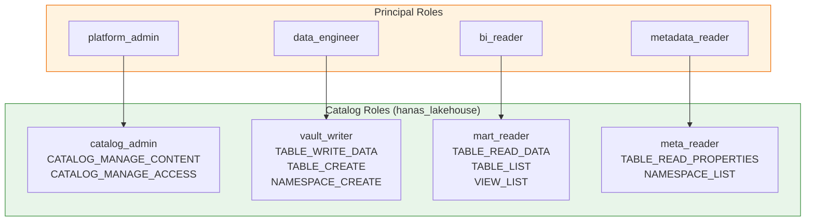
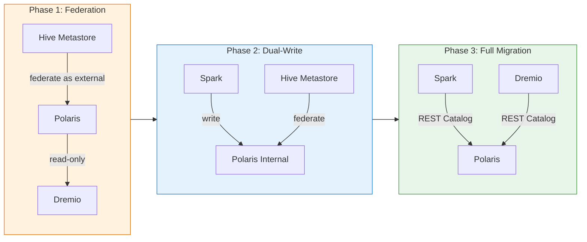

# Apache Polaris - Best Practices

## Production Deployment

### High Availability

| Khuyến nghị | Chi tiết |
|---|---|
| **Replicas** | Tối thiểu 2 replicas cho Polaris server |
| **Pod Disruption Budget** | minAvailable: 1 để đảm bảo availability khi rolling update |
| **PostgreSQL HA** | Sử dụng PostgreSQL cluster (Patroni/CloudNativePG) với standby replicas |
| **Load Balancer** | Đặt load balancer trước Polaris pods cho traffic distribution |
| **Anti-Affinity** | Spread Polaris pods across nodes để tránh single point of failure |

```yaml
# Topology spread constraints (Helm values)
topologySpreadConstraints:
  - maxSkew: 1
    topologyKey: kubernetes.io/hostname
    whenUnsatisfiable: DoNotSchedule
    labelSelector:
      matchLabels:
        app: polaris

podDisruptionBudget:
  enabled: true
  minAvailable: 1
```

### Resource Sizing

| Quy mô | CPU Request | Memory Request | CPU Limit | Memory Limit | PostgreSQL |
|---|---|---|---|---|---|
| **Dev/Test** | 250m | 512Mi | 1000m | 2Gi | 1 CPU, 2GB RAM |
| **Small** ( less than 1000 tables) | 500m | 1Gi | 2000m | 4Gi | 2 CPU, 4GB RAM |
| **Medium** ( 1000 to 10000 tables) | 1000m | 2Gi | 4000m | 8Gi | 4 CPU, 8GB RAM |
| **Large** ( over 10000 tables) | 2000m | 4Gi | 8000m | 16Gi | 8 CPU, 16GB RAM |

### PostgreSQL Tuning

```sql
-- Khuyến nghị cho production
ALTER SYSTEM SET max_connections = 200;
ALTER SYSTEM SET shared_buffers = '2GB';
ALTER SYSTEM SET effective_cache_size = '6GB';
ALTER SYSTEM SET work_mem = '64MB';
ALTER SYSTEM SET maintenance_work_mem = '512MB';
ALTER SYSTEM SET checkpoint_completion_target = 0.9;
ALTER SYSTEM SET wal_buffers = '64MB';
ALTER SYSTEM SET random_page_cost = 1.1;   -- SSD storage
```

---

## Security Best Practices

### RBAC Design Principles

1. **Principle of Least Privilege**: Chỉ cấp quyền tối thiểu cần thiết
2. **Separation of Concerns**: Tách biệt roles cho ETL, BI, admin
3. **Service Accounts**: Mỗi service có principal riêng (spark-etl, dremio-query, etc.)
4. **No Shared Credentials**: Không chia sẻ client_id/secret giữa các services

### RBAC Design Cho Hanas Platform



### Credential Management

| Practice | Chi tiết |
|---|---|
| **Rotate Credentials** | Rotate principal credentials định kỳ (mỗi 90 ngày) |
| **Use Vault** | Lưu trữ client_id/secret trong HashiCorp Vault |
| **Credential Vending** | Bật credential vending (X-Iceberg-Access-Delegation) để engines không cần hardcode S3 credentials |
| **Token Expiry** | Cấu hình token expiry phù hợp (mặc định 1 giờ) |
| **Network Policies** | Giới hạn access đến Polaris API qua K8s Network Policies |

```bash
# Rotate credentials cho principal
curl -s -X POST \
  "http://polaris:8181/api/management/v1/principals/spark-etl/rotate" \
  -H "Authorization: Bearer $TOKEN" | jq .
# Response chứa client_id và client_secret MỚI
```

### Network Security

```yaml
# Kubernetes Network Policy
apiVersion: networking.k8s.io/v1
kind: NetworkPolicy
metadata:
  name: polaris-network-policy
  namespace: polaris
spec:
  podSelector:
    matchLabels:
      app: polaris
  policyTypes:
    - Ingress
  ingress:
    # Chỉ cho phép từ Spark, Dremio, Airflow namespaces
    - from:
        - namespaceSelector:
            matchLabels:
              name: spark
        - namespaceSelector:
            matchLabels:
              name: dremio
        - namespaceSelector:
            matchLabels:
              name: airflow
      ports:
        - protocol: TCP
          port: 8181
```

---

## Performance Best Practices

### Connection Management

| Practice | Chi tiết |
|---|---|
| **Connection Pooling** | Cấu hình PostgreSQL connection pool (min=5, max=20) |
| **Token Refresh** | Bật `token-refresh-enabled=true` cho Spark/Dremio để tránh reconnect |
| **Keep-Alive** | Bật HTTP keep-alive cho REST connections |
| **Caching** | Engines cache table metadata locally, giảm tải cho Polaris |

### Catalog Organization

| Practice | Chi tiết |
|---|---|
| **Namespace Hierarchy** | Tổ chức rõ ràng: `raw_vault`, `business_vault`, `information_mart` |
| **Naming Conventions** | Tuân thủ [Naming Conventions](../../04-data-model/naming-conventions.md) |
| **Table Properties** | Đặt properties phù hợp (write.format.default, write.target-file-size-bytes) |
| **Allowed Locations** | Giới hạn storage locations trong catalog config để tránh data sprawl |

---

## Migration Từ Hive Metastore

### Chiến Lược Migration

Polaris hỗ trợ **catalog federation** cho phép migration dần dần:



**Các bước:**

1. **Phase 1 — Federation**: Federate Hive Metastore hiện tại vào Polaris dưới dạng external catalog. Dremio/Spark đọc từ Polaris, Polaris đọc metadata từ HMS.
2. **Phase 2 — Dual-Write**: Tạo internal catalog mới trong Polaris. Spark ETL mới ghi vào Polaris internal catalog. HMS vẫn hoạt động cho tables cũ.
3. **Phase 3 — Full Migration**: Migrate tất cả tables sang Polaris internal catalog. Decommission Hive Metastore. Tất cả engines sử dụng Polaris REST Catalog.

---

## Backup & Disaster Recovery

### PostgreSQL Backup

```bash
# Backup Polaris database
pg_dump -h <POSTGRES_HOST> -U polaris -d polaris \
  --format=custom --file=polaris_backup_$(date +%Y%m%d).dump

# Restore
pg_restore -h <POSTGRES_HOST> -U polaris -d polaris \
  polaris_backup_20260304.dump
```

### Automated Backup (CronJob)

```yaml
apiVersion: batch/v1
kind: CronJob
metadata:
  name: polaris-db-backup
  namespace: polaris
spec:
  schedule: "0 2 * * *"  # Mỗi ngày lúc 2:00 AM
  jobTemplate:
    spec:
      template:
        spec:
          containers:
            - name: backup
              image: postgres:16-alpine
              command:
                - /bin/sh
                - -c
                - |
                  pg_dump -h $PGHOST -U $PGUSER -d polaris \
                    --format=custom \
                    --file=/backup/polaris_$(date +%Y%m%d_%H%M%S).dump
              env:
                - name: PGHOST
                  value: "postgres-svc"
                - name: PGUSER
                  valueFrom:
                    secretKeyRef:
                      name: polaris-db-credentials
                      key: username
                - name: PGPASSWORD
                  valueFrom:
                    secretKeyRef:
                      name: polaris-db-credentials
                      key: password
              volumeMounts:
                - name: backup-volume
                  mountPath: /backup
          restartPolicy: OnFailure
          volumes:
            - name: backup-volume
              persistentVolumeClaim:
                claimName: polaris-backup-pvc
```

### Recovery Checklist

| Step | Hành động |
|---|---|
| 1 | Restore PostgreSQL database từ backup |
| 2 | Verify Polaris health: `curl /q/health/ready` |
| 3 | Verify catalogs: `GET /api/management/v1/catalogs` |
| 4 | Verify Spark connectivity |
| 5 | Verify Dremio source connection |
| 6 | Verify RBAC: test với non-root principal |

> **Lưu ý:** Polaris chỉ lưu **metadata** (pointers đến Iceberg metadata files). Data files trên MinIO được backup riêng qua MinIO Site Replication hoặc Velero.
