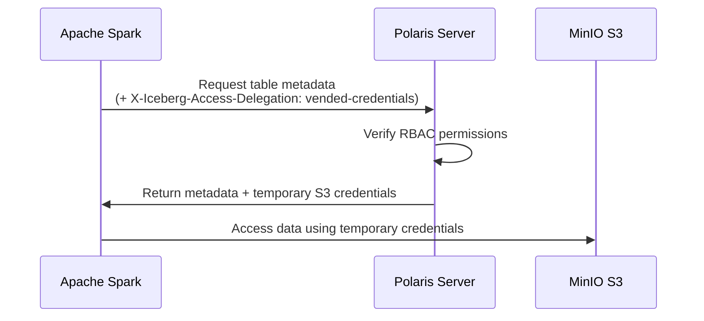
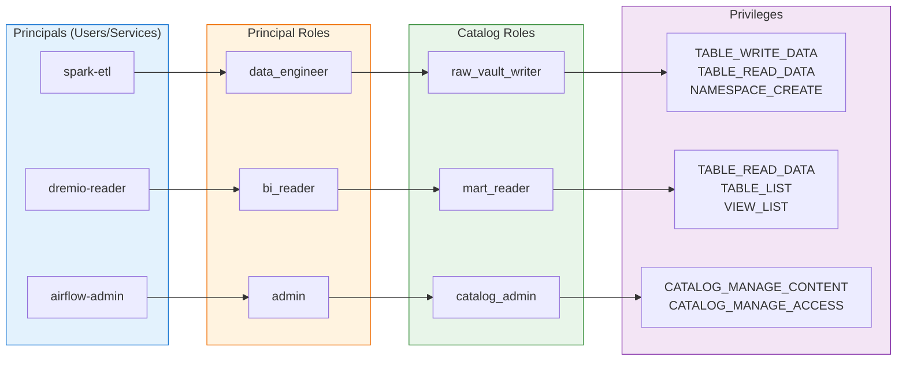

# Apache Polaris - Cấu Hình

## Server Configuration

Apache Polaris sử dụng Quarkus framework. Cấu hình server thông qua environment variables hoặc `application.properties`.

### Cấu Hình Cơ Bản

| Cấu hình | Giá trị mặc định | Mô tả |
|---|---|---|
| `quarkus.http.port` | `8181` | Port cho REST API |
| `quarkus.management.port` | `8182` | Port cho management (health, metrics) |
| `quarkus.log.level` | `INFO` | Log level |

### Environment Variables (Kubernetes)

```yaml
# Trong Helm values hoặc deployment manifest
env:
  # Server
  - name: QUARKUS_HTTP_PORT
    value: "8181"
  - name: QUARKUS_LOG_LEVEL
    value: "INFO"

  # Persistence
  - name: QUARKUS_DATASOURCE_JDBC_URL
    value: "jdbc:postgresql://postgres-svc:5432/polaris"
  - name: QUARKUS_DATASOURCE_USERNAME
    valueFrom:
      secretKeyRef:
        name: polaris-db-credentials
        key: username
  - name: QUARKUS_DATASOURCE_PASSWORD
    valueFrom:
      secretKeyRef:
        name: polaris-db-credentials
        key: password

  # Bootstrap
  - name: POLARIS_BOOTSTRAP_CREDENTIALS
    value: "POLARIS,root,$(POLARIS_CLIENT_SECRET)"
```

---

## Persistence (PostgreSQL)

Polaris lưu trữ tất cả catalog metadata trong PostgreSQL. Đây là **component bắt buộc** cho production.

### Cấu Hình PostgreSQL

```properties
# application.properties hoặc environment variables
quarkus.datasource.db-kind=postgresql
quarkus.datasource.jdbc.url=jdbc:postgresql://<POSTGRES_HOST>:5432/polaris
quarkus.datasource.username=polaris
quarkus.datasource.password=<PASSWORD>

# Connection pool
quarkus.datasource.jdbc.min-size=5
quarkus.datasource.jdbc.max-size=20
quarkus.datasource.jdbc.acquisition-timeout=30s
```

### PostgreSQL Requirements

| Yêu cầu | Giá trị khuyến nghị |
|---|---|
| **Version** | PostgreSQL 14+ |
| **Storage** | 10GB+ (tùy số lượng tables) |
| **Connections** | max_connections ≥ 100 |
| **Extensions** | Không yêu cầu extension đặc biệt |

> **Lưu ý:** In-memory persistence (`polaris.persistence.type=in-memory`) chỉ dùng cho development. Không sử dụng trong production vì dữ liệu mất khi restart.

---

## Storage Configuration (MinIO / S3)

Polaris cần cấu hình storage backend để biết nơi lưu trữ Iceberg data files.

### Cấu Hình MinIO cho Hanas Platform

```properties
# S3-compatible storage (MinIO)
polaris.storage.type=s3
polaris.storage.s3.endpoint=http://<MINIO_HOST>:9000
polaris.storage.s3.region=us-east-1
polaris.storage.s3.path-style-access=true
```

### MinIO Bucket Structure

```
data/                          # MinIO bucket
└── warehouse/                 # Base location
    ├── raw-vault/             # Raw Vault tables
    │   ├── hub_customer/
    │   ├── link_order/
    │   └── sat_customer/
    ├── business-vault/        # Business Vault tables
    │   ├── pit_customer/
    │   └── bridge_order/
    └── information-mart/      # Data Mart tables
        ├── dim_customer/
        └── fact_sales/
```

### Credential Vending

Polaris hỗ trợ **credential vending** — cấp phát temporary S3 credentials cho compute engines thay vì engines tự cấu hình credentials:



---

## RBAC Configuration

Polaris sử dụng mô hình RBAC 2 lớp để kiểm soát truy cập:

### Mô Hình RBAC



### Danh Sách Privileges

| Privilege | Scope | Mô tả |
|---|---|---|
| `CATALOG_MANAGE_CONTENT` | Catalog | Quản lý toàn bộ nội dung catalog |
| `CATALOG_MANAGE_ACCESS` | Catalog | Quản lý RBAC cho catalog |
| `NAMESPACE_CREATE` | Catalog/Namespace | Tạo namespace mới |
| `NAMESPACE_LIST` | Catalog/Namespace | Liệt kê namespaces |
| `NAMESPACE_READ_PROPERTIES` | Namespace | Đọc namespace properties |
| `TABLE_CREATE` | Namespace | Tạo table mới |
| `TABLE_LIST` | Namespace | Liệt kê tables |
| `TABLE_READ_DATA` | Table | Đọc dữ liệu table |
| `TABLE_WRITE_DATA` | Table | Ghi dữ liệu table |
| `TABLE_READ_PROPERTIES` | Table | Đọc table properties |
| `TABLE_WRITE_PROPERTIES` | Table | Sửa table properties |
| `TABLE_DROP` | Table | Xóa table |
| `VIEW_CREATE` | Namespace | Tạo view |
| `VIEW_LIST` | Namespace | Liệt kê views |
| `VIEW_READ_PROPERTIES` | View | Đọc view properties |

### RBAC Cho Hanas Platform (Khuyến Nghị)

| Principal | Principal Role | Catalog Role | Mục đích |
|---|---|---|---|
| `spark-etl` | `data_engineer` | `vault_writer` | Spark ETL ghi Raw Vault, Business Vault |
| `dbt-transform` | `data_engineer` | `vault_writer` | dbt transformation |
| `dremio-query` | `bi_reader` | `mart_reader` | Dremio đọc Data Mart |
| `airflow-admin` | `platform_admin` | `catalog_admin` | Airflow quản lý catalog |
| `datahub-sync` | `metadata_reader` | `metadata_reader` | DataHub sync metadata |

---

## Spark Integration

### SparkApplication Configuration (Kubernetes)

```yaml
# spark-application.yaml
apiVersion: sparkoperator.k8s.io/v1beta2
kind: SparkApplication
spec:
  sparkConf:
    # Iceberg Extensions
    "spark.sql.extensions": "org.apache.iceberg.spark.extensions.IcebergSparkSessionExtensions"

    # Polaris REST Catalog
    "spark.sql.catalog.polaris": "org.apache.iceberg.spark.SparkCatalog"
    "spark.sql.catalog.polaris.catalog-impl": "org.apache.iceberg.rest.RESTCatalog"
    "spark.sql.catalog.polaris.uri": "http://polaris-svc.polaris:8181/api/catalog"
    "spark.sql.catalog.polaris.credential": "<CLIENT_ID>:<CLIENT_SECRET>"
    "spark.sql.catalog.polaris.warehouse": "hanas_lakehouse"
    "spark.sql.catalog.polaris.scope": "PRINCIPAL_ROLE:ALL"
    "spark.sql.catalog.polaris.token-refresh-enabled": "true"
    "spark.sql.catalog.polaris.header.X-Iceberg-Access-Delegation": "vended-credentials"
    "spark.sql.catalog.polaris.io-impl": "org.apache.iceberg.io.ResolvingFileIO"

    # Default catalog
    "spark.sql.defaultCatalog": "polaris"

  deps:
    packages:
      - "org.apache.iceberg:iceberg-spark-runtime-3.5_2.12:1.9.0"
      - "org.apache.iceberg:iceberg-aws-bundle:1.9.0"
```

### So Sánh Với Cấu Hình Hive Metastore Hiện Tại

| Config | Hive Metastore (hiện tại) | Polaris (mới) |
|---|---|---|
| `catalog type` | `hive` | `rest` |
| `catalog-impl` | (built-in) | `RESTCatalog` |
| `uri` | `thrift://<HMS>:9083` | `http://polaris:8181/api/catalog` |
| `credential` | (không cần) | `client_id:client_secret` |
| `warehouse` | `s3a://data/warehouse/` | Tên catalog trong Polaris |
| `io-impl` | `S3FileIO` | `ResolvingFileIO` (với vended credentials) |

---

## Dremio Integration

### Thêm Polaris Làm Data Source Trong Dremio

Dremio hỗ trợ Iceberg REST Catalog source. Cấu hình trong Dremio UI hoặc API:

1. **Dremio UI** → Sources → Add Source → **Apache Iceberg REST**
2. Cấu hình:

| Field | Value |
|---|---|
| **Name** | `polaris_lakehouse` |
| **Catalog URI** | `http://polaris-svc.polaris:8181/api/catalog` |
| **Warehouse** | `hanas_lakehouse` |
| **Auth Type** | OAuth2 Client Credentials |
| **Client ID** | `dremio-query` |
| **Client Secret** | `<DREMIO_CLIENT_SECRET>` |
| **OAuth2 Token URI** | `http://polaris-svc.polaris:8181/api/catalog/v1/oauth/tokens` |
| **Scope** | `PRINCIPAL_ROLE:ALL` |

### Dremio REST API Configuration

```bash
# Thêm Polaris source qua Dremio REST API
curl -X PUT "http://<DREMIO_HOST>:9047/api/v3/catalog" \
  -H "Authorization: Bearer $DREMIO_TOKEN" \
  -H "Content-Type: application/json" \
  -d '{
    "entityType": "source",
    "name": "polaris_lakehouse",
    "type": "ICEBERG_REST",
    "config": {
      "uri": "http://polaris-svc.polaris:8181/api/catalog",
      "warehouse": "hanas_lakehouse",
      "authType": "OAUTH2",
      "clientId": "dremio-query",
      "clientSecret": "<DREMIO_CLIENT_SECRET>",
      "oauth2TokenUri": "http://polaris-svc.polaris:8181/api/catalog/v1/oauth/tokens",
      "scope": "PRINCIPAL_ROLE:ALL"
    }
  }'
```

---

## Catalog Federation

Polaris v1.1+ hỗ trợ **catalog federation** — tích hợp external catalogs (Hive Metastore, Glue) vào Polaris:

### Federate Hive Metastore Hiện Tại

```bash
# Tạo external catalog từ Hive Metastore
curl -s -X POST http://localhost:8181/api/management/v1/catalogs \
  -H "Authorization: Bearer $TOKEN" \
  -H "Content-Type: application/json" \
  -d '{
    "catalog": {
      "name": "hive_legacy",
      "type": "EXTERNAL",
      "properties": {
        "default-base-location": "s3://data/warehouse/"
      },
      "storageConfigInfo": {
        "storageType": "S3",
        "allowedLocations": ["s3://data/warehouse/"]
      },
      "externalCatalogProvider": "hive",
      "remoteUrl": "thrift://<HIVE_METASTORE_HOST>:9083"
    }
  }' | jq .
```

> **Lưu ý:** External catalogs trong Polaris là **read-only**. Để ghi dữ liệu, sử dụng internal catalog.
