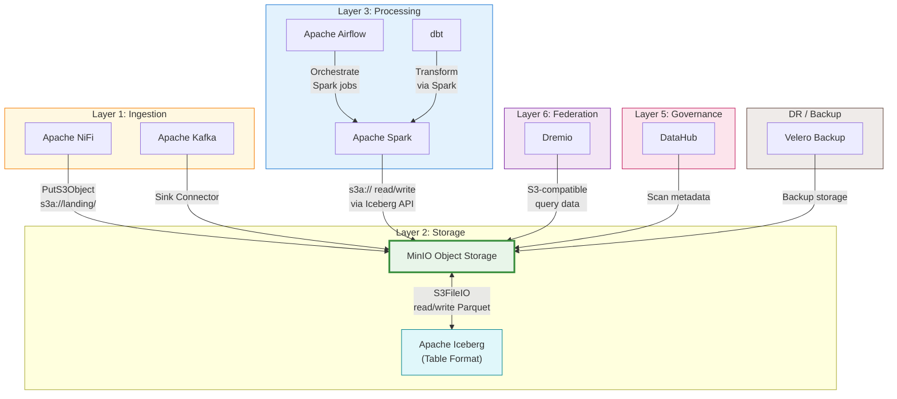

# MinIO

## Tổng Quan

MinIO là hệ thống lưu trữ đối tượng (Object Storage) hiệu năng cao, tương thích API Amazon S3. Trong Hanas Data Platform, MinIO đóng vai trò **lớp lưu trữ vật lý cốt lõi** (Layer 2: Storage), là nơi lưu trữ tập trung toàn bộ dữ liệu từ landing zone đến data mart.

> **Lưu ý:** MinIO Community Edition đã chuyển sang **maintenance mode** (12/2025) và sử dụng license **AGPLv3**. Hanas Platform pin version `RELEASE.2025-04-22T22-12-26Z` để đảm bảo ổn định. Xem [Thông tin Version](version-info.md) để biết chi tiết.

## Kiến Trúc Trong Platform

## Tổ Chức Buckets

MinIO tổ chức dữ liệu theo **Data Vault 2.0 zones**, mỗi zone là một bucket riêng biệt:

| Bucket | Mục đích | Nguồn ghi | Nguồn đọc |
|---|---|---|---|
| **landing/** | Dữ liệu thô từ source systems | NiFi, Kafka, CSV upload | Spark |
| **raw-vault/** | Raw Vault (Hub, Link, Satellite) | Spark (via Iceberg) | Spark, Dremio |
| **business-vault/** | Business Vault (PIT, Bridge, Business Sat) | Spark/dbt (via Iceberg) | Spark, Dremio |
| **information-mart/** | Data Mart cho BI/reporting | Spark/dbt (via Iceberg) | Dremio, BI tools |
| **warehouse/** | Iceberg warehouse metadata | Spark (auto) | Spark, Dremio |

## Vai Trò Trong Platform

- **Lưu trữ tập trung** toàn bộ data zones: Landing → Raw Vault → Business Vault → Information Mart
- **Multi-engine access**: Phục vụ đồng thời NiFi (ghi), Spark (đọc/ghi), Dremio (đọc), DataHub (scan)
- **Iceberg storage backend**: Lưu trữ cả data files (Parquet) và metadata files (JSON, Avro) cho Iceberg tables
- **Lưu trữ dài hạn**: Dữ liệu lịch sử cho đối soát, kiểm toán, compliance
- **Backup storage**: Backend cho Velero (DC-DR backup trên Kubernetes)

## Tính Năng Chính

| Tính năng | Mô tả |
|---|---|
| **S3-compatible API** | Tương thích hoàn toàn với AWS S3 SDK, CLI, và tools |
| **Erasure Coding** | Bảo vệ dữ liệu tự động, chịu lỗi nhiều ổ đĩa |
| **Distributed Mode** | Cluster nhiều node, mở rộng theo chiều ngang |
| **Site Replication** | Đồng bộ dữ liệu active-active giữa DC và DR |
| **Bucket Versioning** | Giữ lịch sử phiên bản object, hỗ trợ rollback |
| **Object Locking** | WORM compliance cho regulatory requirements |
| **IAM & Policies** | Phân quyền chi tiết theo user/group/bucket/prefix |
| **Encryption** | Server-side encryption (SSE-S3, SSE-KMS) |
| **Prometheus Metrics** | Metrics endpoint sẵn sàng cho monitoring stack |

## Tài Liệu

- [Cài đặt & Triển khai](installation.md)
- [Cấu hình](configuration.md)
- [Hướng dẫn sử dụng](user-guide.md)
- [Best Practices](best-practices.md)
- [Thông tin Version](version-info.md)
