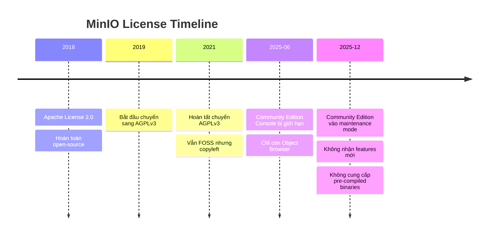

# MinIO - Thông Tin Version

## Version Hiện Tại

| Thông tin | Giá trị |
|---|---|
| **Version** | `RELEASE.2025-04-22T22-12-26Z` |
| **Image** | `quay.io/minio/minio:RELEASE.2025-04-22T22-12-26Z` |
| **License** | AGPLv3 |
| **Môi trường** | Kubernetes (MinIO Operator) |
| **mc (MinIO Client)** | Latest |

> [!CAUTION]
> **Tại sao pin version này?** MinIO Community Edition đã vào **maintenance mode** (12/2025). Từ `RELEASE.2025-06-xx` trở đi, Console UI bị giới hạn chỉ còn Object Browser. Version `RELEASE.2025-04-22T22-12-26Z` là **phiên bản ổn định cuối cùng** với đầy đủ chức năng admin Console.

---

## Lịch Sử License MinIO



### AGPLv3 — Ảnh Hưởng Với Hanas Platform

| Tình huống | Ảnh hưởng | Cần làm gì |
|---|---|---|
| **Sử dụng nội bộ** (internal) | ❌ Không ảnh hưởng | Dùng bình thường |
| **Không fork/modify source** | ❌ Không ảnh hưởng | Dùng binary/image gốc |
| **Fork & modify MinIO source** | ✅ Phải công khai source | Tránh fork, dùng as-is |
| **Cung cấp MinIO service cho bên ngoài** | ✅ Phải comply AGPLv3 | Cần commercial license |

> **Đối với Hanas Platform**: Sử dụng MinIO nội bộ, không fork source → **Không có vấn đề license**. Tuy nhiên nên theo dõi nếu có nhu cầu cung cấp storage-as-a-service cho khách hàng.

---

## Compatibility Matrix

### Platform Services

| Service | MinIO Interface | Protocol | Tested |
|---|---|---|---|
| **Apache Spark 3.5.x** | S3A Connector (`fs.s3a.*`) | HTTP/S3 | ✅ |
| **Apache Iceberg 1.5.x** | S3FileIO | HTTP/S3 | ✅ |
| **Dremio 25.x** | S3-compatible source | HTTP/S3 | ✅ |
| **Apache NiFi** | PutS3Object / FetchS3Object | HTTP/S3 | ✅ |
| **Apache Airflow** | S3Hook (indirect, via Spark) | — | ✅ |
| **dbt-spark** | (via Spark catalog) | — | ✅ |
| **DataHub** | S3 ingestion | HTTP/S3 | ✅ |
| **Velero** | AWS S3 provider | HTTP/S3 | ✅ |
| **AWS CLI** | `--endpoint-url` | HTTP/S3 | ✅ |
| **mc (MinIO Client)** | Native | HTTP/S3 | ✅ |

### Client SDKs

| SDK | Ngôn ngữ | S3 Compatible |
|---|---|---|
| AWS SDK for Java | Java | ✅ |
| boto3 | Python | ✅ |
| aws-sdk-go | Go | ✅ |
| MinIO Python SDK | Python | ✅ (native) |
| MinIO Java SDK | Java | ✅ (native) |

### S3 API Compatibility

| Feature | Hỗ trợ | Ghi chú |
|---|---|---|
| GetObject / PutObject | ✅ | |
| Multipart Upload | ✅ | |
| List Objects V2 | ✅ | |
| Bucket Versioning | ✅ | |
| Object Locking (WORM) | ✅ | |
| Server-Side Encryption | ✅ | SSE-S3, SSE-KMS |
| Presigned URLs | ✅ | |
| Bucket Notifications | ✅ | Kafka, NATS, Webhook |
| Select Object Content | ✅ | S3 Select |
| Bucket Lifecycle | ✅ | |
| Bucket Replication | ✅ | Site Replication |

---

## Alternatives (Nếu Cần Thay Thế)

Trong trường hợp MinIO không phù hợp dài hạn (do license hoặc maintenance mode), các alternatives S3-compatible:

| Alternative | License | Ưu điểm | Nhược điểm |
|---|---|---|---|
| **SeaweedFS** | Apache 2.0 | Nhẹ, nhanh, S3-compatible | Community nhỏ hơn |
| **Ceph (RGW)** | LGPL 2.1 | Enterprise-grade, proven | Phức tạp, heavy resource |
| **GarageHQ** | AGPL 3.0 | Lightweight, geo-distributed | Còn mới, ít features |
| **LocalStack S3** | Apache 2.0 | Chỉ cho dev/test | Không dùng production |

> **Khuyến nghị hiện tại**: Tiếp tục dùng MinIO version pinned. Đánh giá lại sau 12 tháng (Q1/2027) nếu MinIO có thay đổi lớn.

---

## Hướng Dẫn Upgrade

### Nguyên Tắc

1. **Chỉ upgrade, không downgrade** — MinIO không hỗ trợ rollback version
2. **Backup trước khi upgrade** (Site Replication hoặc mc mirror)
3. **Test trên staging** trước khi apply production
4. **Rolling upgrade** trong distributed mode — không cần downtime

### Quy Trình

```bash
# 1. Backup trước
mc mirror hanas/ backup/ --watch

# 2. Đọc release notes
# https://github.com/minio/minio/releases

# 3. Update image tag (K8s)
# Sửa tenant-values.yaml:
#   tag: "RELEASE.2025-04-22T22-12-26Z"  → "RELEASE.2025-xx-xxTxx-xx-xxZ"

# 4. Apply upgrade
helm upgrade hanas-tenant minio-operator/tenant \
  -f tenant-values.yaml \
  --namespace minio-tenant

# 5. Verify
mc admin info hanas
kubectl get pods -n minio-tenant
```

---

## Lịch Sử Thay Đổi

| Ngày | Thay đổi |
|---|---|
| 2025-01-01 | Initial deployment: MinIO single-node (dev) |
| 2025-01-01 | Tạo buckets: landing, raw-vault, business-vault, information-mart, warehouse |
| 2025-01-01 | Tích hợp Spark S3A, Dremio S3-compatible source |
| 2025-02-24 | Pin version `RELEASE.2025-04-22T22-12-26Z`, document licensing |

---

## Tham Khảo

- [MinIO Documentation](https://min.io/docs/minio/linux/index.html)
- [MinIO GitHub](https://github.com/minio/minio)
- [MinIO Operator](https://github.com/minio/operator)
- [MinIO Client (mc)](https://min.io/docs/minio/linux/reference/minio-mc.html)
- [S3 API Compatibility](https://min.io/docs/minio/linux/integrations/aws-cli-with-minio.html)
