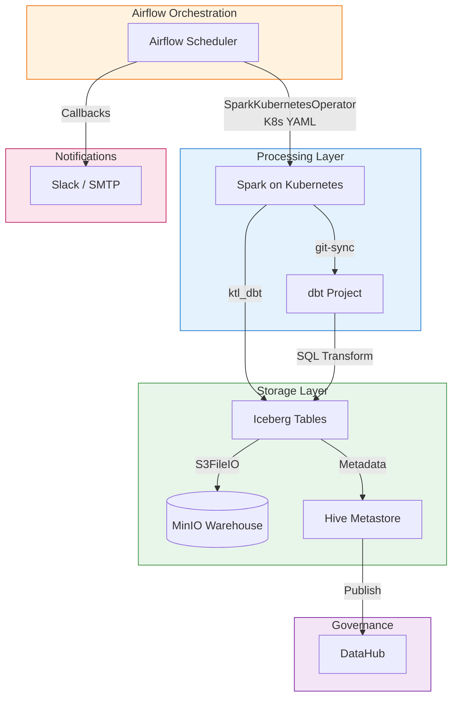

# Apache Airflow

## Tổng Quan

Apache Airflow là nền tảng điều phối (orchestration) trung tâm của Hanas Data Platform. Airflow quản lý toàn bộ lifecycle của data pipeline — từ việc trigger Spark jobs trên Kubernetes, chạy dbt transformations, đến publishing metadata lên DataHub.

### Kiến Trúc Tích Hợp

## Vai Trò Trong Platform

- **Điều phối pipeline ETL/ELT** end-to-end qua `SparkKubernetesOperator`
- **Quản lý dbt transformations** trên Spark (Data Vault, Data Mart, MDM)
- **Publishing metadata** tự động lên DataHub (lineage, schema, data quality)
- **Email notifications** qua SMTP khi DAG hoàn thành
- **Alerting real-time** qua Slack/Teams khi task fail, retry, hoặc SLA breach

## Kiến Trúc Components

| Component | Mô tả |
|---|---|
| **Scheduler** | Lập lịch và trigger DAG runs |
| **Webserver** | UI theo dõi DAGs, task logs, parameters |
| **Kubernetes Executor** | Chạy tasks như Spark pods trên K8s |
| **Metadata DB** | PostgreSQL lưu trạng thái DAG/task |
| **Spark Operator** | Submit SparkApplication CRDs lên K8s cluster |

## Tài Liệu

- [Cài đặt & Triển khai](installation.md)
- [Cấu hình](configuration.md)
- [Hướng dẫn sử dụng](user-guide.md)
- [Best Practices](best-practices.md)
- [Thông tin Version](version-info.md)
