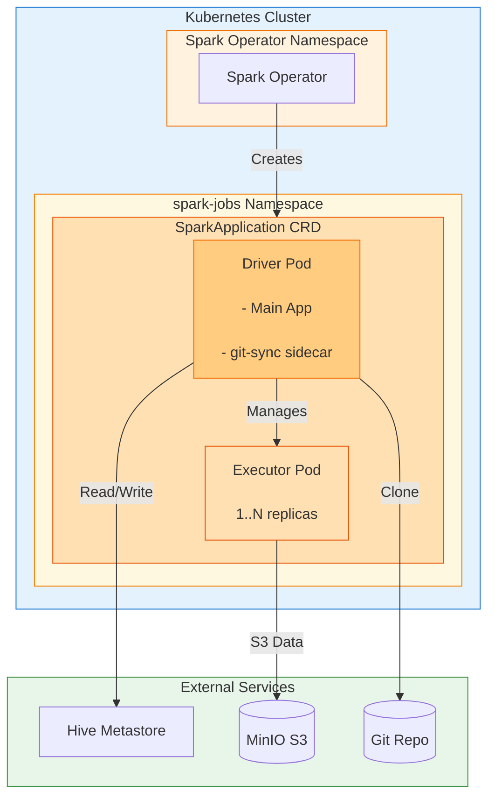
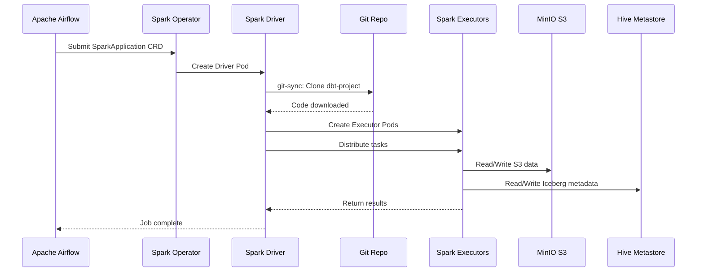

# Apache Spark

## Tổng Quan

Apache Spark là engine xử lý dữ liệu phân tán trong bộ nhớ, đảm nhiệm các tác vụ xử lý phức tạp, khối lượng lớn: batch, streaming, SQL, machine learning. Trong Hanas Platform, Spark được triển khai trên Kubernetes thông qua **Spark Operator** với mô hình đóng gói chuẩn hóa.

## Kiến Trúc

### Mô Hình Đóng Gói

Spark được đóng gói thành **một Docker image chuẩn** chứa toàn bộ runtime:

| Thành phần | Mô tả |
|---|---|
| **Base image** | Bitnami Spark 3.5.1 |
| **JARs** | Iceberg runtime, AWS SDK, Hadoop AWS, JDBC drivers |
| **Python deps** | PySpark, dbt-spark, pyiceberg, oracledb |
| **Application code** | `spark_code/` baked vào `/app` |

**Luồng code dbt-project**: Không baked vào image, mà được pull runtime qua **git-sync sidecar** (init container) khi submit SparkApplication. Code dbt nằm ở `/opt/spark/work-dir/dbt-project/`.

### Luồng Xử Lý

1. **Airflow** trigger `SparkKubernetesOperator` → submit `SparkApplication` manifest
2. **Spark Operator** tạo Driver Pod + Executor Pods
3. **Git-sync** (init container trên Driver) clone dbt-project từ Git repo
4. **Driver** chạy `mainApplicationFile` (e.g., `dbt_runner.py`, `oracle_to_iceberg.py`)
5. Spark đọc/ghi dữ liệu **Iceberg** trên **MinIO (S3)** qua **Hive Metastore**

## Vai Trò Trong Platform

- Xử lý dữ liệu batch quy mô lớn (ETL/ELT)
- Làm sạch, chuẩn hóa, biến đổi dữ liệu
- Xử lý Data Vault (Hub/Link/Satellite) qua dbt-spark
- Đọc/ghi dữ liệu Iceberg trên MinIO

## Tính Năng Chính

1. **In-memory Processing**: Xử lý nhanh trong bộ nhớ
2. **Distributed Computing**: Phân tán trên nhiều Executor pods
3. **Spark SQL**: Truy vấn dữ liệu bằng SQL trên Iceberg tables
4. **Kubernetes Native**: Triển khai qua Spark Operator, quản lý bởi K8s
5. **GitOps Ready**: Code dbt được sync runtime qua git-sync sidecar
6. **Tích hợp**: Iceberg, MinIO (S3), Hive Metastore, Airflow

## Tài Liệu

- [Cài đặt & Triển khai](installation.md) - Build image, Spark Operator, K8s setup
- [Cấu hình](configuration.md) - SparkConf, Iceberg, S3, dbt profiles
- [Hướng dẫn sử dụng](user-guide.md) - Submit job, git-sync, monitoring
- [Best Practices](best-practices.md) - Security, performance, operations
- [Thông tin Version](version-info.md) - Version matrix, compatibility
