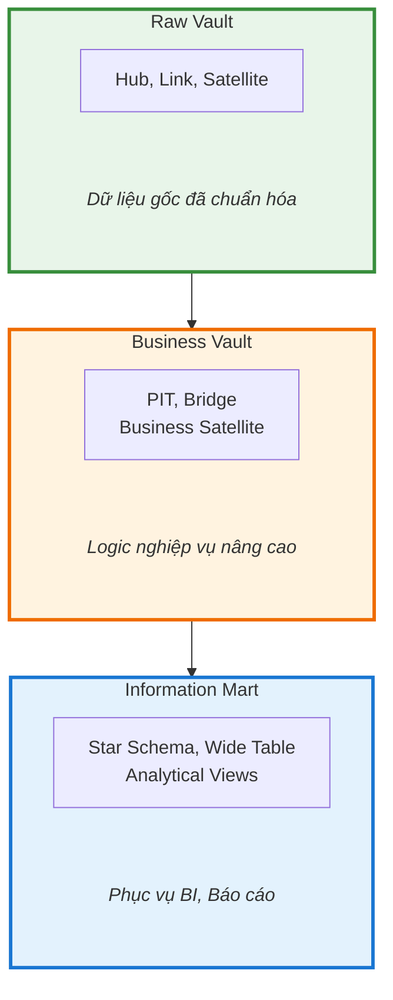
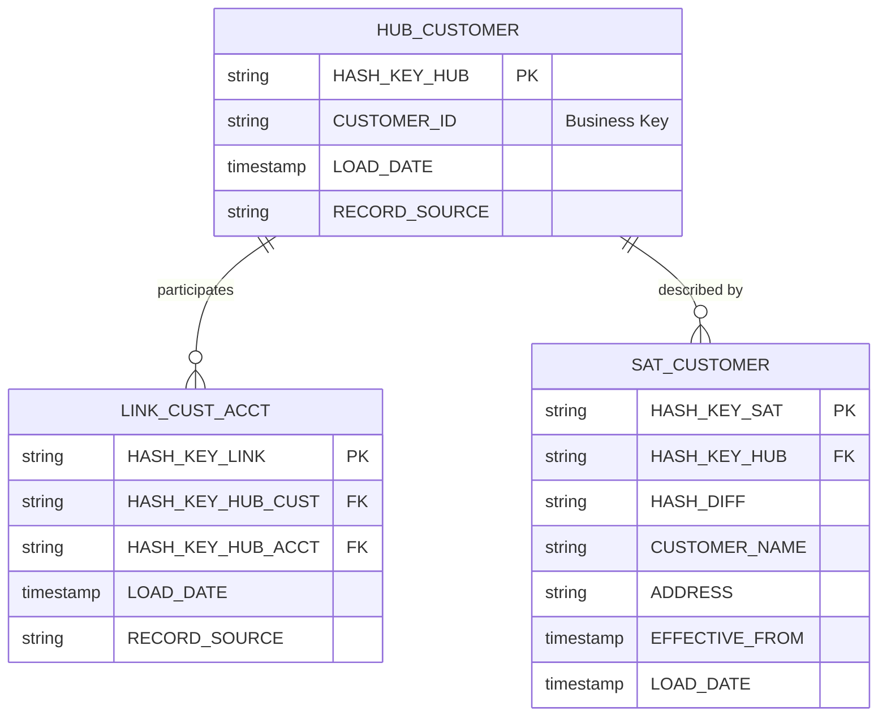

# Data Vault 2.0

## Tổng Quan

Data Vault 2.0 là phương pháp mô hình hóa dữ liệu cho hệ thống Data Warehouse/Lakehouse, thiết kế tối ưu cho tính mở rộng, tính bền vững và khả năng xử lý phân tán.

Data Vault 2.0 là phương pháp mô hình hóa dữ liệu được phát triển bởi **Dan Linstedt**, thiết kế tối ưu cho:

- **Agility**: Linh hoạt với thay đổi nguồn dữ liệu
- **Scalability**: Mở rộng ngang (horizontal scaling)
- **Auditability**: Truy vết đầy đủ lịch sử thay đổi
- **Parallel Processing**: Xử lý song song các thành phần độc lập

## Ba Lớp Mô Hình



| Lớp | Vai trò | Thành phần |
|---|---|---|
| **Raw Vault** | Lưu trữ dữ liệu gốc đã chuẩn hóa | Hub, Link, Satellite |
| **Business Vault** | Logic nghiệp vụ nâng cao | PIT, Bridge, Business Sat |
| **Information Mart** | Phục vụ báo cáo & phân tích | Star Schema, Wide Table |

## Ba Thành Phần Cốt Lõi



## Hash Algorithms

### Tạo Hub Hash Key

```sql
-- Công thức tạo HKEY_HUB
HKEY_HUB = SHA256(BUSINESS_KEY || RECORD_SOURCE)

-- Oracle implementation
HKEY_HUB = LOWER(STANDARD_HASH(BUSINESS_KEY || RECORD_SOURCE, 'SHA256'))

-- Ví dụ
HKEY_HUB = LOWER(STANDARD_HASH('CUST001' || 'FLEXLIVE', 'SHA256'))
```

### Tạo Link Hash Key

```sql
-- Công thức tạo HKEY_LINK
HKEY_LINK = SHA256(HKEY_HUB_1 || HKEY_HUB_2 || ... || HKEY_HUB_N)

-- Oracle implementation
HKEY_LINK = LOWER(STANDARD_HASH(
    HKEY_HUB_CUSTOMER || HKEY_HUB_ACCOUNT, 'SHA256'
))
```

### Tạo Hash Diff

```sql
-- Công thức tạo HASH_DIFF
HASH_DIFF = SHA256(ATTR_1 || '|' || ATTR_2 || '|' || ATTR_3)

-- Oracle implementation
HASH_DIFF = LOWER(STANDARD_HASH(
    NVL(ATTR_1, '') || '|' || 
    NVL(ATTR_2, '') || '|' || 
    NVL(ATTR_3, ''), 'SHA256'
))
```

## Loading Patterns

### Hub Loading

```sql
-- Multi-source incremental load
WITH stage_data AS (
    SELECT DISTINCT
        LOWER(STANDARD_HASH(CUSTOMER_ID || 'FLEXLIVE', 'SHA256')) AS HKEY_HUB,
        CUSTOMER_ID AS BIZ_KEY,
        OP_TIME AS DV_SRC_LDT,
        'FLEXLIVE' AS DV_SRC_REC
    FROM LANDING_CUSTOMER
),
new_records AS (
    SELECT s.*
    FROM stage_data s
    LEFT JOIN HUB_CUSTOMER h ON s.HKEY_HUB = h.HKEY_HUB
    WHERE h.HKEY_HUB IS NULL
)
INSERT INTO HUB_CUSTOMER (...)
SELECT ... FROM new_records;
```

### Satellite Loading

```sql
-- Detect changes using HASH_DIFF
WITH stage_data AS (
    SELECT 
        HKEY_HUB,
        LOWER(STANDARD_HASH(NAME || ADDRESS || PHONE, 'SHA256')) AS HASH_DIFF,
        NAME, ADDRESS, PHONE,
        OP_TIME
    FROM LANDING_CUSTOMER_DETAIL
),
latest_existing AS (
    SELECT HKEY_HUB, HASH_DIFF
    FROM (
        SELECT *,
               ROW_NUMBER() OVER (PARTITION BY HKEY_HUB ORDER BY DV_LDT DESC) AS RN
        FROM SAT_CUSTOMER_DETAIL
    )
    WHERE RN = 1
),
changed_records AS (
    SELECT s.*
    FROM stage_data s
    LEFT JOIN latest_existing l ON s.HKEY_HUB = l.HKEY_HUB
    WHERE l.HASH_DIFF IS NULL OR s.HASH_DIFF != l.HASH_DIFF
)
INSERT INTO SAT_CUSTOMER_DETAIL (...)
SELECT ... FROM changed_records;
```

## Danh Sách Các Loại Cột

| Loại cột | Mô tả | HUB | LNK | SAT | LSAT | LSATE |
|----------|-------|:---:|:---:|:---:|:----:|:-----:|
| **HKEY_HUB** | Hash key của Hub, từ business key | Có | Có | Có | | Có |
| **HKEY_LNK** | Hash key của Link, từ tổ hợp HKEY_HUB | | Có | | Có | Có |
| **HKEY_SAT** | Hash key của Satellite, từ HKEY + load date | | | Có | | |
| **HKEY_LSAT** | Hash key của Link Satellite | | | | Có | |
| **HASH_DIFF** | Hash của tất cả thuộc tính mô tả | | | Có | Có | |
| **BIZ_KEY** | Business Key từ hệ thống nguồn | Có | | | | |
| **DEPENDENT_KEY** | Khóa phụ thuộc trong Satellite | | | Có | Có | |
| **ATTR_COLUMN** | Cột thuộc tính mô tả | | | Có | Có | Có |
| **DV_CDC_OPS** | Loại thao tác CDC (INIT/INSERT/UPDATE/DELETE) | Có | Có | Có | Có | Có |
| **DV_SRC_LDT** | Thờgian phát sinh tại nguồn (OP_TIME) | Có | Có | Có | Có | Có |
| **DV_SCN** | System Change Number (OP_NO) | Có | Có | Có | Có | Có |
| **DV_RBA** | Redo Byte Address (OP_RBA) | Có | Có | Có | Có | Có |
| **DV_SRC_REC** | Tên bảng Landing nguồn | Có | Có | Có | Có | Có |
| **DV_LDT** | Load Date Timestamp | Có | Có | Có | Có | Có |
| **DV_CCD** | Collision Code (default: 'NAB') | Có | | | | |

## Performance Optimization

| Kỹ thuật | Mô tả |
|----------|-------|
| **Partitioning** | Partition Satellite theo DV_LDT |
| **Indexing** | Index trên HKEY_HUB, HKEY_LINK |
| **Parallel Processing** | Xử lý song song các Hub/Link độc lập |
| **Incremental Load** | Chỉ xử lý dữ liệu thay đổi |

## Tài Liệu Chi Tiết

- [Raw Vault](raw-vault.md) — Hub, Link, Satellite chi tiết
- [Business Vault](business-vault.md) — PIT, Bridge, Business Satellite
- [Information Mart](information-mart.md) — Star Schema, Wide Table

## Tài Liệu Tham Khảo

- [Data Vault 2.0](https://en.wikipedia.org/wiki/Data_vault_modeling) — Phương pháp mô hình hóa dữ liệu
- [Data Vault Alliance](https://datavaultalliance.com/) — Tổ chức chuẩn hóa Data Vault
- [Dan Linstedt](https://danlinstedt.com/) — Tác giả Data Vault
