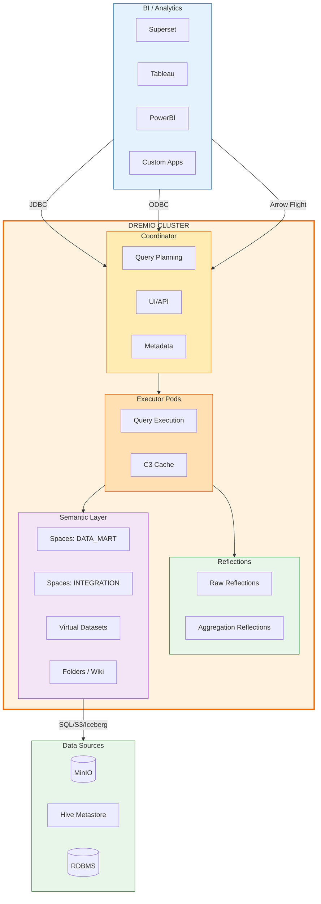
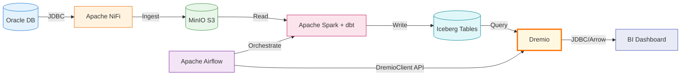

# Dremio

## Tổng Quan

Dremio là **Lakehouse Query Engine** thống nhất, đóng vai trò là lớp liên kết dữ liệu (Data Federation) trong Hanas Data Platform. Dremio ảo hóa toàn bộ nguồn dữ liệu vào một catalog logic duy nhất, cung cấp semantic layer, query acceleration (Reflections), và kết nối BI chuẩn (JDBC/ODBC/Arrow Flight).

Trong kiến trúc 7 lớp của Hanas Platform, Dremio nằm ở **Layer 6 — Liên Kết Dữ Liệu (Federation)**, là _điểm truy vấn duy nhất_ cho toàn bộ ngườii dùng và BI tools.

## Kiến Trúc Trong Platform

## Vai Trò Trong Platform

| # | Vai trò | Mô tả |
|---|---|---|
| 1 | **Data Virtualization** | Ảo hóa đa nguồn (Lakehouse, RDBMS, NoSQL) vào 1 catalog logic duy nhất |
| 2 | **Semantic Layer** | Chuẩn hóa logic nghiệp vụ (measures, dimensions) qua Virtual Datasets |
| 3 | **Query Acceleration** | Reflections (pre-computed aggregations/joins) tăng tốc truy vấn BI |
| 4 | **Iceberg Integration** | Đọc/ghi native Iceberg tables trên MinIO, hỗ trợ time travel |
| 5 | **BI Connectivity** | Điểm kết nối duy nhất cho Superset, Tableau, PowerBI qua JDBC/ODBC/Arrow Flight |
| 6 | **API Automation** | REST API v3 cho phép Airflow tự động tạo views và reflections |
| 7 | **Workspace** | Quản lý Spaces, phân quyền, cộng tác nhóm |

## Tính Năng Chính

| Tính năng | Mô tả |
|---|---|
| **Data Virtualization** | 1 catalog cho toàn bộ nguồn dữ liệu, không cần di chuyển data |
| **Cost-based Query Optimizer** | Predicate pushdown, partition pruning, join reordering |
| **Reflections** | Pre-computed materialized views tự động tăng tốc queries |
| **Cloud Columnar Cache (C3)** | Cache data ở định dạng columnar trên executor nodes |
| **Apache Iceberg Native** | Đọc/ghi Iceberg tables, time travel, schema evolution |
| **Arrow Flight** | High-performance data transfer protocol, tránh serialization overhead |
| **Semantic Layer** | Spaces, Folders, Virtual Datasets, Wiki, Labels |
| **REST API v3** | Quản lý catalog, views, reflections, users programmatically |

## Luồng Dữ Liệu End-to-End

**Luồng chi tiết:**

1. **NiFi** thu thập dữ liệu từ Oracle → lưu vào **MinIO** (landing zone)
2. **Spark** (điều phối bởi **Airflow**) xử lý ETL/ELT → ghi **Iceberg tables**
3. **dbt** xây dựng Data Vault (Hub/Link/Satellite) và Data Mart trên Iceberg
4. **Dremio** đọc Iceberg tables từ Hive Metastore/MinIO → tạo Virtual Datasets
5. **Airflow** gọi Dremio API để tự động tạo views và reflections
6. **BI tools** kết nối Dremio qua JDBC/ODBC/Arrow Flight để truy vấn

## Tích Hợp Với Các Service

| Service | Tích hợp | Chi tiết |
|---|---|---|
| **MinIO (S3)** | Data Source | Đọc Iceberg data/metadata files trên `s3a://data/warehouse/` |
| **Hive Metastore** | Catalog | Đọc Iceberg table metadata, schema, partition info |
| **Apache Iceberg** | Table Format | Native support: read/write, time travel, schema evolution |
| **Apache Spark** | Compute | Cùng đọc/ghi Iceberg tables (multi-engine access) |
| **dbt** | Data Modeling | dbt tạo tables → Dremio tạo views phía trên |
| **Apache Airflow** | Orchestration | `DremioClient` API tự động tạo views & reflections |
| **DataHub** | Governance | Metadata lineage, data catalog integration |
| **Apache Ranger** | Security | Row/column-level access control (tùy chọn) |

## Tài Liệu

- [Cài đặt & Triển khai](installation.md) — System requirements, Helm chart, Docker Compose
- [Cấu hình](configuration.md) — Data sources, Reflections, Semantic Layer, BI connectivity
- [Hướng dẫn sử dụng](user-guide.md) — UI, SQL, views, reflections, API
- [Best Practices](best-practices.md) — Design, performance, security, operations
- [Thông tin Version](version-info.md) — Version matrix, compatibility, changelog
