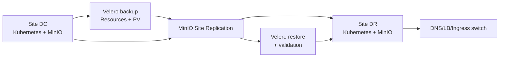

# Giải Pháp DC-DR

## Tổng quan

Giải pháp DC-DR bảo vệ hai nhóm tài sản khác nhau:

| Tầng | Công cụ | Bảo vệ | Đặc tính |
|---|---|---|---|
| Object data | MinIO Site Replication | Parquet/Iceberg objects, bucket/IAM theo phạm vi hỗ trợ | Replication giữa site, có độ trễ cần đo |
| Kubernetes state | Velero + provider/PV data mover | Resource, Secret/ConfigMap, PV data theo policy | Backup theo lịch, restore theo backup point |

Replication không đồng nghĩa với backup bất biến. Cần retention, versioning/immutability, quyền xóa hạn chế và restore test độc lập.

## Kiến trúc

## Điều kiện tiên quyết

- Site DC/DR, network path, DNS/LB và quyền truy cập đã được phê duyệt.
- MinIO peer tương thích version, endpoint ổn định, clock đồng bộ và replication status healthy.
- Velero có BackupStorageLocation dùng object storage độc lập/replicated; PV backup provider đã kiểm thử.
- Danh sách namespace/resource/PV trong scope, retention, RPO/RTO và thứ tự restore đã được phê duyệt.
- Có runbook, người quyết định chuyển site, người vận hành và biên bản DR exercise.

## Tài liệu

- [MinIO Site Replication](minio-replication.md)
- [Velero Backup](velero-backup.md)
- [Quy trình khôi phục](recovery-workflow.md)

## RPO/RTO

| Hạng mục | Không mặc định |
|---|---|
| RPO object data | Đo bằng replication lag và thời điểm object cuối cùng ở DR; không ghi mặc định là 0 |
| RPO metadata/PV | Phụ thuộc lịch Velero, phương thức backup và thời điểm backup gần nhất |
| RTO | Phụ thuộc thời gian cấp cluster, restore PV/resource, DNS/LB switch và smoke test |

Giá trị chính thức phải ghi trong [Baseline triển khai](../../00-overview/platform-baseline.md) và được chứng minh bằng bài kiểm thử.

## Kiểm thử định kỳ

- Kiểm tra replication status và object checksum/đếm object.
- Tạo backup, kiểm tra phase `Completed`/`PartiallyFailed`, đọc backup log.
- Restore một namespace hoặc workload mẫu vào môi trường cô lập.
- Thực hiện full DR exercise theo lịch, đo thời gian từng bước và cập nhật RPO/RTO.
