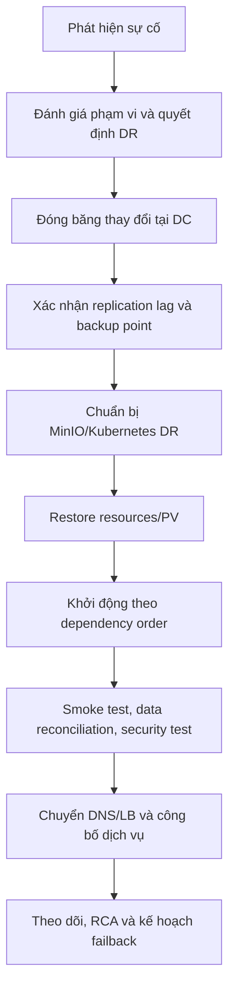

# Quy Trình Khôi Phục (Recovery Workflow)

## 1. Nguyên tắc

Chỉ người có thẩm quyền trong kế hoạch DR được quyết định chuyển site. Mục tiêu là bảo toàn dữ liệu, tránh split-brain và khôi phục theo thứ tự dependency. Mọi thời điểm, quyết định, lỗi và dữ liệu chưa replicate phải được ghi vào incident/DR record.

## 2. Các giai đoạn



## 3. Trước khi restore

- Mở incident mức phù hợp, thông báo stakeholder và chỉ định incident commander.
- Xác định site DC còn khả năng ghi/đọc hay đã mất hoàn toàn; tránh chạy active-active ngoài thiết kế.
- Chốt backup Velero gần nhất, replication lag, danh sách object chưa replicate và RPO chấp nhận được.
- Kiểm tra DR cluster, MinIO endpoint, DNS/LB, registry mirror, certificate, Vault unseal và quota.
- Nếu restore từ BSL, chuyển BSL sang read-only trong quá trình restore theo policy để tránh ghi/xóa backup ngoài ý muốn.

## 4. Restore tham chiếu

```bash
# Kiểm tra backup tại DR
velero backup-location get
velero backup get
velero backup describe <BACKUP_NAME> --details

# Có thể chuyển BSL read-only theo quy trình đã phê duyệt
kubectl patch backupstoragelocation <BSL_NAME> \
  -n velero --type merge \
  -p '{"spec":{"accessMode":"ReadOnly"}}'

# Restore từ backup đã chọn
velero restore create --from-backup <BACKUP_NAME> --wait
velero restore describe <RESTORE_NAME> --details
kubectl get pods -A
```

Không restore đồng thời hai backup có trạng thái thời gian khác nhau cho cùng một resource nếu chưa có kế hoạch hợp nhất.

## 5. Thứ tự kích hoạt

1. Network, DNS, ingress, certificate và secret store.
2. MinIO/catalog và database metadata.
3. Kafka/NiFi, Airflow và Spark Operator.
4. DataHub, Dremio, Superset và các consumer.
5. Dify/vLLM/Langfuse nếu thuộc phạm vi DR.
6. OpenObserve/collector/alerting để theo dõi quá trình khôi phục.

## 6. Tiêu chí xác nhận

| Nhóm | Kiểm tra |
|---|---|
| Hạ tầng | Node/PV/Pod ready, no pending/CrashLoop, ingress/TLS hoạt động |
| Storage/catalog | Bucket/table/catalog visible, metadata nhất quán, write/read test |
| Data pipeline | NiFi/Kafka connector, Airflow DAG và Spark job test thành công |
| Data quality | Row count/checksum/sample/business reconciliation với backup/source |
| Security | SSO/RBAC, masking/row filter, secret retrieval và audit |
| Serving/AI | Dremio query, dashboard, AI workflow/model endpoint và trace |
| Operations | Logs/metrics/alerts nhận được, dashboard cập nhật |

Chỉ chuyển traffic sau khi các tiêu chí bắt buộc đạt và owner khách hàng xác nhận.

## 7. Kết thúc DR và failback

- Khôi phục BSL về read-write khi restore hoàn tất và được phê duyệt.
- Theo dõi dữ liệu mới phát sinh tại DR, backup/replication và chênh lệch với nguồn.
- Lập RCA, timeline, dữ liệu mất/chưa đồng bộ, chi phí/tác động và action phòng ngừa.
- Lập kế hoạch failback riêng: đồng bộ dữ liệu ngược, đóng băng thay đổi, smoke test, chuyển traffic và xác nhận.
- Cập nhật RPO/RTO thực tế, runbook, sơ đồ và đào tạo lại nếu phát hiện gap.
