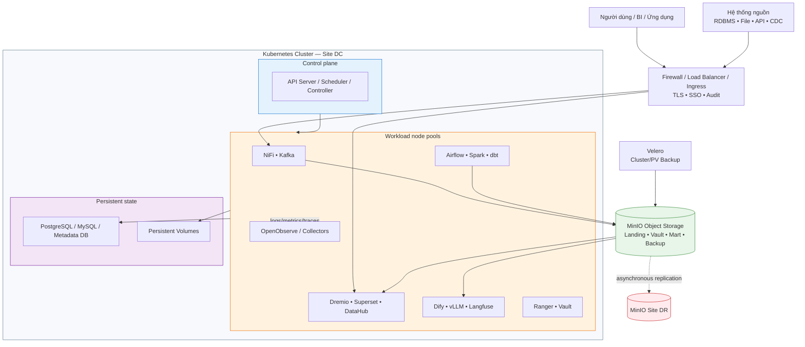

# Sơ Đồ Triển Khai

## Lưu ý

Đây là sơ đồ triển khai tham chiếu cho môi trường on-premise. Sơ đồ production phải được thay bằng bản có IP/VLAN/DNS, số node, zone, firewall flow và endpoint thực tế đã được phê duyệt.

## Luồng kết nối chính

| Luồng | Giao tiếp tham chiếu | Kiểm soát |
|---|---|---|
| Nguồn → NiFi/Kafka | JDBC, SFTP/FTP, HTTPS, CDC, Kafka protocol | Firewall allowlist, credential riêng, TLS |
| Ingestion → MinIO | S3 API/HTTPS | Service account, bucket policy, encryption |
| Airflow → Spark/Kubernetes | Kubernetes API/CRD | ServiceAccount least privilege |
| Spark/dbt → Lakehouse | Catalog API/Thrift + S3 | Catalog role và S3 credential |
| Dremio → Lakehouse | Catalog + S3 | Read/write policy, query audit |
| BI → Dremio | JDBC/ODBC/Arrow Flight/HTTPS | SSO/RBAC, row/column policy |
| Service → OpenObserve | OTLP/HTTP, Fluent Bit/Vector, Prometheus remote write | TLS, token/Basic auth, stream policy |
| DC → DR | Site Replication qua network riêng | Allowlist, encryption, replication status |

## Deployment register

| Hạng mục | Giá trị production |
|---|---|
| Site DC/DR | `<CẦN ĐIỀN>` |
| Kubernetes cluster/context | `<CẦN ĐIỀN>` |
| Node pool và topology zone | `<CẦN ĐIỀN>` |
| MinIO endpoint/bucket | `<CẦN ĐIỀN>` |
| Catalog profile | `<HIVE DEV / POLARIS PROD / KHÁC>` |
| Ingress/DNS/TLS issuer | `<CẦN ĐIỀN>` |
| Network flow/firewall ticket | `<CẦN ĐIỀN>` |
| Backup location/retention | `<CẦN ĐIỀN>` |
| RPO/RTO được phê duyệt | `<CẦN ĐIỀN>` |

## Kiểm tra sau triển khai

- `kubectl get nodes` và `kubectl get pods -A` đạt trạng thái mong đợi.
- Các endpoint health/readiness của service phản hồi đúng.
- Source test → ingestion → object/table → Dremio → dashboard chạy thành công.
- Log/metric/trace xuất hiện trên OpenObserve; alert test được ghi nhận.
- Backup hoàn tất, object xuất hiện ở DR và restore test có biên bản.
