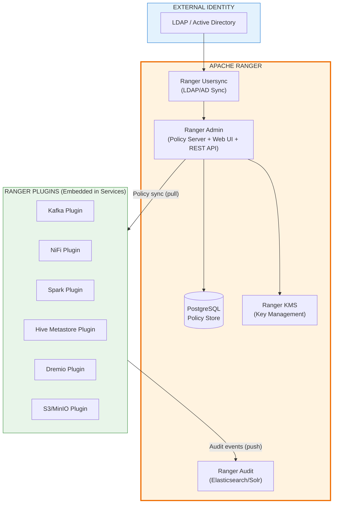
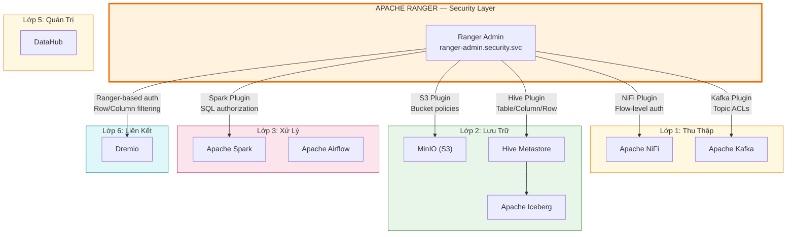

# Apache Ranger

## 1. Tổng Quan

Apache Ranger là framework bảo mật tập trung, mã nguồn mở thuộc Apache Software Foundation, cung cấp khả năng quản lý phân quyền, giám sát truy cập và kiểm toán toàn diện cho hệ sinh thái Big Data và Data Lakehouse.

Trong Hanas Data Platform, Apache Ranger đóng vai trò **An Toàn Thông Tin (Security)**, là **engine phân quyền tập trung** cho các lớp dữ liệu — từ thu thập (NiFi, Kafka), lưu trữ (MinIO, Iceberg), xử lý (Spark), đến liên kết (Dremio), khai thác và quản trị (DataHub).


## 2. Mục Tiêu Chính (Official Goals)

| # | Mục tiêu | Mô tả |
|---|----------|-------|
| 1 | **Centralized Security Administration** | Quản lý toàn bộ policy bảo mật từ một giao diện web hoặc REST API duy nhất |
| 2 | **Fine-Grained Authorization** | Phân quyền chi tiết đến mức database, table, column, row trên từng service |
| 3 | **Standardized Authorization** | Chuẩn hóa phương thức phân quyền xuyên suốt mọi thành phần trong platform |
| 4 | **Multiple Authorization Methods** | Hỗ trợ RBAC, ABAC, tag-based policies, data masking, row filtering |
| 5 | **Centralized Auditing** | Ghi log và kiểm toán tập trung mọi truy cập dữ liệu và hành động quản trị |

## 3. Kiến Trúc Apache Ranger



### Thành Phần Kiến Trúc

| Thành phần | Vai trò |
|------------|---------|
| **Ranger Admin** | Policy server trung tâm, cung cấp Web UI và REST API để quản lý policies, users, groups, roles |
| **Ranger Plugins** | Lightweight Java plugins nhúng vào từng service (Kafka, NiFi, Spark, Hive, Dremio), pull policies từ Admin và enforce tại điểm truy cập |
| **Ranger Usersync** | Đồng bộ user/group từ LDAP, Active Directory hoặc Unix vào Ranger |
| **Ranger KMS** | Quản lý encryption keys cho data-at-rest (HDFS, S3) |
| **Ranger Audit** | Thu thập và lưu trữ audit logs từ tất cả plugins vào Elasticsearch/Solr/RDBMS |
| **Policy Database** | PostgreSQL/MySQL lưu trữ policies, user/group metadata, audit records |

## 4. Kiến Trúc Trong Hanas Platform



## 5. Tích Hợp Với Các Service Trong Platform

| Service | Plugin | Phạm vi phân quyền | Ghi chú |
|---------|--------|---------------------|---------|
| **Apache Kafka** | `ranger-kafka-plugin` | Topic, Consumer Group, Cluster, Transactional ID | Thay thế Kafka ACLs, quản lý tập trung qua Ranger Admin |
| **Apache NiFi** | `ranger-nifi-plugin` | Process Group, Processor, Controller Service, Reporting Task | Kiểm soát ai được view/modify/delete flow components |
| **Apache Spark** | `ranger-spark-plugin` | Database, Table, Column (Iceberg SQL) | Enforce policies khi Spark query Iceberg tables |
| **Hive Metastore** | `ranger-hive-plugin` | Database, Table, Column, Row, UDF | Policy trung tâm cho mọi engine đọc qua HMS (Spark, Dremio) |
| **Dremio** | Ranger-based authorization | Database, Table, Column, Row-level filter, Column masking | Dremio pull policies từ Ranger, hỗ trợ row filtering và column masking |
| **MinIO (S3)** | `ranger-s3-plugin` | Bucket, Object path, Prefix | Kiểm soát truy cập object storage layer |

### Luồng Phân Quyền End-to-End

```
User Request → Service (NiFi/Kafka/Spark/Dremio)
    → Ranger Plugin (check local policy cache)
    → Allow / Deny
    → Audit Event → Ranger Audit (Elasticsearch)
    → Ranger Admin (review via UI)
```

## 6. Tính Năng Chính

| # | Tính năng | Mô tả |
|---|-----------|-------|
| 1 | **Resource-Based Policies** | Cấu hình quyền truy cập cho từng resource cụ thể (database, table, topic, bucket) |
| 2 | **Tag-Based Policies** | Phân quyền dựa trên metadata tags (PII, Confidential, Public) — tích hợp với DataHub/Atlas |
| 3 | **Row-Level Filtering** | Giới hạn rows user được xem (ví dụ: `region = 'HCM'`) |
| 4 | **Column Masking** | Che giấu dữ liệu nhạy cảm (Redact, Hash, Partial Mask, Nullify, Custom) |
| 5 | **RBAC (Role-Based)** | Tạo roles (Admin, Engineer, Analyst), gán permissions cho role, assign user vào role |
| 6 | **ABAC (Attribute-Based)** | Phân quyền dựa trên user attributes, resource attributes, context (thời gian, IP) |
| 7 | **Centralized Audit** | Ghi log chi tiết mọi access request: who, what, when, where, allow/deny |
| 8 | **Policy Delegation** | Ủy quyền quản lý policy cho team lead / data owner |
| 9 | **Data Encryption (KMS)** | Quản lý encryption keys cho data-at-rest trên S3/HDFS |
| 10 | **REST API** | Quản lý policies, users, groups, services programmatically |

## 7. So Sánh Với Các Phương Thức Phân Quyền Khác

| Tiêu chí | Apache Ranger | Kafka ACLs | NiFi Authorizer |
|----------|--------------|------------|-----------------|
| **Quản lý tập trung** | Một UI cho tất cả | Không: CLI per cluster | Không: File-based |
| **Fine-grained** | Row/Column level | Topic level | Component level |
| **Audit tập trung** | Elasticsearch/Solr | Không: Kafka logs | Không: NiFi provenance |
| **LDAP/AD sync** | Usersync | Không: Manual | LDAP |
| **Tag-based** | Atlas/DataHub tags | Không hỗ trợ | Không hỗ trợ |
| **Multi-service** | Kafka + NiFi + Spark + Dremio | Không: Chỉ Kafka | Không: Chỉ NiFi |

## Tài Liệu

- [Cài đặt & Triển khai](installation.md) — System requirements, Helm chart, Kubernetes deployment
- [Cấu hình](configuration.md) — Core config, plugin setup, LDAP, audit backend
- [Hướng dẫn sử dụng](user-guide.md) — Policy management, audit review, troubleshooting
- [Best Practices](best-practices.md) — Security patterns, RBAC model, operational guidelines
- [Thông tin Version](version-info.md) — Version matrix, compatibility, changelog

## Tham Khảo

- [Apache Ranger Official](https://ranger.apache.org/) — Trang chủ dự án
- [GitHub Repository](https://github.com/apache/ranger) — Source code
- [Ranger REST API Docs](https://ranger.apache.org/apidocs/index.html) — API reference
- [Apache Ranger Wiki](https://cwiki.apache.org/confluence/display/RANGER/Index) — Community documentation
