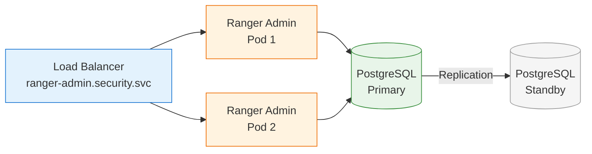

# Apache Ranger — Best Practices

## 1. Thiết Kế Policy — Nguyên Tắc Chung

### 1.1 Principle of Least Privilege

> Chỉ cấp quyền **tối thiểu cần thiết** cho mỗi user/group để thực hiện công việc.

| ❌ Không nên | ✅ Nên |
|-------------|--------|
| Cấp `All` permissions cho mọi user | Cấp `Select` cho analyst, `All` cho admin |
| Dùng wildcard `*` cho tất cả tables | Chỉ định database/table cụ thể |
| Một policy chung cho toàn bộ platform | Policy riêng theo service và data zone |
| Cấp `Delegate Admin` cho nhiều users | Chỉ cấp `Delegate Admin` cho team lead |

### 1.2 Policy Naming Convention

Sử dụng naming convention nhất quán cho tất cả policies:

```
<service>-<zone>-<permission>-<target>

Ví dụ:
  hive-landing-readwrite-engineers
  hive-datamart-readonly-analysts
  kafka-cdc-publish-connect
  nifi-flow-viewedit-engineers
  spark-datamart-select-analysts
```

### 1.3 Phân Quyền Theo Data Zone

Hanas Platform sử dụng data zone model. Áp dụng policies tương ứng:

| Data Zone | Database | Who Can Read | Who Can Write | Masking |
|-----------|----------|-------------|---------------|---------|
| **Landing** | `landing` | Engineers, Service Accounts | NiFi, Kafka Connect | Không |
| **Raw Vault** | `raw_vault` | Engineers, Service Accounts | Spark, dbt | Không |
| **Business Vault** | `biz_vault` | Engineers, Analysts | dbt | Tùy chọn |
| **Data Mart** | `data_mart` | Analysts, Viewers, BI Tools | dbt | PII masking |
| **Staging** | `staging` | Engineers | Spark, dbt | Không |

---

## 2. Mô Hình RBAC Khuyến Nghị

### 2.1 Roles và Permissions Matrix

| Role | Kafka | NiFi | HMS (Landing) | HMS (Data Mart) | Spark | Dremio |
|------|-------|------|--------------|----------------|-------|--------|
| **PLATFORM_ADMIN** | Full | Full | Full | Full | Full | Full |
| **DATA_ENGINEER** | Consume, Describe | Read, Write | Full | Select, Create | Full | Select |
| **DATA_ANALYST** | — | Read | — | Select (masked) | Select | Select |
| **DATA_VIEWER** | — | — | — | Select (masked, filtered) | — | Select (masked) |
| **SERVICE_ACCOUNT** | Pub/Sub | Read | Full | Full | Full | — |
| **SECURITY_ADMIN** | Audit Only | Audit Only | Audit Only | Audit Only | Audit Only | Audit Only |

### 2.2 Service Accounts

Mỗi service sử dụng service account riêng với quyền cụ thể:

| Service Account | Dùng cho | Quyền |
|-----------------|---------|-------|
| `airflow_svc` | Airflow DAGs → Spark, dbt | Full trên HMS, Spark |
| `spark_svc` | Spark jobs | Full trên HMS, Select/Create trên databases |
| `nifi_svc` | NiFi flows | Write trên landing, Publish trên Kafka |
| `kafka_connect_svc` | Kafka Connect (CDC) | Publish/Consume trên CDC topics |
| `dremio_svc` | Dremio query engine | Select trên tất cả HMS databases |
| `datahub_svc` | DataHub metadata ingestion | Select (metadata only) trên HMS |

---

## 3. Bảo Mật Ranger Admin

### 3.1 Checklist Hardening

| # | Hạng mục | Hành động | Ưu tiên |
|---|---------|-----------|---------|
| 1 | **Đổi password mặc định** | Đổi `admin` / `rangerR0cks!` ngay lập tức | 🔴 Cao |
| 2 | **Enable HTTPS** | Cấu hình SSL certificate cho Ranger Admin (port 6182) | 🔴 Cao |
| 3 | **LDAP Authentication** | Chuyển từ `NONE` sang `LDAP` authentication | 🔴 Cao |
| 4 | **Network Policy** | Chỉ cho phép plugin pods kết nối đến Ranger Admin | 🟡 Trung bình |
| 5 | **Audit to external store** | Gửi audit logs ra Elasticsearch, không lưu chỉ DB | 🟡 Trung bình |
| 6 | **Backup policies** | Export policies định kỳ qua REST API | 🟡 Trung bình |
| 7 | **Rotate KMS master key** | Đổi master key định kỳ (quarterly) | 🟢 Thấp |
| 8 | **Review audit logs** | Review denied access hàng tuần | 🟡 Trung bình |

### 3.2 Kubernetes Network Policy

```yaml
apiVersion: networking.k8s.io/v1
kind: NetworkPolicy
metadata:
  name: ranger-admin-access
  namespace: security
spec:
  podSelector:
    matchLabels:
      app: ranger-admin
  policyTypes:
    - Ingress
  ingress:
    # Chỉ cho phép từ plugin pods và admin nodes
    - from:
        - namespaceSelector:
            matchLabels:
              security-access: "ranger"
      ports:
        - port: 6080
        - port: 6182
```

---

## 4. Performance Optimization

### 4.1 Plugin Caching

| Tham số | Giá trị khuyến nghị | Ghi chú |
|---------|---------------------|---------|
| `policy.pollIntervalMs` | `30000` (30s) | Tăng lên 60s nếu policies ít thay đổi |
| `policy.cache.dir` | `/tmp/<service>/policycache` | Dùng persistent volume nếu có thể |
| `tag.pollIntervalMs` | `30000` | Tần suất pull tag-based policies |

### 4.2 Audit Performance

| Khuyến nghị | Chi tiết |
|------------|---------|
| **Dùng Elasticsearch** | Performance tốt hơn Solr/DB cho large-scale audit |
| **Index lifecycle** | Cấu hình ILM xóa audit index > 90 ngày |
| **Batch audit** | Plugins batch audit events, không gửi real-time |
| **Separate cluster** | Sử dụng Elasticsearch cluster riêng cho audit (hoặc dùng OpenObserve) |

### 4.3 Ranger Admin Tuning

```bash
# JVM Settings cho Ranger Admin
RANGER_ADMIN_HEAP="-Xmx4g -Xms2g"    # Tăng heap cho large policy sets
RANGER_ADMIN_MAX_POOL=80               # Tăng DB pool nếu nhiều plugins

# PostgreSQL tuning
max_connections = 200
shared_buffers = 1GB
work_mem = 64MB
```

---

## 5. Audit Management

### 5.1 Retention Policy

| Loại audit | Retention | Storage | Ghi chú |
|------------|---------|---------|---------|
| **Access logs** | 90 ngày | Elasticsearch | ILM auto-delete |
| **Admin logs** | 365 ngày | PostgreSQL | Compliance requirement |
| **Plugin status** | 30 ngày | Elasticsearch | Monitoring only |
| **Login sessions** | 90 ngày | PostgreSQL | Security review |

### 5.2 Elasticsearch ILM Config

```json
{
  "policy": {
    "phases": {
      "hot": {
        "min_age": "0ms",
        "actions": {
          "rollover": {
            "max_size": "50GB",
            "max_age": "7d"
          }
        }
      },
      "warm": {
        "min_age": "30d",
        "actions": {
          "forcemerge": { "max_num_segments": 1 },
          "shrink": { "number_of_shards": 1 }
        }
      },
      "delete": {
        "min_age": "90d",
        "actions": { "delete": {} }
      }
    }
  }
}
```

---

## 6. High Availability & Disaster Recovery

### 6.1 Ranger Admin HA



| Thành phần | HA Strategy |
|------------|------------|
| **Ranger Admin** | 2+ replicas behind Kubernetes Service (load balancing) |
| **PostgreSQL** | Primary-Standby replication, auto-failover |
| **Plugin Cache** | Plugins cache policies locally — hoạt động khi Admin down |
| **Audit** | Elasticsearch cluster (3+ nodes) |

### 6.2 Backup & Restore

```bash
# Backup tất cả policies
for service in kafka_hanas hive_hanas nifi_hanas spark_hanas; do
  curl -u admin:password \
    "http://ranger-admin:6080/service/plugins/policies/exportJson?serviceName=$service" \
    -o "backup_${service}_$(date +%Y%m%d).json"
done

# Backup database
pg_dump -h ranger-db-postgresql -U ranger ranger > ranger_backup_$(date +%Y%m%d).sql

# Restore policies
curl -u admin:password -X POST \
  -F "file=@backup_hive_hanas_20260301.json" \
  "http://ranger-admin:6080/service/plugins/policies/importPoliciesFromFile?serviceName=hive_hanas"
```

---

## 7. Compliance & Governance

### 7.1 Checklist Tuân Thủ

| # | Yêu cầu | Ranger Solution | Khu vực kiểm tra |
|---|---------|----------------|-------------------|
| 1 | Kiểm soát truy cập tối thiểu | RBAC + resource-based policies | Policy Manager |
| 2 | Phân tách nhiệm vụ (SoD) | Roles với permissions không chồng lấn | Settings → Roles |
| 3 | Ghi log truy cập | Audit logs cho mọi access request | Audit → Access |
| 4 | Bảo vệ dữ liệu cá nhân (PII) | Column masking cho CCCD, email, phone | Masking Policies |
| 5 | Giới hạn truy cập theo vùng | Row-level filtering theo region | Row Filter Policies |
| 6 | Review quyền định kỳ | Export policies, review với Security team | REST API export |
| 7 | Phát hiện vi phạm | Monitor denied access trong audit | Audit → Denied Access |
| 8 | Mã hóa dữ liệu | KMS cho data-at-rest encryption | KMS Service |
