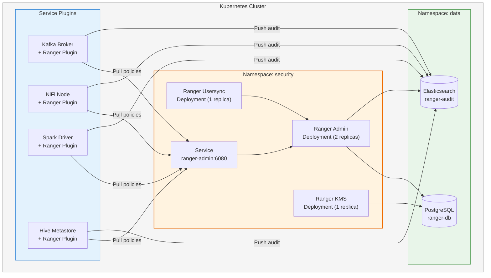

# Apache Ranger — Cài Đặt & Triển Khai

## 1. Yêu Cầu Hệ Thống

### 1.1 Phần Cứng Tối Thiểu

| Thành phần | CPU | RAM | Disk | Ghi chú |
|------------|-----|-----|------|---------|
| **Ranger Admin** | 2 vCPU | 4 GB | 20 GB SSD | Chạy Web UI + Policy Server |
| **Ranger Usersync** | 1 vCPU | 2 GB | 10 GB | Đồng bộ LDAP/AD |
| **PostgreSQL** | 2 vCPU | 4 GB | 50 GB SSD | Lưu policies, audit metadata |
| **Elasticsearch** (audit) | 2 vCPU | 4 GB | 100 GB SSD | Audit log storage (khuyến nghị) |

### 1.2 Phần Mềm

| Yêu cầu | Phiên bản | Ghi chú |
|----------|-----------|---------|
| **Java** | JDK 11+ (khuyến nghị JDK 17) | Oracle JDK hoặc OpenJDK |
| **Kubernetes** | 1.24+ | Helm 3.x |
| **PostgreSQL** | 12+ | Backend database cho Ranger Admin |
| **Elasticsearch** | 7.x / 8.x hoặc OpenSearch 2.x | Audit backend (tùy chọn) |
| **Solr** | 8.x+ | Audit backend thay thế |
| **LDAP/AD** | OpenLDAP hoặc Active Directory | User/Group sync (tùy chọn) |

---

## 2. Kiến Trúc Triển Khai Trên Kubernetes



---

## 3. Cài Đặt Step-by-Step

### 3.1 Tạo Namespace và Database

```bash
# 1. Tạo namespace
kubectl create namespace security

# 2. Deploy PostgreSQL cho Ranger
helm install ranger-db bitnami/postgresql \
  --namespace security \
  --set-string auth.postgresPassword=<RANGER_DB_ADMIN_PASSWORD_FROM_SECRET> \
  --set auth.database=ranger \
  --set auth.username=ranger \
  --set-string auth.password=<RANGER_DB_PASSWORD_FROM_SECRET> \
  --set primary.persistence.size=50Gi
```

### 3.2 Deploy Ranger Admin

```yaml
# ranger-admin-deployment.yaml
apiVersion: apps/v1
kind: Deployment
metadata:
  name: ranger-admin
  namespace: security
  labels:
    app: ranger-admin
spec:
  replicas: 2
  selector:
    matchLabels:
      app: ranger-admin
  template:
    metadata:
      labels:
        app: ranger-admin
    spec:
      containers:
        - name: ranger-admin
          image: apache/ranger-admin:2.5.0
          ports:
            - containerPort: 6080
              name: http
            - containerPort: 6182
              name: https
          env:
            - name: DB_HOST
              value: "ranger-db-postgresql.security.svc"
            - name: DB_NAME
              value: "ranger"
            - name: DB_USER
              valueFrom:
                secretKeyRef:
                  name: ranger-db-secret
                  key: username
            - name: DB_PASSWORD
              valueFrom:
                secretKeyRef:
                  name: ranger-db-secret
                  key: password
            - name: RANGER_ADMIN_LOG_DIR
              value: "/var/log/ranger"
            - name: JAVA_OPTS
              value: "-Xmx2g -Xms1g"
          resources:
            requests:
              cpu: "1"
              memory: "2Gi"
            limits:
              cpu: "2"
              memory: "4Gi"
          readinessProbe:
            httpGet:
              path: /login.jsp
              port: 6080
            initialDelaySeconds: 60
            periodSeconds: 15
          livenessProbe:
            httpGet:
              path: /login.jsp
              port: 6080
            initialDelaySeconds: 120
            periodSeconds: 30
          volumeMounts:
            - name: ranger-config
              mountPath: /opt/ranger/admin/conf
      volumes:
        - name: ranger-config
          configMap:
            name: ranger-admin-config
---
apiVersion: v1
kind: Service
metadata:
  name: ranger-admin
  namespace: security
spec:
  type: ClusterIP
  ports:
    - port: 6080
      targetPort: 6080
      name: http
    - port: 6182
      targetPort: 6182
      name: https
  selector:
    app: ranger-admin
```

```bash
# Deploy
kubectl apply -f ranger-admin-deployment.yaml
```

### 3.3 Deploy Ranger Usersync

```yaml
# ranger-usersync-deployment.yaml
apiVersion: apps/v1
kind: Deployment
metadata:
  name: ranger-usersync
  namespace: security
spec:
  replicas: 1
  selector:
    matchLabels:
      app: ranger-usersync
  template:
    metadata:
      labels:
        app: ranger-usersync
    spec:
      containers:
        - name: ranger-usersync
          image: apache/ranger-usersync:2.5.0
          env:
            - name: POLICY_MGR_URL
              value: "http://ranger-admin.security.svc:6080"
            - name: SYNC_SOURCE
              value: "ldap"
            - name: SYNC_LDAP_URL
              value: "ldap://openldap.security.svc:389"
            - name: SYNC_LDAP_BIND_DN
              value: "cn=admin,dc=hanas,dc=local"
            - name: SYNC_LDAP_BIND_PASSWORD
              valueFrom:
                secretKeyRef:
                  name: ranger-ldap-secret
                  key: password
            - name: SYNC_LDAP_USER_SEARCH_BASE
              value: "ou=users,dc=hanas,dc=local"
            - name: SYNC_LDAP_GROUP_SEARCH_BASE
              value: "ou=groups,dc=hanas,dc=local"
            - name: SYNC_INTERVAL
              value: "360"   # 6 phút
          resources:
            requests:
              cpu: "500m"
              memory: "1Gi"
            limits:
              cpu: "1"
              memory: "2Gi"
```

### 3.4 Cấu Hình Audit Backend (Elasticsearch)

```yaml
# ranger-admin-config ConfigMap (trích)
apiVersion: v1
kind: ConfigMap
metadata:
  name: ranger-admin-config
  namespace: security
data:
  ranger-admin-site.xml: |
    <configuration>
      <!-- Audit to Elasticsearch -->
      <property>
        <name>ranger.audit.store</name>
        <value>elasticsearch</value>
      </property>
      <property>
        <name>ranger.audit.elasticsearch.urls</name>
        <value>http://elasticsearch.observability.svc:9200</value>
      </property>
      <property>
        <name>ranger.audit.elasticsearch.index</name>
        <value>ranger_audits</value>
      </property>
      <property>
        <name>ranger.audit.elasticsearch.port</name>
        <value>9200</value>
      </property>
    </configuration>
```

---

## 4. Cài Đặt Plugins Cho Các Service

### 4.1 Kafka Plugin

Thêm Ranger Kafka Plugin vào cấu hình Kafka broker:

```bash
# Trong Kafka broker container hoặc Helm values
RANGER_KAFKA_OPTS:
  - ranger.plugin.kafka.policy.rest.url=http://ranger-admin.security.svc:6080
  - ranger.plugin.kafka.service.name=kafka_hanas
  - ranger.plugin.kafka.policy.pollIntervalMs=30000

# server.properties
authorizer.class.name=org.apache.ranger.authorization.kafka.authorizer.RangerKafkaAuthorizer
```

### 4.2 Hive Metastore Plugin

```bash
# Trong HMS container — install-properties.env
POLICY_MGR_URL=http://ranger-admin.security.svc:6080
REPOSITORY_NAME=hive_hanas
COMPONENT_INSTALL_DIR_NAME=/opt/hive

# hive-site.xml additions
hive.security.authorization.enabled=true
hive.security.authorization.manager=org.apache.ranger.authorization.hive.authorizer.RangerHiveAuthorizerFactory
hive.security.authenticator.manager=org.apache.hadoop.hive.ql.security.SessionStateUserAuthenticator
```

### 4.3 NiFi Plugin

```xml
<!-- nifi/conf/authorizers.xml -->
<authorizer>
    <identifier>ranger-provider</identifier>
    <class>org.apache.nifi.ranger.authorization.RangerNiFiAuthorizer</class>
    <property name="Ranger Audit Config Path">/opt/nifi/conf/ranger-nifi-audit.xml</property>
    <property name="Ranger Security Config Path">/opt/nifi/conf/ranger-nifi-security.xml</property>
    <property name="Ranger Service Type">nifi</property>
    <property name="Ranger Application Id">nifi_hanas</property>
    <property name="Ranger Admin Identity">CN=ranger-admin</property>
</authorizer>
```

### 4.4 Spark Plugin

```bash
# spark-defaults.conf
spark.sql.extensions=org.apache.ranger.authorization.spark.authorizer.RangerSparkSQLExtension
spark.ranger.plugin.service.name=spark_hanas
spark.ranger.plugin.policy.rest.url=http://ranger-admin.security.svc:6080
spark.ranger.plugin.policy.pollIntervalMs=30000
```

### 4.5 Dremio Ranger Integration

```yaml
# Trong Dremio Helm values hoặc dremio.conf
services:
  coordinator:
    web:
      auth:
        type: "ranger"
    ranger:
      service-name: "dremio_hanas"
      host-url: "http://ranger-admin.security.svc:6080"
```

> **Lưu ý**: Dremio sử dụng cơ chế riêng — hoặc Ranger-based authorization hoặc Dremio built-in, không thể dùng cả hai cùng lúc.

---

## 5. Kiểm Tra Sau Cài Đặt

### 5.1 Health Check

```bash
# Check Ranger Admin pod
kubectl get pods -n security -l app=ranger-admin

# Check Ranger Admin UI
kubectl port-forward svc/ranger-admin -n security 6080:6080
# Truy cập http://localhost:6080
# Dùng RANGER_ADMIN_USER/RANGER_ADMIN_PASSWORD từ Secret manager; không ghi credential vào shell history.

# Check Ranger Admin status via API
curl -u "$RANGER_ADMIN_USER:$RANGER_ADMIN_PASSWORD" \
  http://ranger-admin.security.svc:6080/service/public/v2/api/service
```

### 5.2 Smoke Test — Tạo Service Đầu Tiên

```bash
# Tạo Kafka service trong Ranger
curl -u "$RANGER_ADMIN_USER:$RANGER_ADMIN_PASSWORD" -X POST \
  -H "Content-Type: application/json" \
  http://ranger-admin.security.svc:6080/service/public/v2/api/service \
  -d '{
    "name": "kafka_hanas",
    "type": "kafka",
    "configs": {
      "username": "admin",
      "password": "admin",
      "zookeeper.connect": "zookeeper.data.svc:2181"
    }
  }'
```

### 5.3 Verify Plugin Connectivity

```bash
# Kiểm tra plugin đã kết nối Ranger Admin
curl -u "$RANGER_ADMIN_USER:$RANGER_ADMIN_PASSWORD" \
  "http://ranger-admin.security.svc:6080/service/public/v2/api/plugins/info"

# Expected: Danh sách plugins với last policy download time
```

### 5.4 Checklist Sau Cài Đặt

| # | Kiểm tra | Lệnh / Cách kiểm tra | Kết quả mong đợi |
|---|----------|----------------------|-------------------|
| 1 | Ranger Admin pod running | `kubectl get pods -n security` | STATUS = Running |
| 2 | Ranger Admin UI accessible | Port-forward + browser | Login page hiển thị |
| 3 | Database connected | Ranger Admin logs | `Connected to database` |
| 4 | Usersync running | Ranger Admin → Settings → Users | LDAP users sync thành công |
| 5 | Kafka plugin registered | Service Manager → kafka_hanas | Plugin info hiển thị |
| 6 | Hive plugin registered | Service Manager → hive_hanas | Plugin info hiển thị |
| 7 | Audit logs flowing | Audit tab trong Ranger UI | Access logs hiển thị |
| 8 | Policy enforcement | Thử truy cập Kafka topic không có quyền | Access denied |
