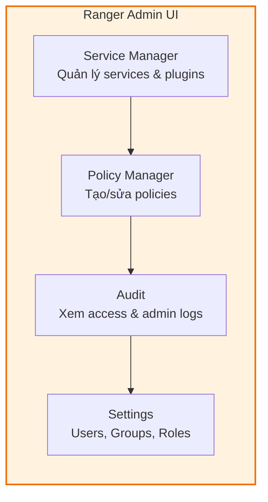
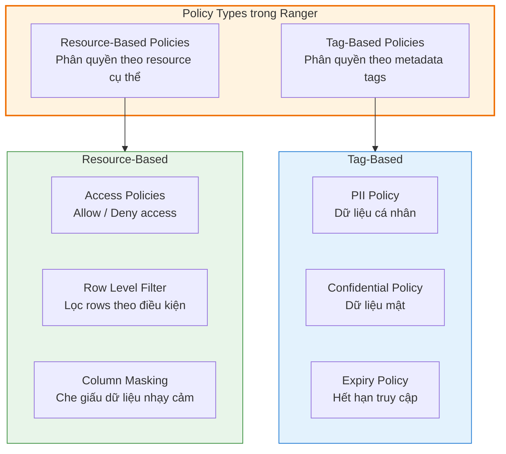
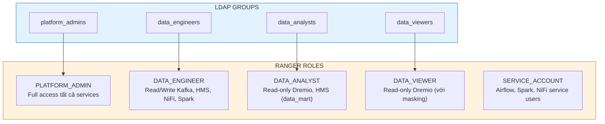

# Apache Ranger — Hướng Dẫn Sử Dụng

## 1. Truy Cập Ranger Admin UI

### 1.1 URL và Tài Khoản

| Thông tin | Giá trị |
|-----------|---------|
| **URL** | `http://ranger-admin.security.svc:6080` |
| **Port-forward** | `kubectl port-forward svc/ranger-admin -n security 6080:6080` |
| **Admin user** | `<RANGER_ADMIN_USER>` |
| **Admin password** | `<FROM_SECRET_MANAGER>` |
| **Keyadmin** | `<RANGER_KEYADMIN_USER>` / `<FROM_SECRET_MANAGER>` (cho KMS) |

> **Quan trọng**: Không dùng credential mặc định. Tạo admin/keyadmin qua Secret manager, bật SSO nếu được hỗ trợ và rotate theo chính sách.

### 1.2 Giao Diện Chính



| Tab | Chức năng |
|-----|-----------|
| **Service Manager** | Xem danh sách services đã đăng ký (Kafka, Hive, NiFi, Spark, Dremio), trạng thái plugin |
| **Access Policies** | Tạo, sửa, xóa resource-based policies cho từng service |
| **Row Level Filter** | Cấu hình row-level filtering cho Hive/Dremio tables |
| **Column Masking** | Cấu hình data masking cho các cột nhạy cảm |
| **Audit** | Xem chi tiết access logs, admin logs, plugin status |
| **Settings** | Quản lý Users, Groups, Roles, Permissions |

---

## 2. Quản Lý Service

### 2.1 Danh Sách Service Trong Hanas Platform

| Service Name | Type | Mô tả | Tự động đăng ký |
|-------------|------|-------|-----------------|
| `kafka_hanas` | Kafka | Kafka broker cluster | Khi plugin cài đặt |
| `hive_hanas` | Hive | Hive Metastore (Iceberg catalog) | Khi plugin cài đặt |
| `nifi_hanas` | NiFi | NiFi flow authorization | Khi plugin cài đặt |
| `spark_hanas` | Spark SQL | Spark SQL authorization | Khi plugin cài đặt |
| `dremio_hanas` | Hive (Ranger-based) | Dremio query engine | Cấu hình trong Dremio |

### 2.2 Tạo Service Mới

1. Truy cập **Service Manager**
2. Click **+** bên cạnh loại service (ví dụ: Kafka)
3. Điền thông tin:
   - **Service Name**: `kafka_hanas`
   - **Username / Password**: Tài khoản admin của service
   - **Connection Config**: Kafka bootstrap servers, Zookeeper URL
4. Click **Test Connection** → Verify kết nối thành công
5. Click **Add** để lưu

---

## 3. Quản Lý Policy

### 3.1 Loại Policy



### 3.2 Tạo Access Policy — Hive Metastore (Iceberg Tables)

Đây là policy quan trọng nhất trong Hanas Platform vì Hive Metastore là **catalog chung** cho cả Spark, Dremio, và Iceberg.

**Ví dụ**: Cho phép nhóm `data_engineers` đọc/ghi tất cả tables trong database `landing`, nhưng nhóm `data_analysts` chỉ được đọc.

1. Truy cập **Service Manager → hive_hanas → Add New Policy**
2. Cấu hình:

| Trường | Giá trị |
|--------|---------|
| **Policy Name** | `landing-db-access` |
| **Database** | `landing` |
| **Table** | `*` (tất cả tables) |
| **Column** | `*` (tất cả columns) |

3. **Allow Conditions**:

| # | User/Group | Permissions | Delegate Admin |
|---|-----------|-------------|----------------|
| 1 | Group: `data_engineers` | Select, Update, Create, Drop, Alter, Index, Lock | Không |
| 2 | Group: `data_analysts` | Select | Không |
| 3 | User: `airflow_svc` | All | Có |
| 4 | User: `spark_svc` | All | Không |

4. Click **Add** để lưu policy.

### 3.3 Tạo Access Policy — Kafka Topics

**Ví dụ**: Cho phép `kafka_connect_svc` produce vào tất cả CDC topics, `spark_svc` consume.

1. Truy cập **Service Manager → kafka_hanas → Add New Policy**
2. Cấu hình:

| Trường | Giá trị |
|--------|---------|
| **Policy Name** | `cdc-topics-access` |
| **Topic** | `ORACLE.*` (pattern matching cho CDC topics) |

3. **Allow Conditions**:

| # | User/Group | Permissions |
|---|-----------|-------------|
| 1 | User: `kafka_connect_svc` | Publish, Describe |
| 2 | User: `spark_svc` | Consume, Describe |
| 3 | Group: `platform_admins` | Publish, Consume, Configure, Describe, Create, Delete, Admin |

### 3.4 Tạo Access Policy — NiFi Flows

**Ví dụ**: Cho phép `data_engineers` view và modify process groups, nhưng `data_viewers` chỉ được xem.

1. Truy cập **Service Manager → nifi_hanas → Add New Policy**
2. Cấu hình:

| Trường | Giá trị |
|--------|---------|
| **Policy Name** | `nifi-flow-access` |
| **NiFi Resource** | `/flow` (view UI) |

3. **Allow Conditions**:

| # | User/Group | Permissions |
|---|-----------|-------------|
| 1 | Group: `data_engineers` | Read, Write |
| 2 | Group: `data_viewers` | Read |

> **Lưu ý**: NiFi resources sử dụng dạng path — `/flow`, `/system`, `/controller`, `/data/process-groups/<uuid>`.

### 3.5 Tạo Access Policy — Spark SQL (Iceberg)

**Ví dụ**: Cho phép `data_analysts` query tables trong database `data_mart`.

1. Truy cập **Service Manager → spark_hanas → Add New Policy**
2. Cấu hình:

| Trường | Giá trị |
|--------|---------|
| **Policy Name** | `datamart-read-access` |
| **Database** | `data_mart` |
| **Table** | `*` |
| **Column** | `*` |

3. **Allow Conditions**:

| # | User/Group | Permissions |
|---|-----------|-------------|
| 1 | Group: `data_analysts` | Select |
| 2 | Group: `data_engineers` | Select, Create, Drop, Alter |

---

## 4. Row-Level Filtering

Row-level filtering cho phép giới hạn user chỉ xem những rows thỏa mãn điều kiện nhất định. Áp dụng cho **Hive Metastore** (ảnh hưởng Spark và Dremio).

### 4.1 Ví Dụ: Lọc Theo Vùng Địa Lý

**Use case**: User thuộc nhóm `region_hcm` chỉ xem dữ liệu có `region = 'HCM'`.

1. Truy cập **Service Manager → hive_hanas → Row Level Filter tab**
2. Click **Add New Policy**:

| Trường | Giá trị |
|--------|---------|
| **Policy Name** | `region-filter-khach-hang` |
| **Database** | `data_mart` |
| **Table** | `dim_customer` |

3. **Row Filter Conditions**:

| # | User/Group | Access Type | Row Level Filter |
|---|-----------|-------------|-----------------|
| 1 | Group: `region_hcm` | Select | `region = 'HCM'` |
| 2 | Group: `region_hn` | Select | `region = 'HN'` |
| 3 | Group: `data_admins` | Select | _(trống — xem tất cả)_ |

> Khi user thuộc `region_hcm` chạy `SELECT * FROM data_mart.dim_customer`, Ranger tự động thêm `WHERE region = 'HCM'` vào query.

---

## 5. Column Masking (Data Masking)

Column masking che giấu dữ liệu nhạy cảm trong các cột cụ thể khi user không có quyền xem dữ liệu gốc.

### 5.1 Các Loại Masking

| Loại | Ví dụ Input | Ví dụ Output | Mô tả |
|------|------------|-------------|-------|
| **Redact** | `Nguyễn Văn A` | `xxxxx xxx x` | Thay ký tự alpha bằng `x`, số bằng `n` |
| **Hash** | `nguyenvana@email.com` | `a1b2c3d4e5f6...` | SHA-256 hash |
| **Partial Mask** | `0912345678` | `091****678` | Hiện một phần, ẩn phần còn lại |
| **Nullify** | `123456789` | `NULL` | Thay bằng NULL |
| **Custom** | `nguyenvana@email.com` | `n***a@email.com` | Expression tùy chỉnh |

### 5.2 Ví Dụ: Mask CMND/CCCD và Email

1. Truy cập **Service Manager → hive_hanas → Masking tab**
2. Click **Add New Policy**:

| Trường | Giá trị |
|--------|---------|
| **Policy Name** | `mask-pii-customer` |
| **Database** | `data_mart` |
| **Table** | `dim_customer` |
| **Column** | `cccd` |

3. **Masking Conditions**:

| # | User/Group | Access Type | Masking Option |
|---|-----------|-------------|----------------|
| 1 | Group: `data_analysts` | Select | Partial Mask (show last 4) |
| 2 | Group: `data_viewers` | Select | Hash |
| 3 | Group: `data_admins` | Select | _(unmasked — xem gốc)_ |

Tạo thêm policy tương tự cho cột `email`, `phone`, `address`.

---

## 6. Quản Lý Users, Groups, Roles

### 6.1 Mô Hình RBAC Trong Hanas Platform



### 6.2 Tạo Role

1. Truy cập **Settings → Roles → Add New Role**
2. Cấu hình:
   - **Role Name**: `DATA_ENGINEER`
   - **Description**: `Read/Write access to ingestion and processing layers`
   - **Users**: Thêm users thuộc role
   - **Groups**: Liên kết LDAP group `data_engineers`
3. Click **Save**

### 6.3 Quản Lý Users

| Nguồn | Cách thêm | Ghi chú |
|-------|-----------|---------|
| **LDAP/AD** | Tự động qua Usersync | Sync mỗi 6 phút |
| **Internal** | Settings → Users → Add New User | Cho service accounts |
| **Ranger API** | `POST /service/xusers/users` | Tự động hóa qua script |

---

## 7. Audit — Kiểm Toán Truy Cập

### 7.1 Xem Audit Logs

Truy cập **Audit tab** trong Ranger Admin UI:

| Tab | Nội dung | Ví dụ |
|-----|---------|-------|
| **Access** | Toàn bộ access requests (allow/deny) | User `analyst1` SELECT on `data_mart.dim_customer` → Allowed |
| **Admin** | Thay đổi policies, users, groups | Admin tạo policy mới cho Kafka |
| **Login Sessions** | Lịch sử đăng nhập Ranger UI | User `<RANGER_USER>` login from `<CLIENT_IP>` |
| **Plugins** | Trạng thái plugins | `kafka_hanas` last policy download: 30s ago |
| **Plugin Status** | Chi tiết health của mỗi plugin | Active, last heartbeat timestamp |

### 7.2 Tìm Kiếm Audit

```
Filters:
├── Service Type:  kafka / hive / nifi / spark
├── User:          analyst1
├── Resource:      data_mart.dim_customer
├── Access Type:   select / create / drop
├── Result:        Allowed / Denied
├── Start Date:    2026-03-01
└── End Date:      2026-03-02
```

### 7.3 Audit Report Cho Compliance

Ranger cung cấp các báo cáo tích hợp:

| Báo cáo | Mô tả |
|---------|-------|
| **Access Report** | Ai truy cập gì, khi nào, kết quả allow/deny |
| **Policy Report** | Danh sách tất cả policies theo service |
| **User Activity** | Tổng hợp hoạt động theo user trong khoảng thời gian |
| **Denied Access** | Tất cả access bị deny — cảnh báo vi phạm |

---

## 8. REST API

### 8.1 API Thường Dùng

```bash
# Base URL và credential lấy từ Secret/Vault hoặc biến môi trường bảo vệ
BASE="${RANGER_ADMIN_BASE_URL:?Set RANGER_ADMIN_BASE_URL}"
RANGER_ADMIN_USER="${RANGER_ADMIN_USER:?Set RANGER_ADMIN_USER}"
RANGER_ADMIN_PASSWORD="${RANGER_ADMIN_PASSWORD:?Set RANGER_ADMIN_PASSWORD}"

# Liệt kê tất cả services
curl --user "${RANGER_ADMIN_USER}:${RANGER_ADMIN_PASSWORD}" "$BASE/service/public/v2/api/service"

# Liệt kê policies của một service
curl --user "${RANGER_ADMIN_USER}:${RANGER_ADMIN_PASSWORD}" "$BASE/service/public/v2/api/service/kafka_hanas/policy"

# Tạo policy mới
curl --user "${RANGER_ADMIN_USER}:${RANGER_ADMIN_PASSWORD}" -X POST -H "Content-Type: application/json" \
  "$BASE/service/public/v2/api/policy" \
  -d @policy.json

# Xóa policy
curl --user "${RANGER_ADMIN_USER}:${RANGER_ADMIN_PASSWORD}" -X DELETE \
  "$BASE/service/public/v2/api/policy/<policy_id>"

# Liệt kê users
curl --user "${RANGER_ADMIN_USER}:${RANGER_ADMIN_PASSWORD}" "$BASE/service/xusers/users"

# Liệt kê roles
curl --user "${RANGER_ADMIN_USER}:${RANGER_ADMIN_PASSWORD}" "$BASE/service/roles/roles"

# Export tất cả policies (backup)
curl --user "${RANGER_ADMIN_USER}:${RANGER_ADMIN_PASSWORD}" \
  "$BASE/service/plugins/policies/exportJson?serviceName=hive_hanas" \
  -o hive_policies_backup.json

# Import policies
curl --user "${RANGER_ADMIN_USER}:${RANGER_ADMIN_PASSWORD}" -X POST \
  -H "Content-Type: multipart/form-data" \
  -F "file=@hive_policies_backup.json" \
  "$BASE/service/plugins/policies/importPoliciesFromFile?serviceName=hive_hanas"
```

---

## 9. Troubleshooting

### 9.1 Các Lỗi Thường Gặp

| Lỗi | Nguyên nhân | Giải pháp |
|-----|------------|-----------|
| **Plugin not connected** | Plugin không thể kết nối Ranger Admin | Kiểm tra network connectivity, URL config, firewall |
| **Policy not taking effect** | Plugin chưa pull policies mới | Chờ poll interval (30s) hoặc restart service |
| **User not found** | User chưa được sync từ LDAP | Kiểm tra Usersync logs, verify LDAP config |
| **Access denied unexpectedly** | Policy deny hoặc thiếu allow policy | Kiểm tra Audit → Access tab, xem policy nào deny |
| **Ranger Admin UI 500** | Database connection issue | Kiểm tra PostgreSQL connectivity, logs |
| **LDAP sync failed** | LDAP connection hoặc credentials sai | Kiểm tra Usersync logs, test LDAP bind |

### 9.2 Kiểm Tra Logs

```bash
# Ranger Admin logs
kubectl logs -n security deployment/ranger-admin -f

# Ranger Usersync logs
kubectl logs -n security deployment/ranger-usersync -f

# Kiểm tra plugin status qua API
curl --user "${RANGER_ADMIN_USER}:${RANGER_ADMIN_PASSWORD}" \
  "$BASE/service/public/v2/api/plugins/info"
```

### 9.3 Debug Policy Evaluation

Khi cần debug tại sao user bị deny:

1. Truy cập **Audit → Access** tab
2. Filter theo user và resource bị deny
3. Xem cột **Policy ID** — click để xem policy gây deny
4. Kiểm tra:
   - User có thuộc group/role nào trong policy không
   - Có deny policy nào override allow policy không
   - Policy có đúng resource path không (database, table, column)

> **Lưu ý quy tắc ưu tiên**: Deny policy luôn ưu tiên hơn Allow policy. Nếu user thuộc cả 2 groups — một cho phép, một từ chối — kết quả sẽ là deny.
