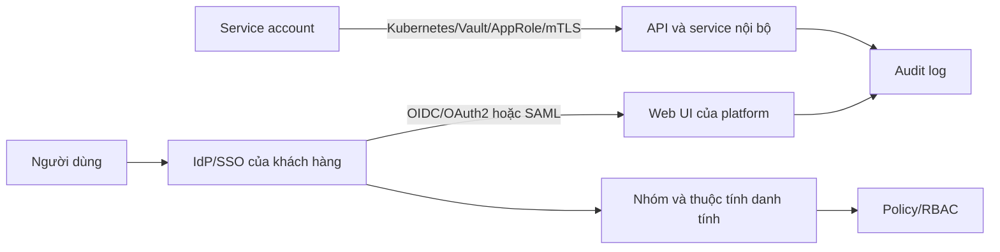

# Xác thực và quản lý danh tính

## Mục tiêu

Tất cả giao diện quản trị, API và service account của Hanas phải được xác thực trước khi truy cập. Cấu hình cụ thể phụ thuộc Identity Provider (IdP) của khách hàng; các giá trị triển khai phải được ghi tại [Baseline triển khai](../00-overview/platform-baseline.md), không ghi mật khẩu hoặc token vào tài liệu.

## Mô hình tham chiếu



## Phương thức xác thực

| Đối tượng | Phương thức ưu tiên | Phương thức dự phòng | Yêu cầu kiểm soát |
|---|---|---|---|
| Người dùng quản trị | SSO qua OIDC/OAuth2 hoặc SAML | Tài khoản local break-glass | MFA, phê duyệt, audit và giới hạn số người |
| Người dùng nghiệp vụ | SSO và group mapping | Local chỉ khi được phê duyệt | Không cấp quyền trực tiếp theo user nếu có thể dùng group |
| Pipeline/service | Workload identity, Kubernetes Secret lấy từ Vault, mTLS hoặc token ngắn hạn | Service account riêng theo service | Không dùng tài khoản cá nhân; rotate và thu hồi khi đổi pipeline |
| Nhà cung cấp hỗ trợ | Tài khoản tạm thời/JIT | Không cấp tài khoản dùng chung | Ticket, thời hạn, phạm vi và audit bắt buộc |

## Tích hợp SSO

Thông tin cần lấy từ khách hàng:

| Tham số | Giá trị bàn giao |
|---|---|
| IdP và protocol | `<CẦN ĐIỀN: Entra ID/Keycloak/LDAP/...>` |
| Issuer/metadata URL | `<CẦN ĐIỀN>` |
| Client ID | `<CẦN ĐIỀN; lưu trong Secret/Vault>` |
| Redirect/logout URL | `<CẦN ĐIỀN theo từng service>` |
| Claim/group dùng để phân quyền | `<CẦN ĐIỀN>` |
| MFA và chính sách session | `<CẦN ĐIỀN theo chính sách ATTT>` |
| Đầu mối IdP | `<CẦN ĐIỀN>` |

Ví dụ cấu hình tham chiếu, không phải manifest dùng trực tiếp:

```yaml
auth:
  enabled: true
  protocol: oidc # oidc, oauth2 hoặc saml theo IdP
  issuer_url: <IDP_ISSUER_URL>
  client_id: <FROM_SECRET_OR_VAULT>
  client_secret: <FROM_SECRET_OR_VAULT>
  groups_claim: groups
  allowed_groups:
    - <PLATFORM_ADMIN_GROUP>
    - <DATA_ENGINEER_GROUP>
```

## Tài khoản break-glass

- Chỉ duy trì số lượng tối thiểu tài khoản local quản trị để xử lý sự cố IdP.
- Mật khẩu được tạo ngẫu nhiên, lưu trong Vault/password manager và kiểm kê định kỳ.
- Không dùng break-glass cho vận hành thường ngày; mỗi lần sử dụng phải có ticket và review audit log.
- Thử đăng nhập trong diễn tập nhưng không ghi mật khẩu vào biên bản hoặc log.

## Vòng đời danh tính

1. **Onboarding:** user thuộc group được phê duyệt, gán role tối thiểu và kiểm tra login.
2. **Thay đổi:** thay đổi group/role qua request có owner, lý do và thời hạn.
3. **Offboarding:** IdP disable trước, revoke session/token/service credential liên quan, sau đó kiểm tra quyền còn sót.
4. **Định kỳ:** rà soát user, group, service account, token hết hạn và quyền break-glass.

## Bảo vệ phiên và API

- Chỉ công bố UI/API qua HTTPS; TLS certificate và DNS phải thuộc phạm vi vận hành của khách hàng.
- Thiết lập thời hạn session, idle timeout, refresh-token rotation và giới hạn thử đăng nhập theo chuẩn IdP.
- API token phải gắn với một service account, scope tối thiểu, ngày hết hạn và owner.
- Không truyền token qua URL; không log `Authorization`, cookie, client secret hoặc payload chứa dữ liệu nhạy cảm.
- Service-to-service phải dùng network policy và identity riêng; không dùng `admin` credential giữa các service.

## Audit và tiêu chí nghiệm thu

Kiểm tra tối thiểu:

| Kiểm tra | Kết quả cần đạt |
|---|---|
| User hợp lệ đăng nhập SSO | Truy cập đúng service và role |
| User ngoài group đăng nhập | Bị từ chối hoặc không có quyền dữ liệu |
| MFA với admin | Được áp dụng theo chính sách khách hàng |
| Tài khoản offboard | Không còn session/token truy cập |
| Break-glass | Có kiểm soát, cảnh báo và audit |
| API credential hết hạn/rotate | Pipeline dùng credential mới, credential cũ bị revoke |
| Audit log | Có actor, thời gian, action, resource, kết quả và correlation ID |

## Phân định trách nhiệm

| Hạng mục | Hanas | Khách hàng |
|---|---|---|
| Cung cấp IdP, group và chính sách MFA | Hỗ trợ tích hợp | Owner/phê duyệt |
| Cấu hình connector/service | Thực hiện theo thiết kế | Cấp endpoint/credential qua kênh an toàn |
| User lifecycle | Hỗ trợ mapping và kiểm tra | Quản lý user/group hằng ngày |
| Audit và review quyền | Cung cấp log/báo cáo | Phê duyệt, lưu trữ và xử lý theo chính sách |
