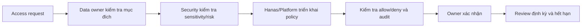

# Phân quyền (Authorization)

## Mục tiêu

Phân quyền theo nguyên tắc **least privilege**, quản lý theo group/role, giới hạn theo data domain và bảo vệ dữ liệu nhạy cảm ở các lớp query, catalog, BI và export. Quyền thực tế phải được kiểm tra trên môi trường khách hàng; không xem tên role mẫu là quyền mặc định.

## Các lớp kiểm soát

| Lớp | Thành phần tham chiếu | Kiểm soát |
|---|---|---|
| Identity | IdP/SSO | User, group, MFA, vòng đời danh tính |
| Platform | Kubernetes RBAC, namespace, network policy | Quyền vận hành workload và secret |
| Data policy | Apache Ranger hoặc policy engine được phê duyệt | Database/table/column, audit, deny/allow |
| Query/semantic | Dremio và catalog | Space/source, dataset, row/column rule, reflection |
| Consumption | Superset/BI/API | Dataset, dashboard, export và chia sẻ |
| Secrets | HashiCorp Vault | Credential, token, rotation và access audit |

## Role tham chiếu

Role chỉ là mẫu khởi đầu; mapping group và scope phải được điền vào baseline.

| Role | Phạm vi | Quyền chính | Không được phép |
|---|---|---|---|
| Platform Admin | Toàn platform | Vận hành hạ tầng, cấu hình service, xem audit kỹ thuật | Truy cập dữ liệu nghiệp vụ nếu không có business approval |
| Data Engineer | Domain được giao | Tạo pipeline, schema, job, kiểm tra chất lượng | Cấp quyền cho chính mình hoặc export dữ liệu nhạy cảm |
| Data Steward | Domain/dataset được giao | Glossary, owner, quality rule, phê duyệt metadata | Thay đổi hạ tầng hoặc đọc ngoài scope |
| Data Analyst/Consumer | Mart/semantic layer | Query, dashboard, phân tích theo dataset được cấp | Raw/PII, DDL/DML production, chia sẻ ngoài policy |
| Security Auditor | Log/audit scope | Đọc policy và audit, xuất báo cáo được phê duyệt | Thay đổi dữ liệu hoặc policy |
| Support JIT | Ticket và thời hạn | Quyền tối thiểu để xử lý incident | Truy cập thường trực hoặc dùng tài khoản chung |

## Phạm vi theo vùng dữ liệu

| Vùng | Người được truy cập | Chính sách |
|---|---|---|
| Landing | Ingestion/Platform | Dùng cho kiểm tra tiếp nhận; retention ngắn; hạn chế truy cập người dùng |
| Raw Vault | Data Engineer/Steward | Có lineage, quality check, không chia sẻ trực tiếp cho business |
| Business Vault | Steward/Analyst được phê duyệt | Dữ liệu đã chuẩn hóa và áp dụng rule nghiệp vụ |
| Information Mart | Consumer/BI/API | Là lớp ưu tiên cho báo cáo và use case |
| Audit/Observability | Platform/Security | Chứa log kỹ thuật; áp dụng retention và masking riêng |

## Row-level, column-level và export

- **Row-level:** giới hạn theo đơn vị, chi nhánh, tenant hoặc domain bằng policy ở lớp hỗ trợ tương ứng.
- **Column-level:** ẩn hoặc mask cột PII/financial/secrets; xác định rõ user được thấy giá trị đầy đủ, đã mask hay chỉ được aggregate.
- **Export:** mặc định tắt với dữ liệu nhạy cảm; nếu bật phải có scope, giới hạn số dòng, watermark (nếu có), audit và thời hạn.
- **Derived data:** quyền của dashboard, reflection, view và API không được vô tình rộng hơn quyền của dataset nguồn.

Việc một engine hỗ trợ syntax policy không đồng nghĩa policy đã được áp dụng đúng. Mỗi rule phải có test allow/deny và bằng chứng audit.

## Quy trình cấp quyền



Request phải có user/group, dataset, thao tác, mục đích, môi trường, thời hạn, approver và yêu cầu export. Tài khoản hỗ trợ phải có ticket và tự thu hồi sau thời hạn.

## Mẫu policy quản lý

```yaml
policy_id: <POLICY_ID>
subject_group: <IDP_GROUP>
resource: <CATALOG.SCHEMA.TABLE_OR_VIEW>
environment: <DEV|TEST|PROD>
actions: [SELECT]
row_filter: <APPROVED_FILTER_OR_NONE>
masked_columns:
  - <COLUMN_NAME>
export: denied
valid_until: <UTC_TIMESTAMP>
owner: <DATA_OWNER>
approval_ticket: <TICKET_ID>
```

Mẫu trên chỉ là bản ghi thiết kế. Cấu hình thật phải được triển khai qua công cụ quản lý policy của môi trường, review và version-control theo quy trình change.

## Kiểm thử phân quyền

| Test case | Kỳ vọng |
|---|---|
| Consumer đọc Information Mart được cấp | Thành công |
| Consumer đọc Raw Vault ngoài scope | Bị từ chối |
| User không thuộc group | Không thấy dataset hoặc bị từ chối |
| Analyst đọc cột PII | Giá trị bị mask/deny theo policy |
| Consumer export dữ liệu nhạy cảm | Bị chặn hoặc yêu cầu phê duyệt |
| Data Engineer thay đổi policy | Bị chặn nếu không có role/approval |
| JIT support sau hết hạn | Credential/session không còn hiệu lực |
| Audit query bị từ chối | Có actor, resource, rule và timestamp |

## Thông tin cần chốt với khách hàng

| Hạng mục | Giá trị |
|---|---|
| IdP groups → platform roles | `<CẦN ĐIỀN>` |
| Data owner theo domain | `<CẦN ĐIỀN>` |
| Danh mục dữ liệu nhạy cảm/PII | `<CẦN ĐIỀN>` |
| Rule row/column masking | `<CẦN ĐIỀN>` |
| Export/download policy | `<CẦN ĐIỀN>` |
| Retention audit và người review | `<CẦN ĐIỀN>` |
| Công cụ policy chính thức | `<CẦN ĐIỀN: Ranger/Dremio/khác>` |
