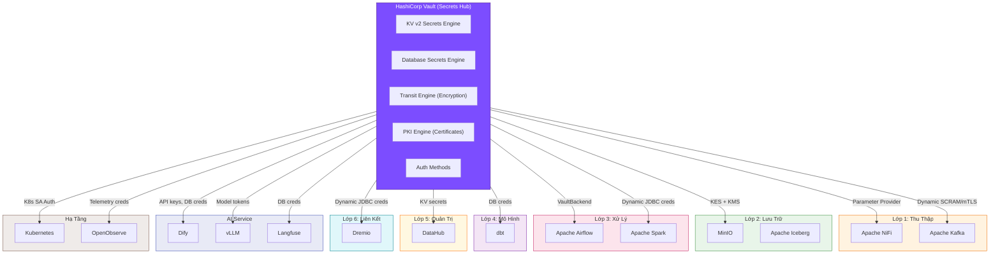
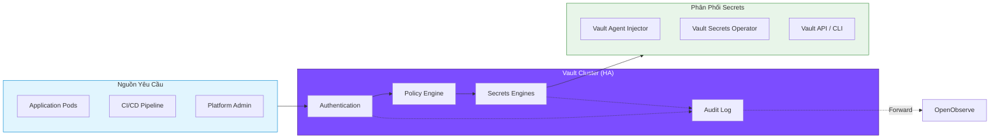

# HashiCorp Vault

## 1. Tổng Quan

HashiCorp Vault là công cụ mã nguồn mở quản lý secrets, mã hóa dữ liệu và kiểm soát truy cập dựa trên danh tính (identity-based access). Vault tập trung hóa việc lưu trữ, truy cập và xoay vòng các thông tin nhạy cảm như mật khẩu, API keys, certificates và encryption keys.

Trong Hanas Data Platform, Vault đóng vai trò **trung tâm quản lý bí mật (Secrets Management Hub)** — cung cấp credentials động, mã hóa dữ liệu và chứng chỉ TLS cho toàn bộ 7 lớp kiến trúc và tất cả services.

> **Phiên bản**: HashiCorp Vault OSS (Open Source) — MPL 2.0 License

## 2. Kiến Trúc Trong Hanas Platform

## 3. Tích Hợp Với Các Service

### 3.1 Ma Trận Tích Hợp

| Service | Secrets Engine | Auth Method | Cơ Chế Tích Hợp | Secrets Quản Lý |
|---------|---------------|-------------|-----------------|-----------------|
| **Apache NiFi** | KV v2, Transit | Kubernetes | `HashiCorpVaultParameterProvider`, Transit encrypt sensitive properties | DB passwords, API keys, encryption keys |
| **Apache Kafka** | Database | Kubernetes, AppRole | Dynamic SCRAM credentials, mTLS certificates | Broker auth, client creds, Schema Registry tokens |
| **Apache Airflow** | KV v2, Database | Kubernetes | `VaultBackend` — connections & variables tự động load | Connection strings, DAG variables, API tokens |
| **MinIO** | KV v2 | Kubernetes | MinIO KES → Vault KMS cho Server-Side Encryption (SSE) | Encryption keys, access keys |
| **Apache Spark** | Database | Kubernetes | Dynamic JDBC credentials qua Vault Agent Injector | DB connection creds, S3 access keys |
| **Dremio** | Database | Kubernetes | Dynamic JDBC credentials cho source connections | Catalog creds, S3 keys, JDBC passwords |
| **dbt** | KV v2 | AppRole | Environment variables inject qua CI/CD | `profiles.yml` credentials |
| **DataHub** | KV v2 | Kubernetes | Vault Secrets Operator (VSO) sync → K8s Secrets | MySQL creds, Kafka creds, Elasticsearch keys |
| **Dify** | KV v2 | Kubernetes | VSO hoặc Agent Injector | LLM API keys, DB creds, Redis passwords |
| **vLLM** | KV v2 | Kubernetes | K8s Secrets via VSO | Model access tokens, HuggingFace tokens |
| **Langfuse** | KV v2, Database | Kubernetes | Dynamic PostgreSQL credentials | DB creds, encryption keys |
| **OpenObserve** | KV v2 | Kubernetes | VSO sync credentials | Storage creds, auth tokens |
| **Kubernetes** | PKI | Kubernetes SA | ServiceAccount token auth, TLS certificates | Cluster TLS, ingress certs |

### 3.2 Luồng Secrets Trong Platform

**Ba cơ chế phân phối secrets vào workloads:**

| Cơ Chế | Mô Tả | Khi Nào Dùng |
|--------|--------|-------------|
| **Vault Agent Injector** | Sidecar container tự động inject secrets vào Pod qua annotations | App không hỗ trợ Vault API natively |
| **Vault Secrets Operator (VSO)** | Controller sync Vault secrets → Kubernetes Secrets | App đọc secrets từ env vars hoặc mounted files |
| **Direct API / CLI** | App gọi trực tiếp Vault HTTP API | App có Vault SDK integration (Airflow, NiFi) |

## 4. Secrets Engines

| Engine | Mô Tả | Use Case Trong Platform |
|--------|--------|------------------------|
| **KV v2** | Lưu trữ key-value có versioning | API keys, static passwords, config secrets |
| **Database** | Tạo credentials động với TTL, tự xoay vòng | PostgreSQL, MySQL, MongoDB credentials cho Dremio, Spark, Langfuse |
| **Transit** | Encryption-as-a-Service — mã hóa/giải mã không lộ key | NiFi sensitive properties, PII data encryption |
| **PKI** | Cấp phát X.509 certificates động | Internal mTLS, Kafka broker/client certs, Ingress TLS |

## 5. Authentication Methods

| Method | Mô Tả | Dùng Cho |
|--------|--------|---------|
| **Kubernetes** | Auth qua ServiceAccount token — zero-config cho Pods | Tất cả workloads trên K8s |
| **AppRole** | RoleID + SecretID cho machine-to-machine | CI/CD pipelines (dbt, Airflow DAG deploy) |
| **LDAP** | Xác thực qua LDAP/Active Directory | Platform admins, developers |
| **Token** | Token trực tiếp | Initial setup, emergency access |

## 6. So Sánh OSS vs Enterprise

| Tính Năng | OSS (Miễn Phí) | Enterprise |
|-----------|:---:|:---:|
| KV, Database, Transit, PKI Secrets Engines | ✅ | ✅ |
| Kubernetes, AppRole, LDAP Auth | ✅ | ✅ |
| HA Clustering (Raft Integrated Storage) | ✅ | ✅ |
| Audit Logging | ✅ | ✅ |
| Policies (ACL) | ✅ | ✅ |
| UI Dashboard | ✅ | ✅ |
| Namespaces (Multi-Tenancy) | ❌ | ✅ |
| Sentinel Policies (Policy-as-Code) | ❌ | ✅ |
| Performance Replication | ❌ | ✅ |
| Disaster Recovery Replication | ❌ | ✅ |
| HSM Auto-Unseal | ❌ | ✅ |
| MFA | ❌ | ✅ |
| Control Groups | ❌ | ✅ |

> **Hanas Platform sử dụng phiên bản OSS** — đáp ứng đầy đủ nhu cầu secrets management, dynamic credentials và encryption cho hệ thống. Các tính năng enterprise chủ yếu phục vụ tổ chức lớn với yêu cầu multi-tenancy và compliance cao.

## 7. Tài Liệu

- [Cài đặt & Triển khai](installation.md)
- [Cấu hình](configuration.md)
- [Hướng dẫn sử dụng](user-guide.md)
- [Best Practices](best-practices.md)
- [Thông tin Version](version-info.md)

## 8. Tham Khảo

| Nguồn | Link |
|-------|------|
| Vault Official Docs | [developer.hashicorp.com/vault](https://developer.hashicorp.com/vault/docs) |
| Vault GitHub | [github.com/hashicorp/vault](https://github.com/hashicorp/vault) |
| Vault Helm Chart | [github.com/hashicorp/vault-helm](https://github.com/hashicorp/vault-helm) |
| Vault Secrets Operator | [github.com/hashicorp/vault-secrets-operator](https://github.com/hashicorp/vault-secrets-operator) |
| Vault Agent Injector | [developer.hashicorp.com/vault/docs/platform/k8s/injector](https://developer.hashicorp.com/vault/docs/platform/k8s/injector) |
