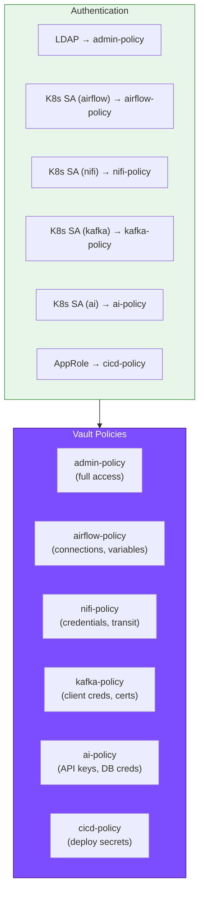
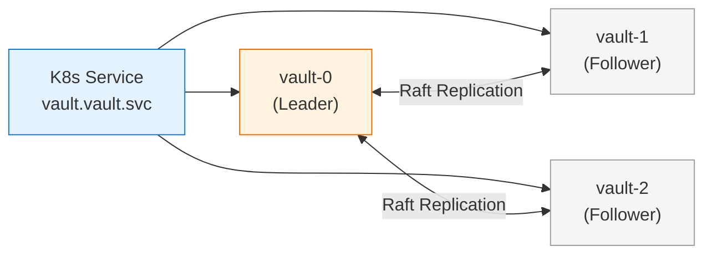
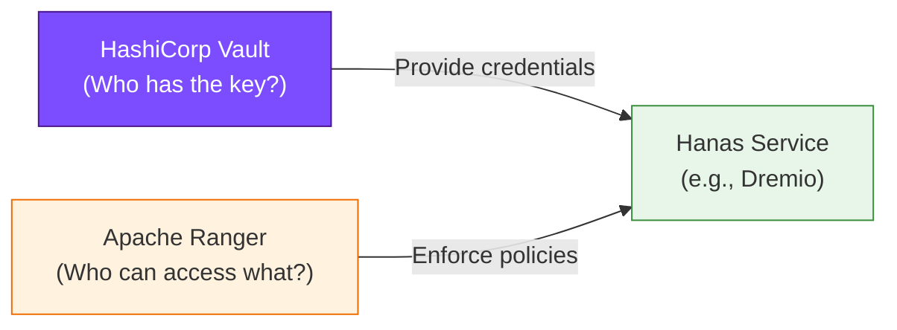

# HashiCorp Vault — Best Practices

## 1. Security Hardening

### 1.1 Checklist Triển Khai Production

| # | Hạng Mục | Hành Động | Ưu Tiên |
|---|----------|-----------|---------|
| 1 | **Revoke Root Token** | Xóa root token ngay sau initial setup, chỉ generate khi cần | Cao |
| 2 | **Enable TLS** | Luôn sử dụng HTTPS cho mọi communication, bao gồm internal | Cao |
| 3 | **Audit Logging** | Enable ít nhất 2 audit devices (file + syslog/OpenObserve) | Cao |
| 4 | **Disable Swap** | Tránh sensitive data bị ghi ra disk | Cao |
| 5 | **Disable Core Dumps** | Ngăn memory dump chứa secrets | Cao |
| 6 | **Network Policies** | Chỉ cho phép authorized namespaces truy cập Vault | Trung bình |
| 7 | **Dedicated Service Account** | Vault chạy dưới unprivileged user, không dùng root | Trung bình |
| 8 | **Minimal Write Privileges** | Vault process chỉ ghi vào data dir và audit dir | Trung bình |
| 9 | **Single Tenancy** | Vault là process duy nhất chạy trên node (nếu có thể) | Thấp |
| 10 | **HSTS Headers** | Enable HTTP Strict Transport Security | Thấp |

### 1.2 Kubernetes Network Policy

```yaml
apiVersion: networking.k8s.io/v1
kind: NetworkPolicy
metadata:
  name: vault-access-control
  namespace: vault
spec:
  podSelector:
    matchLabels:
      app.kubernetes.io/name: vault
  policyTypes:
    - Ingress
  ingress:
    # Cho phép từ các namespace có label vault-access
    - from:
        - namespaceSelector:
            matchLabels:
              vault-access: "true"
      ports:
        - port: 8200  # Vault API
    # Cho phép internal cluster communication
    - from:
        - podSelector:
            matchLabels:
              app.kubernetes.io/name: vault
      ports:
        - port: 8201  # Cluster port
```

**Label namespaces cần truy cập Vault:**

```bash
# Cho phép các namespace truy cập Vault
kubectl label namespace airflow vault-access=true
kubectl label namespace nifi vault-access=true
kubectl label namespace confluent vault-access=true
kubectl label namespace minio vault-access=true
kubectl label namespace dremio vault-access=true
kubectl label namespace ai vault-access=true
kubectl label namespace datahub vault-access=true
```

---

## 2. Quản Lý Secrets — Nguyên Tắc Chung

### 2.1 Principle of Least Privilege

> Mỗi service chỉ được cấp quyền **tối thiểu cần thiết** trên Vault paths.

| Không nên | Nên |
|-------------|--------|
| Policy `path "secret/*" { capabilities = ["read"] }` | Policy `path "secret/data/hanas/airflow/*" { capabilities = ["read"] }` |
| Dùng root token cho ứng dụng | Dùng Kubernetes auth + service-specific role |
| Static passwords trong ConfigMap | Dynamic credentials qua Database Engine |
| Shared credentials giữa services | Mỗi service có credentials riêng |
| Long-lived tokens (>24h) | Short-lived tokens (1-4h) với auto-renewal |
| Hardcode secrets trong code/config | Inject qua Vault Agent / VSO |

### 2.2 Dynamic vs Static Secrets

| Loại Secret | Nên Dùng | Khi Nào |
|-------------|---------|---------|
| **Dynamic** (Database Engine) | Ưu tiên | Database credentials, cloud access keys |
| **Static** (KV v2) | Khi cần thiết | API keys bên thứ 3, encryption keys, config values |
| **Hardcoded** | Tuyệt đối không | Không bao giờ hardcode secrets |

### 2.3 Naming Convention

```
# Path convention
secret/hanas/<service>/<category>/<name>

# Database roles
database/creds/<service>-role

# PKI roles
pki_int/issue/<service>-mtls

# Transit keys
transit/keys/<purpose>-encryption
```

**Ví dụ:**

| Path | Mục đích |
|------|---------|
| `secret/hanas/airflow/connections/postgres_default` | Airflow PostgreSQL connection |
| `secret/hanas/kafka/connect/oracle-cdc` | Kafka Connect Oracle CDC creds |
| `secret/hanas/ai/dify/llm-api-keys` | Dify LLM API keys |
| `database/creds/dremio-role` | Dynamic JDBC creds cho Dremio |
| `pki_int/issue/kafka-mtls` | mTLS certificates cho Kafka |
| `transit/keys/pii-encryption` | PII data encryption key |

---

## 3. TTL & Rotation Strategy

### 3.1 Khuyến Nghị TTL

| Secret Type | Default TTL | Max TTL | Rotation | Phương Pháp |
|-------------|:-----------:|:-------:|:--------:|-------------|
| **Database creds** | 1h | 24h | Tự động | Database Secrets Engine |
| **Kubernetes tokens** | 1h | 8h | Tự động | K8s auth renewal |
| **AppRole tokens** | 10m | 30m | Tự động | CI/CD re-auth |
| **TLS certificates** | 168h (7d) | 720h (30d) | Tự động | PKI Engine |
| **Transit encryption keys** | N/A | N/A | 30 ngày | `auto_rotate_period` |
| **API keys (KV v2)** | N/A | N/A | 90 ngày | Manual + versioning |
| **Root credentials** | N/A | N/A | Ngay sau init | `vault operator generate-root` |

### 3.2 Lease Management

```bash
# Kiểm tra lease sắp hết hạn (< 30 phút)
vault list sys/leases/lookup/database/creds/airflow-role

# Batch revoke khi nghi ngờ bị compromise
vault lease revoke -prefix database/creds/airflow-role

# Force rotation root credentials
vault write -force database/rotate-root/hanas-postgres
```

---

## 4. Policy Design Patterns

### 4.1 Policy Theo Service Role



### 4.2 Checklist Policy Review

| # | Kiểm Tra | Tần Suất |
|---|---------|----------|
| 1 | Review policies — loại bỏ quyền không cần thiết | Hàng tháng |
| 2 | Audit denied access — phát hiện misconfiguration | Hàng tuần |
| 3 | Kiểm tra orphan tokens — revoke tokens không sử dụng | Hàng tuần |
| 4 | Review active leases — đảm bảo TTL hợp lý | Hàng tuần |
| 5 | Rotate static secrets (KV) — API keys, encryption keys | Hàng quý |
| 6 | Test disaster recovery — restore từ Raft snapshot | Hàng quý |

---

## 5. High Availability & Disaster Recovery

### 5.1 HA Architecture



| Thành phần | HA Strategy |
|------------|------------|
| **Vault Server** | 3 replicas, Raft Integrated Storage, auto leader election |
| **Vault Agent Injector** | 2 replicas, stateless |
| **Unseal Keys** | Shamir 5/3 — phân phối cho 5 admins khác nhau |
| **Raft Data** | Tự replicate giữa 3 nodes |

### 5.2 Backup Schedule

| Loại Backup | Tần Suất | Retention | Nơi Lưu |
|-------------|---------|-----------|---------|
| **Raft Snapshot** | Hàng ngày (2:00 AM) | 30 ngày | MinIO `s3://backups/vault/` |
| **Policy Export** | Hàng tuần | 90 ngày | Git repository |
| **Audit Logs** | Streaming | 90 ngày | OpenObserve |

### 5.3 DR Procedure

| Bước | Hành Động | Thời Gian |
|------|-----------|-----------|
| 1 | Phát hiện lỗi — monitoring alert | < 1 phút |
| 2 | Nếu sealed → unseal bằng 3/5 keys | 2-5 phút |
| 3 | Nếu data loss → restore Raft snapshot | 5-10 phút |
| 4 | Verify cluster health + policy enforcement | 2-3 phút |
| 5 | Notify services refresh credentials | < 1 phút |

> **Quan trọng**: Vault Agent và VSO cache secrets locally. Nếu Vault tạm unavailable, applications vẫn hoạt động với cached secrets cho đến khi lease expire.

---

## 6. Monitoring & Alerting

### 6.1 Key Metrics

| Metric | Ý Nghĩa | Ngưỡng Alert |
|--------|---------|-------------|
| `vault.core.unsealed` | Vault sealed/unsealed | `= 0` → **CRITICAL** |
| `vault.raft.leader.lastContact` | Raft heartbeat latency | `> 500ms` → CRITICAL |
| `vault.expire.num_leases` | Active leases count | `> 10000` → WARNING |
| `vault.token.count` | Active tokens | `> 50000` → WARNING |
| `vault.audit.log_response` | Audit write latency | `> 500ms` → WARNING |
| `vault.core.handle_request` | API requests/sec | Baseline + 100% → WARNING |

### 6.2 Checklist Giám Sát

| # | Item | Tần Suất | Công Cụ |
|---|------|---------|---------|
| 1 | Vault seal status | Real-time | Prometheus + Alert |
| 2 | Raft cluster membership | Real-time | Prometheus + Alert |
| 3 | Denied access audit | Hàng ngày | OpenObserve dashboard |
| 4 | Lease count trend | Hàng ngày | Grafana |
| 5 | Certificate expiration | Hàng ngày | PKI engine + Alert |
| 6 | Storage utilization | Hàng tuần | K8s PV monitoring |

---

## 7. Tích Hợp Với Apache Ranger

Vault và Ranger có vai trò **bổ sung** trong Hanas Platform Security:

| Khía Cạnh | HashiCorp Vault | Apache Ranger |
|-----------|----------------|---------------|
| **Chức năng** | Secrets Management, Encryption | Authorization, Access Control |
| **Quản lý** | Credentials, keys, certificates | Policies, permissions, audit |
| **Phạm vi** | Infrastructure-level secrets | Data-level access control |
| **Ví dụ** | Tạo JDBC password cho Dremio | Kiểm soát user A chỉ được SELECT table X |



> **Vault** trả lời: "Service có credentials gì để kết nối?"
> **Ranger** trả lời: "User có quyền truy cập data nào?"
