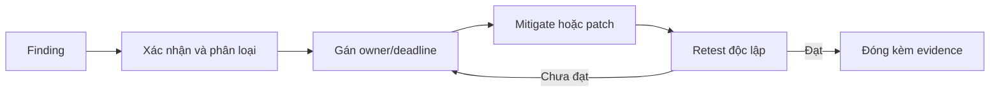

# Đánh giá kỹ thuật an toàn thông tin

Tài liệu này mô tả quy trình đánh giá kỹ thuật tham chiếu cho Hanas Data Platform. Nó không thay thế hồ sơ đánh giá ATTT chính thức, yêu cầu cấp độ an toàn hệ thống hoặc quy trình phê duyệt của khách hàng.

## Phạm vi

Phạm vi cần được chốt trước mỗi đợt đánh giá:

| Nhóm | Nội dung |
|---|---|
| Hạ tầng | Kubernetes control plane/worker, ingress, network policy, storage, registry |
| Workload | Image, Helm/manifest, RBAC, service account, probe, resource limit |
| Data services | NiFi, Kafka/Connect, MinIO, Iceberg/catalog, Spark/Airflow, Dremio/Superset |
| Governance/security | DataHub, Ranger, Vault, IdP/SSO, secret rotation, audit |
| AI/observability | Dify, vLLM, Langfuse, OpenObserve, API và data egress |
| Kết nối | DNS, TLS, firewall, external endpoint, backup/DR channel |

Không đưa dữ liệu production nhạy cảm vào công cụ scan/test nếu chưa có phê duyệt. Tài sản bên thứ ba, nguồn dữ liệu upstream và hoạt động gây gián đoạn phải ghi rõ là loại trừ hoặc có cửa sổ kiểm thử riêng.

## Phương pháp

### Rà quét lỗ hổng

1. Chốt inventory, owner, môi trường và cửa sổ scan.
2. Scan image/package, Kubernetes configuration, endpoint/TLS, dependency và secret exposure theo công cụ được khách hàng phê duyệt.
3. Xác nhận phát hiện bằng evidence tối thiểu; loại bỏ false positive có lý do.
4. Phân loại severity, owner, deadline và biện pháp giảm thiểu.

Tên công cụ và phiên bản: `<CẦN ĐIỀN THEO CHUẨN KHÁCH HÀNG>`. Không ghi credential scan trong báo cáo công khai.

### Kiểm thử xâm nhập

- Thực hiện theo rules of engagement được ký trước: mục tiêu, source IP, thời gian, kỹ thuật cho phép, giới hạn tải và điều kiện dừng.
- Ưu tiên authentication/authorization, exposed management endpoint, injection, SSRF, secret leakage, network segmentation, upload/export và API abuse.
- Tách kiểm thử ứng dụng, API, Kubernetes và network nếu owner/nhà cung cấp khác nhau.
- Mọi thao tác có khả năng làm thay đổi hoặc xóa dữ liệu phải có backup, người giám sát và kế hoạch rollback.

Phạm vi pentest, phương pháp, đơn vị thực hiện và thời gian: `<CẦN ĐIỀN/PHÊ DUYỆT>`.

## Phân loại và xử lý

| Mức | Ví dụ | Hành động tham chiếu |
|---|---|---|
| Critical | Bypass xác thực, lộ secret production, RCE qua endpoint công khai | Cô lập/mitigate ngay; thông báo incident |
| High | Escalation quyền, truy cập dữ liệu ngoài scope, lỗ hổng public exploitable | Có workaround và kế hoạch sửa được phê duyệt |
| Medium | Misconfiguration có điều kiện khai thác, thiếu kiểm soát audit | Khắc phục trong chu kỳ bảo trì |
| Low/Informational | Hardening, header, logging hoặc hygiene | Đưa vào backlog/risk acceptance |

Deadline cụ thể phải theo chính sách ATTT/SLA của khách hàng, không suy ra từ bảng trên.

## Quy trình remediation

Mỗi finding phải có ID, asset, evidence, severity, impact, recommendation, owner, due date, trạng thái, risk acceptance (nếu có) và kết quả retest. Không đóng finding chỉ vì đã tạo ticket.

## Báo cáo và bằng chứng

Bộ hồ sơ bàn giao tối thiểu:

- scope/rules of engagement và danh sách tài sản;
- methodology, tool/version, thời gian scan/test;
- executive summary và danh sách finding theo severity;
- bằng chứng đã redact, log thay đổi và ticket liên quan;
- patch/config version, workaround và risk acceptance;
- retest report, residual risk và người phê duyệt đóng.

Kho lưu trữ, thời hạn giữ báo cáo và người có quyền xem: `<CẦN ĐIỀN>`.

## Chu kỳ và tiêu chí nghiệm thu

| Hoạt động | Chu kỳ tham chiếu | Tiêu chí |
|---|---|---|
| Vulnerability scan | `<CẦN ĐIỀN>` | Có report, triage và tracking |
| Pentest | Trước go-live và khi thay đổi lớn | Có scope, report và retest |
| Secret/access review | `<CẦN ĐIỀN>` | Không có credential hết hạn/bất ngờ |
| Security assessment định kỳ | Nguồn tham chiếu nêu 6 tháng; chốt theo hợp đồng/chính sách | Có biên bản và action plan |
