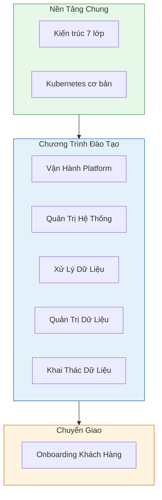

# Đào Tạo & Chuyển Giao Công Nghệ

## Tổng Quan

Chương trình đào tạo và chuyển giao công nghệ Hanas Data Platform được thiết kế để đảm bảo đội ngũ vận hành nắm vững toàn bộ nền tảng — từ kiến trúc 7 lớp, vận hành hệ thống, xử lý dữ liệu, đến khai thác và quản trị.

Chương trình bao gồm **5 nhóm đối tượng** và **1 quy trình onboarding khách hàng**, đảm bảo mọi vai trò trong tổ chức đều được trang bị kiến thức và kỹ năng phù hợp.

## Kiến Trúc Đào Tạo

## Chương Trình Đào Tạo

| # | Chương trình | Đối tượng | Thời lượng | Tài liệu |
|---|---|---|---|---|
| 1 | Vận hành Platform (Operations) | DevOps, SRE, Platform Engineer | 4 tuần | [Chi tiết](operations-training.md) |
| 2 | Quản trị hệ thống & hạ tầng | IT Admin, DevOps | 2 tuần | [Chi tiết](system-admin-training.md) |
| 3 | Xử lý dữ liệu (Processing) | Data Engineer, ETL Developer | 2 tuần | [Chi tiết](data-processing-training.md) |
| 4 | Quản trị dữ liệu (Governance) | Data Steward, Data Owner | 1 tuần | [Chi tiết](data-governance-training.md) |
| 5 | Khai thác dữ liệu (Consumer) | Business Analyst, End Users | 1 tuần | [Chi tiết](data-consumer-training.md) |

## Quy Trình Onboarding Khách Hàng

| Quy trình | Mô tả | Thời gian | Tài liệu |
|---|---|---|---|
| Customer Onboarding | Quy trình đưa khách hàng lên hệ thống: từ kickoff → deploy → training → migration → go-live | 3 tuần | [Chi tiết](customer-onboarding-guide.md) |

## Tài Liệu Tham Khảo

Tất cả chương trình đào tạo tham chiếu đến tài liệu platform:

| Lớp | Tài liệu | Chương trình liên quan |
|-----|----------|----------------------|
| [Tổng Quan](../00-overview/README.md) | Kiến trúc, mục tiêu | Tất cả |
| [Thu Thập](../01-ingestion/README.md) | NiFi, Kafka | Xử lý dữ liệu, Vận hành |
| [Lưu Trữ](../02-storage/README.md) | MinIO, Iceberg | Quản trị hệ thống, Vận hành |
| [Xử Lý](../03-processing/README.md) | Airflow, Spark | Xử lý dữ liệu, Vận hành |
| [Mô Hình](../04-data-model/README.md) | dbt, Data Vault | Xử lý dữ liệu |
| [Quản Trị DL](../05-governance/README.md) | DataHub | Quản trị dữ liệu |
| [Liên Kết](../06-federation/README.md) | Dremio | Khai thác dữ liệu |
| [Hệ Thống](../07-system-management/README.md) | OpenObserve | Quản trị hệ thống, Vận hành |
| [Hạ Tầng](../08-infrastructure/README.md) | K8s, Velero | Quản trị hệ thống |
| [An Toàn TT](../09-security/README.md) | Ranger, Vault | Quản trị hệ thống, Vận hành |
| [AI Service](../12-ai-service/README.md) | Dify, vLLM, Langfuse | Khai thác dữ liệu |

## Hướng Dẫn Thực Hành Bổ Trợ

- [Quickstart Guide](../guides/quickstart.md) — Dựng môi trường và chạy data flow đầu tiên
- [End-to-End Tutorial](../guides/end-to-end-tutorial.md) — Tutorial đầy đủ từ Source → BI
- [Troubleshooting](../guides/troubleshooting.md) — Xử lý sự cố thường gặp
