# Hướng Dẫn Onboarding Khách Hàng

## Tổng Quan

| Thông tin | Chi tiết |
|-----------|---------|
| **Mục tiêu** | Đưa khách hàng mới lên Hanas Data Platform — từ kickoff đến go-live |
| **Thời gian** | 3 tuần (từ contract signed đến go-live) |
| **Vai trò** | CSM, Solutions Architect (SA), DevOps Engineer (DE), Support Engineer (SE) |

```mermaid
gantt
    title Onboarding Timeline (3 Tuần)
    dateFormat X
    axisFormat %s

    section Tuần 1
    Kickoff Meeting           :a1, 1, 2
    Infrastructure Sizing     :a2, 2, 3
    Deploy Services           :a3, 3, 4
    Data Connections          :a4, 4, 5
    Smoke Tests               :a5, 5, 6

    section Tuần 2
    Admin Training            :b1, 6, 8
    Data Engineer Training    :b2, 8, 10
    Analyst Training          :b3, 10, 11

    section Tuần 3
    Migration Planning        :c1, 11, 12
    Data Migration            :c2, 12, 14
    Parallel Run              :c3, 14, 15
    Go-Live                   :milestone, c4, 15, 16
```



---

## Tuần 1: Chuẩn Bị Kỹ Thuật

### Ngày 1: Kickoff Meeting

#### Trước Meeting (30 phút)

| Vai trò | Chuẩn bị |
|---------|---------|
| **CSM** | Chuẩn bị agenda (giới thiệu team → tổng quan Hanas → yêu cầu customer → timeline) |
| **SA** | Review requirements: data volume, concurrent users, data sources, compliance, SLA |
| **DE** | Kiểm tra capacity cluster (`kubectl top nodes`, `kubectl describe nodes`) |

#### Kickoff Meeting (90 phút)

Agenda:
1. Giới thiệu team (15 phút)
2. Tổng quan Hanas — kiến trúc 7 lớp (30 phút)
3. Yêu cầu của customer (45 phút)

📖 Tham khảo: [Kiến trúc tổng thể](../00-overview/architecture.md)

#### Sau Meeting

- **CSM**: Gửi meeting notes + action items trong 2 giờ
- **SA**: Tạo customer folder (`customers/{{CUSTOMER_ID}}/{docs,configs,scripts}`)
- **DE**: Tạo Jira epic cho onboarding

---

### Ngày 2: Infrastructure Sizing & Security

#### Sizing Calculator

| Hạng mục | Thông tin cần thu thập |
|----------|----------------------|
| Data Volume | Initial TB, monthly growth, retention |
| Compute | Concurrent pipelines, Spark executors, Airflow workers |
| Network | Peak bandwidth, daily transfer |
| Security | Authentication (SSO/LDAP), network (VPN/private link), compliance |

#### Resource Request

```yaml
# customers/{{CUSTOMER_ID}}/resources.yaml
customer:
  id: "{{CUSTOMER_ID}}"
  name: "{{CUSTOMER_NAME}}"

resources:
  kubernetes:
    namespace: hanas-{{CUSTOMER_ID}}
    cpu: { request: "8", limit: "16" }
    memory: { request: "16Gi", limit: "32Gi" }
  minio:
    buckets: [landing, raw-vault, business-vault, information-mart]
    storage: "{{MINIO_STORAGE}}"
  airflow:
    workers: "{{AIRFLOW_WORKERS}}"
  monitoring:
    retention: "30d"
```

---

### Ngày 3: Deploy Môi Trường

#### Checklist Deploy

| # | Task | Lệnh |
|---|------|------|
| 1 | Tạo namespace & quotas | `kubectl apply -f namespace.yaml` |
| 2 | Deploy MinIO | `kubectl apply -k overlays/production/minio/` |
| 3 | Deploy Airflow | `kubectl apply -k overlays/production/airflow/` |
| 4 | Deploy Spark Operator | `kubectl apply -f components/spark-operator/` |
| 5 | Deploy Kafka Connect (CDC) | `kubectl apply -f components/kafka-connect/` |
| 6 | Cấu hình monitoring | `./scripts/create-dashboard.sh {{CUSTOMER_ID}}` |
| 7 | Cấu hình alerts | `kubectl apply -f monitoring/alerts.yaml` |

#### Verify

```bash
kubectl get pods -n hanas-{{CUSTOMER_ID}}
kubectl wait --for=condition=ready pod -l app=airflow-webserver \
  -n hanas-{{CUSTOMER_ID}} --timeout=300s
```

📖 Tham khảo: [Đào tạo quản trị hệ thống](system-admin-training.md)

---

### Ngày 4: Kết Nối Data Sources

| Loại | Cần làm |
|------|---------|
| Database (Batch) | Test connection, tạo K8s secret cho credentials |
| Database (CDC) | Deploy Oracle CDC Source / Debezium connector, tạo Iceberg Sink connector |
| API | Test endpoint, tạo Airflow connection |
| File/SFTP | Test access, cấu hình NiFi processor |

```bash
# Test database connection
kubectl run test-db --rm -it --image=postgres:15 -- psql {{CONNECTION_STRING}}

# Tạo secret
kubectl create secret generic db-credentials \
  --from-literal=username={{DB_USER}} \
  --from-literal=password={{DB_PASSWORD}} \
  -n hanas-{{CUSTOMER_ID}}

# Deploy CDC connector (nếu khách hàng cần streaming)
curl -X POST http://connect:8083/connectors/ \
  -H "Content-Type: application/json" \
  -d @connector_config.json

# Verify connector status
curl -s http://connect:8083/connectors/ | jq .
```

---

### Ngày 5: Smoke Tests & Week 1 Sign-off

#### Smoke Tests

```bash
./tests/smoke/minio.sh {{CUSTOMER_ID}}
./tests/smoke/airflow.sh {{CUSTOMER_ID}}
./tests/smoke/spark.sh {{CUSTOMER_ID}}
./tests/smoke/dremio.sh {{CUSTOMER_ID}}
```

#### End-to-End Pipeline Test

Upload test data → Trigger DAG → Monitor Spark → Query Dremio → Verify output.
Nếu có CDC: Verify Kafka connector RUNNING, consumer lag = 0, Iceberg table có dữ liệu.

#### Week 1 Sign-off

CSM gửi email xác nhận customer:

> Environment đã sẵn sàng: Infrastructure provisioned, Services deployed, Data connections tested, Security validated.
>
> Access URLs: Airflow, Dremio, Monitoring.

---

## Tuần 2: Training & Configuration

### Ngày 6-7: Admin Training (16 giờ)

| Nội dung | Thời lượng |
|----------|-----------|
| Platform overview | 30 phút |
| User management | 45 phút |
| Security settings | 45 phút |
| Kafka CDC monitoring | 30 phút |
| Monitoring | 30 phút |
| Troubleshooting | 45 phút |
| Q&A | 15 phút |

**Exercises**: Tạo user + gán role → Tạo custom alert → Xem và filter logs.

📖 Chi tiết: [Đào tạo quản trị hệ thống](system-admin-training.md)

---

### Ngày 8-9: Data Engineer Training (16 giờ)

| Nội dung | Thời lượng |
|----------|-----------|
| Data ingestion (NiFi/Kafka) | 2 giờ |
| Pipeline development (Airflow) | 3 giờ |
| dbt models (Data Vault) | 2 giờ |
| Data quality | 1 giờ |
| **Pipeline Workshop**: Build customer pipeline | 8 giờ |

**Workshop output**: Customer commits first DAG → ArgoCD deploy → Verify pipeline.

📖 Chi tiết: [Đào tạo xử lý dữ liệu](data-processing-training.md)

---

### Ngày 10: Analyst Training (8 giờ)

| Nội dung | Thời lượng |
|----------|-----------|
| Dremio interface | 1 giờ |
| SQL best practices | 1 giờ |
| Dashboard creation | 1.5 giờ |
| Self-service analytics | 0.5 giờ |
| **Dashboard Workshop**: Tạo dashboard thực tế | 2 giờ |

📖 Chi tiết: [Đào tạo khai thác dữ liệu](data-consumer-training.md)

---

### Training Sign-off

Sau mỗi buổi training, thu thập feedback:

| Tiêu chí | Thang điểm |
|----------|-----------|
| Content clarity | 1-5 |
| Hands-on usefulness | 1-5 |
| Pace appropriate | 1-5 |
| Bổ sung nội dung | Tự do |

Customer ký xác nhận hoàn thành training.

---

## Tuần 3: Data Migration & Go-Live

### Ngày 11: Migration Planning

#### Migration Strategy

| Phương pháp | Mô tả | Khi nào dùng |
|-------------|-------|-------------|
| Big Bang | Chuyển tất cả cùng lúc | Dataset nhỏ, downtime OK |
| Parallel | Chạy song song 2 hệ thống | Không chấp nhận downtime |
| Phased | Chuyển từng phần | Dataset lớn, nhiều nguồn |

#### Checklist

- Xác định tables/datasets cần migrate
- Xác định historical data (bao nhiêu tháng)
- Chuẩn bị validation criteria (row count, data quality checks)
- Chuẩn bị migration scripts

---

### Ngày 12-13: Data Migration Execution

#### Historical Load

```bash
./scripts/migrate/historical-load.sh \
  --customer {{CUSTOMER_ID}} \
  --source {{SOURCE_CONNECTION}} \
  --tables "table1,table2,table3" \
  --months 24
```

#### Reconciliation Report

| Table | Source Rows | Target Rows | Match |
|-------|-----------|------------|-------|
| hub_customer | 1,234,567 | 1,234,567 | 100% |
| sat_customer_details | 1,234,567 | 1,234,567 | 100% |

```sql
-- Validation query
SELECT 'Source' as source, COUNT(*) as cnt FROM source_table
UNION ALL
SELECT 'Target', COUNT(*) FROM raw_vault.hub_customer;
```

---

### Ngày 14: Parallel Run

Chạy song song 2 hệ thống trong 5 ngày:

| Giai đoạn | Old System | Hanas |
|-----------|-----------|-------|
| Tuần 1 (ngày 1-5) | Primary | Shadow (verify outputs) |
| Tuần 2 | Backup (fallback) | Primary |

Customer xác nhận kết quả hàng ngày → Sign-off sau 5 ngày match.

---

### Ngày 15: Go-Live

#### Pre Go-Live Checklist

| Nhóm | Hạng mục |
|------|---------|
| **Technical** | All services healthy, Data migrated, Pipelines running, Monitoring active, Alerts configured, Backup tested, DR documented |
| **Training** | Admin training complete, DE training complete, Analyst training complete, Documentation provided |
| **Support** | Support contacts provided, Escalation path defined, War room ready |
| **Communication** | Customer sign-off, Go-live announcement |

#### Go-Live Timeline

| Thời gian | Hoạt động |
|----------|----------|
| 20:00 | Stop old system writes |
| 20:15 | Final data sync |
| 20:30 | Verify Hanas current |
| 20:45 | Switch DNS to Hanas |
| 21:00 | Smoke tests |
| 21:30 | Customer validation |
| 22:00 | Go-live complete **HOẶC** rollback |

#### Post Go-Live: Hypercare (1 tuần)

- Daily standup 9 AM (5 ngày)
- L2 engineer dedicated
- Response time: < 15 phút
- Week review vào ngày cuối

---

## Common Issues & Solutions

| Vấn đề | Giải pháp |
|--------|----------|
| Customer chậm cung cấp access | Reminder 24h/48h/72h → Escalate to sponsor → Document delay impact |
| Data migration fail | Stop immediately → Preserve logs → Root cause → Retry → Communicate |
| Training attendance thấp | Reschedule → Record sessions → Offer 1-on-1 → Make mandatory |
| Customer muốn thêm scope | Document change request → Assess impact → Option A (delay) / Option B (Phase 2) → Written approval |

---

## Metrics & KPIs

| Metric | Target | Đo lường |
|--------|--------|---------|
| Time to First Value | < 1 tuần | First successful pipeline run |
| Go-Live Duration | < 3 giờ | From cutover start to sign-off |
| Training Completion | 100% | All required attendees |
| Customer Satisfaction | > 4.5/5 | Post-onboarding survey |
| Data Migration Accuracy | 100% | Reconciliation match |
| Zero Critical Issues | Yes | P1 incidents trong tuần đầu |

---

## Templates

### Template 1: Customer Kickoff Email

```
Subject: Welcome to Hanas - Project Kickoff

Dear {{CUSTOMER_NAME}} team,

Welcome to Hanas Data Platform!

📅 KICKOFF MEETING
Date: {{MEETING_DATE}}
Time: {{MEETING_TIME}}
Duration: 90 minutes

📋 PRE-MEETING
Please complete:
- Technical Requirements Form
- Security Questionnaire
```

### Template 2: Daily Status Update

```
Subject: [Customer-{{CUSTOMER_ID}}] Day {{N}} Status Update

📊 PROGRESS
✅ Completed: {{TASKS}}
🔄 In Progress: {{TASKS}} ({{PROGRESS}}%)
⏳ Up Next: {{TASKS}}

⚠️ BLOCKERS: {{DESCRIPTION}}
📅 TIMELINE: Original {{DATE}} → Current {{DATE}}
```

### Template 3: Go-Live Announcement

```
Subject: {{CUSTOMER_NAME}} is now LIVE on Hanas!

✅ WHAT'S LIVE: Ingestion, Warehouse, Analytics, API

🔗 ACCESS: Airflow, Dremio, Monitoring URLs

👥 NEXT STEPS: Week 1 Hypercare → Week 2 Regular → Week 4 Review

📞 SUPPORT: Email, Phone, Slack, Escalation
```

---

## Project Closure

Sau go-live + hypercare thành công:

| Deliverable | Status |
|-------------|--------|
| Infrastructure deployed | ✅ |
| Data migrated & validated | ✅ |
| Training completed | ✅ |
| Documentation delivered | ✅ |
| Support transitioned | ✅ |

Customer & Hanas ký sign-off → Chuyển giao sang Support Team.

📖 Tham khảo: [SLA & Cam kết](../11-maintenance/sla.md) | [Quy trình bảo trì](../11-maintenance/maintenance-process.md) | [Troubleshooting](../guides/troubleshooting.md)
