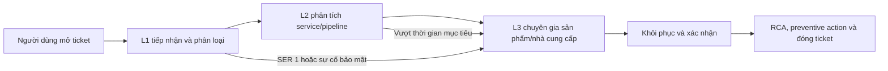

# SLA Và Cam Kết Dịch Vụ

## 1. Phạm vi áp dụng

SLA áp dụng cho các service, môi trường, thời gian hỗ trợ và loại yêu cầu đã được ghi trong hợp đồng. Bảng dưới đây là baseline tham chiếu từ hồ sơ giải pháp; giá trị chính thức phải được điền vào [Baseline triển khai](../00-overview/platform-baseline.md) và phụ lục SLA.

## 2. Mức độ nghiêm trọng

| Mức | Tương đương | Tiêu chí | Ví dụ |
|---|---|---|---|
| **SER 1 — Nghiêm trọng** | Critical | Toàn bộ hoặc một phần hệ thống production ngừng; ảnh hưởng diện rộng, nghiệp vụ trọng yếu hoặc sự kiện bảo mật | Không truy cập được platform; mất khả năng ghi/đọc dữ liệu trọng yếu; nghi ngờ rò rỉ dữ liệu |
| **SER 2 — Cao** | High | Một phần chức năng production lỗi, có workaround hạn chế hoặc ảnh hưởng lớn trong thời gian ngắn | Pipeline chính thất bại liên tục; query service không phục vụ nhóm người dùng lớn |
| **SER 3 — Bình thường** | Medium | Sai lệch hoặc suy giảm một phần nhưng chưa chặn nghiệp vụ quan trọng | Một dataset chậm, một connector lỗi, lỗi dữ liệu có thể chạy bù |
| **SER 4 — Yêu cầu** | Low/Request | Câu hỏi, yêu cầu cấu hình, tối ưu hoặc thay đổi không khẩn cấp | Tạo dashboard, xin hướng dẫn, đề xuất tuning |

## 3. Mục tiêu phản hồi và khôi phục

| Mức | Xác nhận/ phản hồi ban đầu | Mục tiêu khôi phục dịch vụ | Mục tiêu phản hồi | Mục tiêu khôi phục |
|---|---:|---:|---:|---:|
| SER 1 | 15 phút | 2 giờ | 100% | 100% |
| SER 2 | 30 phút | 24 giờ trong ngày làm việc | 100% | 100% |
| SER 3 | 120 phút | 8 giờ làm việc | 95% | 100% |
| SER 4 | 1 ngày làm việc | Theo kế hoạch đã thống nhất | Theo hợp đồng | Theo hợp đồng |

> Đây là mục tiêu tham chiếu, không phải cam kết thương mại độc lập. “Khôi phục” là đưa dịch vụ về trạng thái sử dụng được hoặc cung cấp workaround; “khắc phục hoàn toàn” có thể cần thời gian khác và được theo dõi trong problem/change record.

## 4. Quy tắc tính thời gian

- Đồng hồ bắt đầu khi ticket có đủ thông tin tối thiểu và được hệ thống ITSM ghi nhận.
- Thời gian chờ khách hàng cung cấp log, quyền truy cập, phê duyệt hoặc maintenance window được tách riêng và không tính vào thời gian xử lý nếu hợp đồng quy định.
- Thời gian khôi phục, workaround, nguyên nhân sơ bộ và rủi ro còn lại phải được ghi trong ticket.
- Ticket bảo mật được xử lý theo quy trình hạn chế truy cập; không ghi dữ liệu nhạy cảm vào nội dung ticket.

## 5. Uptime và chỉ số dịch vụ

Uptime mục tiêu phải được chốt theo từng môi trường/service: `<CẦN ĐIỀN THEO HỢP ĐỒNG>`. Báo cáo tháng nên bao gồm:

- tổng thời gian kỳ đo, thời gian gián đoạn và số incident;
- availability từng endpoint/service quan trọng;
- pipeline success rate, dữ liệu trễ và consumer lag;
- backup success rate, replication lag và kết quả restore test;
- thời gian phản hồi/khôi phục theo từng severity.

Không tính vào uptime nếu được hợp đồng loại trừ: maintenance window đã thông báo, lỗi hạ tầng/nguồn dữ liệu do bên khác quản lý, force majeure hoặc thay đổi chưa được phê duyệt.

## 6. Escalation

| Cấp | Trách nhiệm |
|---|---|
| L1 | Tiếp nhận, kiểm tra thông tin, phân loại, cập nhật trạng thái và điều phối |
| L2 | Kiểm tra log/metric, pipeline, cấu hình, dependency và triển khai workaround |
| L3 | Phân tích sâu, phối hợp hãng, sửa lỗi sản phẩm hoặc thiết kế phương án khôi phục |
| Customer owner | Cung cấp thông tin, phê duyệt truy cập/change, xác nhận kết quả |

Kênh và người liên hệ cụ thể được ghi tại [trang tổng quan bảo hành/bảo trì](README.md) và biên bản bàn giao.
