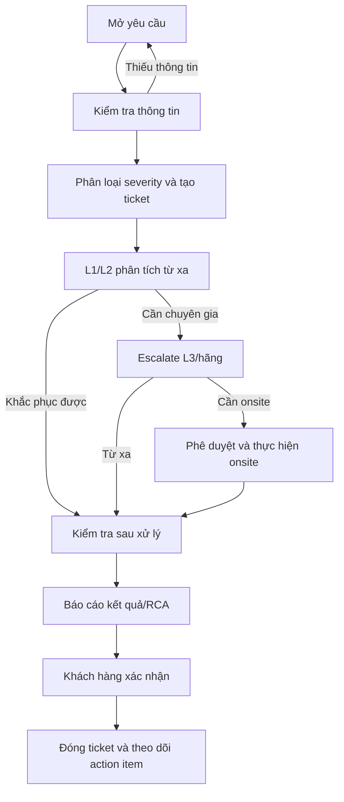

# Quy Trình Bảo Hành

## 1. Mục đích và phạm vi

Quy trình bảo hành áp dụng cho sự cố kỹ thuật trong phạm vi sản phẩm/dịch vụ đã nghiệm thu. Mục tiêu là khôi phục dịch vụ an toàn, ghi nhận đầy đủ bằng chứng, thông báo nguyên nhân và đóng ticket có xác nhận.

## 2. Luồng xử lý

## 3. Gửi yêu cầu

Kênh tiếp nhận: `<EMAIL/HOTLINE/ITSM CẦN ĐIỀN>`. Người yêu cầu cung cấp tối thiểu:

| Thông tin | Nội dung cần có |
|---|---|
| Người liên hệ | Họ tên, đơn vị, số điện thoại/email |
| Môi trường | DEV/TEST/STAGING/PROD, site và namespace |
| Thời điểm | Bắt đầu, tần suất và thời điểm gần nhất |
| Ảnh hưởng | Service/dataset/pipeline/user bị ảnh hưởng; số người dùng |
| Triệu chứng | Error message, query ID, DAG/run ID, connector/task ID |
| Đã thử | Các thao tác đã thực hiện và kết quả |
| Bằng chứng | Log/metric/screenshot đã che secret và dữ liệu nhạy cảm |
| Quyền hỗ trợ | Cửa sổ truy cập/onsite/change approval nếu cần |

Không gửi credential thật trong ticket. Nếu cần truy cập, dùng tài khoản tạm thời hoặc quy trình cấp quyền được phê duyệt.

## 4. Tiếp nhận và phân loại

1. L1 kiểm tra ticket có đủ thông tin, xác định service và severity.
2. Hệ thống ITSM tạo mã ticket, ghi timestamp và gửi xác nhận.
3. L1 thông báo người xử lý, mục tiêu phản hồi và thông tin cần bổ sung.
4. SER 1/sự cố bảo mật được báo ngay cho đầu mối quản lý và L2/L3; không chờ đủ toàn bộ log mới bắt đầu containment.

## 5. Phân tích và khắc phục

- L1 kiểm tra health/readiness, alert gần nhất, thay đổi gần đây và phạm vi ảnh hưởng.
- L2 kiểm tra log service, pipeline status, storage/network dependency, resource pressure, backup và replication.
- L3 phối hợp chuyên gia/hãng khi có lỗi sản phẩm, cần hotfix hoặc cần thay đổi kiến trúc.
- Mọi thay đổi production phải có change record, kế hoạch rollback, người phê duyệt và kiểm tra sau thay đổi.
- Workaround phải nêu rõ rủi ro, thời hạn sử dụng và action để khắc phục gốc.

## 6. Escalation và onsite

Escalate khi: vượt mục tiêu SLA, lỗi lặp lại, mất dữ liệu/nghi ngờ bảo mật, cần quyền đặc biệt, cần thay đổi hạ tầng hoặc L2 không xác định được nguyên nhân. Onsite chỉ thực hiện khi đã có phê duyệt, kế hoạch can thiệp từng bước, backup/điểm quay lui, cửa sổ tác động và biên bản người tham gia.

## 7. Kiểm tra, báo cáo và đóng ticket

Trước khi đề nghị đóng, người xử lý phải:

- kiểm tra health, dữ liệu, pipeline, query/dashboard và alert liên quan;
- xác nhận workaround/fix không tạo duplicate, mất dữ liệu hoặc bypass quyền;
- ghi nguyên nhân, phạm vi ảnh hưởng, thời gian gián đoạn, hành động đã làm và khuyến nghị phòng ngừa;
- cập nhật tài liệu/runbook nếu phát hiện gap.

Khách hàng xác nhận bằng ITSM/email/biên bản. Nếu chưa có phản hồi, ticket giữ trạng thái chờ xác nhận và thực hiện follow-up theo SLA hợp đồng; không tự đóng nếu còn rủi ro chưa được thông báo.

## 8. Mẫu báo cáo xử lý

| Trường | Nội dung |
|---|---|
| Ticket/severity | `<CẦN ĐIỀN>` |
| Thời gian phản hồi/khôi phục | `<CẦN ĐIỀN>` |
| Dịch vụ và phạm vi ảnh hưởng | `<CẦN ĐIỀN>` |
| Nguyên nhân | `<CẦN ĐIỀN>` |
| Khắc phục/workaround | `<CẦN ĐIỀN>` |
| Kiểm tra sau xử lý | `<CẦN ĐIỀN>` |
| Tác động dữ liệu/bảo mật | `<CẦN ĐIỀN>` |
| RCA/preventive action | `<CẦN ĐIỀN>` |
| Người xác nhận | `<CẦN ĐIỀN>` |
