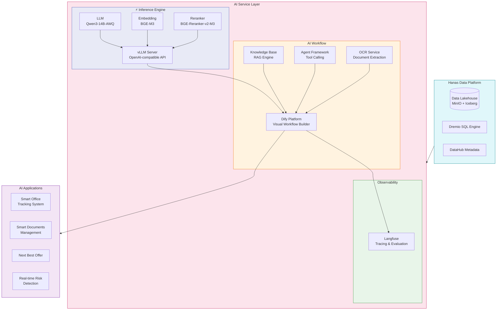
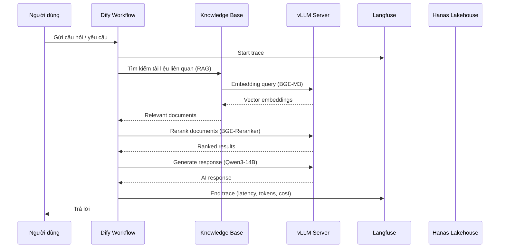

# Lớp AI Service

## Tổng Quan

Lớp AI Service mở rộng kiến trúc Hanas Data Platform với khả năng **trí tuệ nhân tạo**, cho phép xây dựng và vận hành các ứng dụng AI trên nền tảng dữ liệu sẵn có. Lớp này hoạt động song song với các lớp Data Lakehouse, khai thác dữ liệu từ Lakehouse để phục vụ các use case AI trong doanh nghiệp.

| Thành phần | Vai trò |
|---|---|
| **vLLM** | Inference engine — Host LLM/Embedding/Reranker models với OpenAI-compatible API |
| **Dify** | AI Workflow Platform — Visual builder cho chatbot, RAG, agent, workflow AI |
| **Langfuse** | LLM Observability — Tracing, evaluation, prompt management cho AI workflows |

## Kiến Trúc

### Luồng Hoạt Động

## Use Cases

| Use Case | Mô Tả | Tính Năng AI |
|---|---|---|
| **Smart Office Tracking** | Số hóa, tự động hóa luồng hồ sơ và ý kiến chỉ đạo | Chatbot hỏi đáp, tóm tắt văn bản, tạo ticket tự động |
| **Smart Documents Management** | Tương tác thông minh với tài liệu nội bộ | OCR, truy vấn văn bản, tra cứu API Customer360 |
| **Next Best Offer** | Dự đoán sản phẩm phù hợp cho khách hàng | ML models, phân tích hành vi, cross-selling |
| **Real-time Risk Detection** | Nhận diện giao dịch rủi ro theo thời gian thực | Anomaly detection, rule engine, alerting |

## Liên Kết Với Hanas Platform

| Lớp Hanas | Tích Hợp AI Service |
|---|---|
| **L1 — Thu Thập** (NiFi, Kafka) | Streaming events → AI real-time processing |
| **L2 — Lưu Trữ** (MinIO, Iceberg) | Dữ liệu Lakehouse → Knowledge Base (RAG) |
| **L3 — Xử Lý** (Airflow, Spark) | Orchestrate AI model training/batch inference |
| **L5 — Quản Trị** (DataHub) | AI-powered metadata exploration |
| **L6 — Liên Kết** (Dremio) | SQL query → AI Data Analytics |
| **L7 — Tiêu Thụ** (BI Tools) | AI insights → dashboards, reports |

## Services

- [Dify](dify/README.md) — AI Workflow Platform
- [vLLM](vllm/README.md) — LLM Inference Engine
- [Langfuse](langfuse/README.md) — LLM Observability
