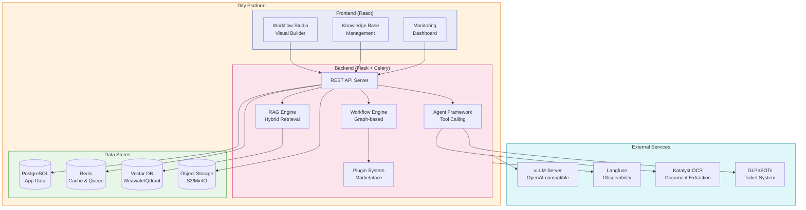
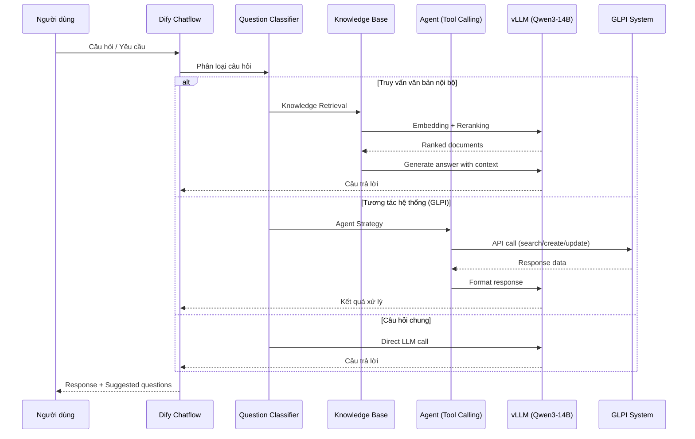

# Dify

## Tổng Quan

Dify là nền tảng phát triển ứng dụng AI mã nguồn mở, cung cấp giao diện visual để xây dựng **chatbot, AI workflow, RAG pipeline và Agent** mà không cần viết nhiều code. Trong Hanas Platform, Dify đóng vai trò **AI Workflow Platform** — nơi tổ chức, điều phối và triển khai toàn bộ ứng dụng AI.

## Kiến Trúc

### Luồng Xử Lý Chatflow

## Vai Trò Trong Platform

- **AI Application Hub**: Điểm trung tâm xây dựng và quản lý tất cả ứng dụng AI
- **RAG Engine**: Kết nối Knowledge Base với dữ liệu từ Hanas Lakehouse
- **Agent Orchestration**: Điều phối multi-agent cho các tác vụ phức tạp
- **Model Gateway**: Quản lý kết nối đến vLLM và các model providers khác
- **Observability Hub**: Tích hợp Langfuse để giám sát hiệu suất AI

## Tính Năng Chính

1. **Visual Workflow Builder**: Kéo-thả nodes để thiết kế chatbot, workflow AI phức tạp
2. **RAG Pipeline**: Upload tài liệu → embedding → indexing → hybrid retrieval (vector + keyword)
3. **Agent Framework**: Tool calling, function calling, multi-step reasoning
4. **Knowledge Base**: Quản lý nhiều knowledge base với các chiến lược retrieval khác nhau
5. **Prompt IDE**: Quản lý, versioning, A/B testing prompts
6. **Plugin Ecosystem**: 500+ plugins cho models, tools, agent strategies
7. **Backend-as-a-Service**: Auto-generated REST API cho mỗi ứng dụng
8. **Multi-tenant**: Phân quyền truy cập theo workspace và role

## Use Cases Triển Khai

| Use Case | Loại Workflow | Mô Tả |
|---|---|---|
| **Demo GLPI Chatflow** | Advanced Chat | Chatbot hỗ trợ quản lý phiếu đề xuất trong GLPI, hỏi đáp văn bản nội bộ |
| **Smart Office** | Chatflow + Agent | Tóm tắt tài liệu, truy vấn trạng thái, tạo ticket tự động |
| **Smart Documents** | Workflow + RAG | OCR → trích xuất → tra cứu → hỏi đáp tài liệu nội bộ |
| **AI Data Analytics** | Workflow | Kết nối Dremio/Lakehouse → phân tích → biểu diễn charts |

## Tài Liệu

- [Cài đặt & Triển khai](installation.md) — Docker Compose, Kubernetes, prerequisites
- [Cấu hình](configuration.md) — Model provider, Knowledge Base, Langfuse, plugins
- [Hướng dẫn sử dụng](user-guide.md) — Tạo workflow, Knowledge Base, agent, tool
- [Best Practices](best-practices.md) — Prompt engineering, RAG optimization, security
- [Thông tin Version](version-info.md) — Version matrix, changelog
