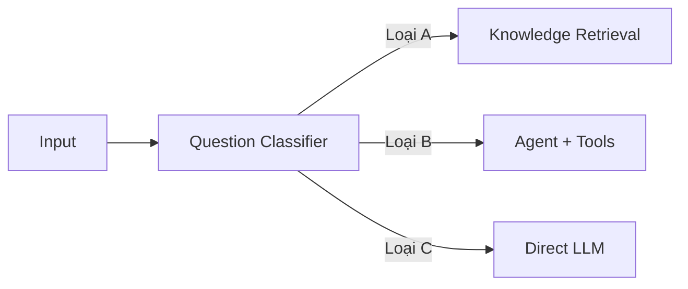
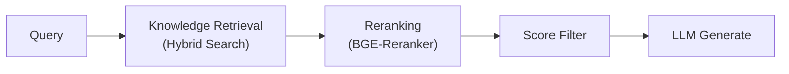
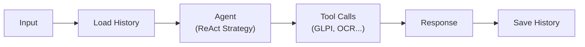

# Best Practices — Dify

## Prompt Engineering

### Cấu Trúc System Prompt

```text
## Vai trò
Bạn tên là Hanas, một AI Assistant của công ty cổ phần Katalyst.

## Nhiệm vụ
- Hỗ trợ người dùng tương tác với hệ thống quản lý công việc
- Hỏi đáp liên quan đến nội dung văn bản nội bộ

## Quy tắc
- Trả lời bằng tiếng Việt, chuyên nghiệp và thân thiện
- Chỉ trả lời trong phạm vi dữ liệu nội bộ
- Khi không có thông tin phù hợp, từ chối trả lời rõ ràng
- Không lấy thông tin từ internet bên ngoài

## Format
- Sử dụng Markdown cho câu trả lời có cấu trúc
- Dùng bảng cho dữ liệu dạng danh sách
- Highlight thông tin quan trọng bằng **bold**
```

### Tips Cho Tiếng Việt

| Tip | Mô Tả |
|---|---|
| **Explicit instructions** | Chỉ rõ "Trả lời bằng tiếng Việt" trong system prompt |
| **Few-shot examples** | Cung cấp ví dụ input/output bằng tiếng Việt |
| **Guardrails** | Thêm quy tắc từ chối cho câu hỏi ngoài phạm vi |
| **Context format** | Chỉ rõ format output (Markdown, bảng, bullet points) |

## RAG Optimization

### Chunking Strategy

| Tham số | Giá trị khuyến nghị | Lý do |
|---|---|---|
| **Chunk size** | 500 tokens | Cân bằng context quality và retrieval accuracy |
| **Chunk overlap** | 50 tokens (10%) | Đảm bảo không mất ngữ cảnh giữa các chunks |
| **Separator** | `\n\n` | Giữ nguyên paragraph boundaries |

### Retrieval Tuning

1. **Luôn dùng Hybrid Search** (vector + keyword) cho production
2. **Bật Reranking** với `BGE-Reranker-v2-M3` để cải thiện ranking quality
3. **Top-K = 3-5**: Quá nhiều chunks gây noise, quá ít thiếu context
4. **Score threshold = 0.5**: Lọc bỏ chunks không liên quan

### Knowledge Base Management

- **Tách riêng Knowledge Bases** theo domain (văn bản nội bộ, hướng dẫn, FAQ)
- **Cập nhật định kỳ** khi có tài liệu mới
- **Monitor retrieval quality** qua Langfuse traces
- **Document metadata** giúp cải thiện retrieval filtering

## Workflow Design Patterns

### Pattern 1: Question Classifier



**Khi nào dùng**: Chatbot phục vụ nhiều mục đích — inquiry, action, general chat.

### Pattern 2: RAG with Reranking



**Khi nào dùng**: Hỏi đáp tài liệu nội bộ, cần accuracy cao.

### Pattern 3: Agent with Conversation Memory



**Khi nào dùng**: Tương tác hệ thống phức tạp cần nhớ ngữ cảnh.

## Security

### Authentication & Authorization

- **Phân quyền workspace**: Mỗi team/department một workspace riêng
- **API Key rotation**: Thay đổi API keys định kỳ
- **Role-based access**: Admin, Editor, Viewer cho mỗi workspace

### Data Protection

- **Không log sensitive data** trong conversation variables
- **Encrypt secrets** bằng HashiCorp Vault (Hanas L9)
- **Network isolation**: Dify internal network chỉ kết nối đến services cần thiết

### Guardrails

```yaml
# Sensitive word avoidance
sensitive_word_avoidance:
  enabled: true
  type: "moderation_api"  # hoặc custom keywords

# Scope restriction
scope_restriction:
  - "Chỉ trả lời trong phạm vi dữ liệu nội bộ"
  - "Không lấy thông tin từ internet bên ngoài"
  - "Từ chối câu hỏi không thuộc phạm vi"
```

## Performance

### Tối Ưu Latency

| Kỹ thuật | Mô Tả |
|---|---|
| **Streaming response** | Bật `response_mode: streaming` cho real-time UX |
| **Reduce top_k** | Giảm số chunks retrieval (3-5 là đủ) |
| **Cache embeddings** | Dify cache embeddings sau lần query đầu |
| **Limit max_tokens** | Set output max_tokens hợp lý (512-1024) |

### High Availability

- **API replicas**: Chạy 2+ replicas cho Dify API
- **Worker replicas**: Chạy 2+ Celery workers cho async tasks
- **Database HA**: Sử dụng PostgreSQL cluster (Hanas shared)
- **Redis HA**: Redis Sentinel hoặc Cluster mode

## Vận Hành

### Backup

```bash
# Backup PostgreSQL data
pg_dump -h db-host -U dify -d dify > dify_backup_$(date +%Y%m%d).sql

# Backup Knowledge Base files
aws s3 sync s3://dify-storage ./backup/dify-storage/
```

### Monitoring Checklist

| Metric | Threshold | Action |
|---|---|---|
| **API response time** | > 5s | Check vLLM server load |
| **Error rate** | > 5% | Review error logs |
| **Token usage** | Budget-based | Alert và review prompts |
| **Knowledge Base freshness** | > 30 days | Update documents |
