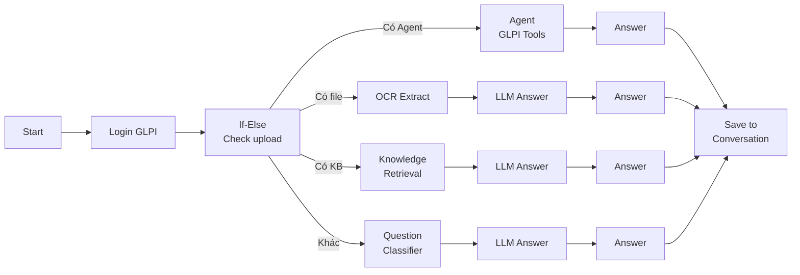
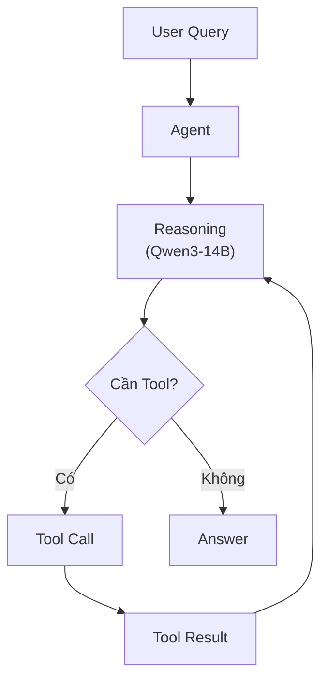

# Hướng Dẫn Sử Dụng Dify

## Tổng Quan Giao Diện

Dify cung cấp 3 khu vực chính:

| Khu vực | Chức năng |
|---|---|
| **Studio** | Tạo và quản lý ứng dụng AI (Chatbot, Workflow, Agent) |
| **Knowledge** | Quản lý Knowledge Base cho RAG |
| **Monitoring** | Theo dõi logs, hiệu suất, Langfuse traces |

## Tạo Ứng Dụng AI

### Các Loại Ứng Dụng

| Loại | Mô Tả | Use Case |
|---|---|---|
| **Chat App** | Chatbot đơn giản với 1 LLM | FAQ bot, simple assistant |
| **Agent** | Chatbot với tool calling | GLPI interaction, API calls |
| **Chatflow** | Visual workflow cho chat | Smart Office, Smart Documents |
| **Workflow** | Visual workflow cho batch processing | Data Analytics, report generation |

### Tạo Chatflow (Ví Dụ: Demo GLPI)

Chatflow Demo GLPI là ví dụ điển hình về việc tích hợp AI với hệ thống quản lý công việc.

#### Bước 1: Tạo Ứng Dụng Mới

1. Vào **Studio → Create App → Chatflow**
2. Đặt tên: "Demo GLPI Chatflow"
3. Chọn biểu tượng mô hình AI

#### Bước 2: Thiết Lập Workflow Nodes



#### Bước 3: Cấu Hình Conversation Variables

| Variable | Type | Mô Tả |
|---|---|---|
| `session_token` | string | GLPI session token sau login |
| `user_info` | string | Thông tin user đang đăng nhập |
| `conversation` | string | Lịch sử hội thoại |
| `form_selector` | string | Form gợi ý câu hỏi nhanh |
| `upload_contents` | array[string] | Nội dung file upload (OCR) |

#### Bước 4: Thiết Lập Opening Statement

```text
Xin chào! Tôi là Hanas, trợ lý ảo của Katalyst, được thiết kế để hỗ trợ 
truy vấn những thông tin liên quan đến quản lý tờ trình trong cơ sở dữ liệu 
và thực hiện một số tác vụ đơn giản. Hãy đăng nhập theo tài khoản GLPI 
của bạn và đặt câu hỏi nhé!
```

#### Bước 5: Cấu Hình Suggested Questions

```yaml
suggested_questions:
  - "Báo cáo trạng thái các phiếu đề xuất đang mở trong hệ thống"
  - "Liệt kê các phiếu đề xuất được tạo trong hôm nay"
  - "Liệt kê các phiếu đề xuất có độ ưu tiên cao nhưng chưa hoàn thành"
  - "Liệt kê các phiếu đề xuất đang mở yêu cầu phê duyệt"
  - "Liệt kê các phiếu đề xuất sắp đến hạn giải quyết"
```

## Quản Lý Knowledge Base

### Tạo Knowledge Base Mới

1. Vào **Knowledge → Create Knowledge Base**
2. Đặt tên và mô tả
3. Chọn **Embedding Model**: `BAAI/bge-m3` (từ vLLM)
4. Chọn **Retrieval Mode**: `Hybrid Search` (khuyến nghị)

### Upload Tài Liệu

Dify hỗ trợ nhiều định dạng:

| Định dạng | Hỗ trợ | Lưu ý |
|---|---|---|
| **PDF** | Có | Dùng OCR service cho scanned PDFs |
| **DOCX/DOC** | Có | Auto extract text |
| **TXT/MD** | Có | Plain text processing |
| **CSV/XLSX** | Có | Structured data |
| **HTML** | Có | Web content |

### Cấu Hình Chunking

```yaml
# Tối ưu cho tiếng Việt
chunk_size: 500        # Token-based chunking
chunk_overlap: 50      # 10% overlap
separator: "\n\n"      # Split theo paragraph
```

### Cấu Hình Retrieval

```yaml
retrieval:
  search_method: hybrid_search    # vector + keyword
  reranking_enable: true
  reranking_model: BAAI/bge-reranker-v2-m3
  top_k: 5                        # Số chunks trả về
  score_threshold: 0.5            # Ngưỡng relevance
```

## Agent & Tool Calling

### Cấu Hình Agent

Agent trong Dify cho phép LLM gọi các tools bên ngoài:



### Các Tools Tích Hợp

| Tool | Mô Tả | API |
|---|---|---|
| **GLPI Search** | Tìm kiếm phiếu đề xuất | `GET /apirest.php/search/Ticket` |
| **GLPI Create** | Tạo phiếu mới | `POST /apirest.php/Ticket` |
| **GLPI Update** | Cập nhật phiếu | `PUT /apirest.php/Ticket/:id` |
| **OCR Convert** | Trích xuất text từ file | `POST /api/v1/ocr/convert` |
| **Knowledge Query** | Truy vấn Knowledge Base | Dify internal API |

### Environment Variables Cho Tools

```bash
# GLPI Integration
GLPI_HOST=https://glpi.your-domain.com
# Dify self-reference
DIFY_URL=https://dify.your-domain.com
# OCR Service
OCR_HOST=http://<OCR_HOST>:<OCR_PORT>
# Chatbot Identity
CHATBOT_IDENTITY="Bạn tên là <ASSISTANT_NAME>, một AI Assistant của <CUSTOMER_ORGANIZATION_NAME>..."
```

## Xuất & Nhập Workflow (DSL)

### Export Workflow

1. Vào ứng dụng → **Settings → Export DSL**
2. File YAML được tải về chứa toàn bộ workflow definition

### Import Workflow

1. **Studio → Import DSL**
2. Chọn file YAML (ví dụ: `Demo GLPI Chatflow.yml`)
3. Dify tự động tạo ứng dụng với đầy đủ nodes, variables, và configurations

> [!TIP]
> Sử dụng DSL export/import để version control workflows trong Git repository.

## API Integration

Mỗi ứng dụng Dify tự động tạo REST API endpoints:

### Chat API

```bash
curl -X POST 'https://dify.your-domain.com/v1/chat-messages' \
  -H 'Authorization: Bearer app-your-api-key' \
  -H 'Content-Type: application/json' \
  -d '{
    "inputs": {},
    "query": "Báo cáo trạng thái các phiếu đề xuất đang mở",
    "response_mode": "streaming",
    "conversation_id": "",
    "user": "user-123"
  }'
```

### Workflow API

```bash
curl -X POST 'https://dify.your-domain.com/v1/workflows/run' \
  -H 'Authorization: Bearer app-your-api-key' \
  -H 'Content-Type: application/json' \
  -d '{
    "inputs": {"query": "Phân tích doanh thu Q4"},
    "response_mode": "blocking",
    "user": "user-123"
  }'
```

## Monitoring & Logs

### Theo Dõi Trong Dify

- **Logs**: Xem chi tiết từng cuộc hội thoại — input, output, tool calls
- **Annotations**: Đánh giá chất lượng câu trả lời (thumbs up/down)
- **Analytics**: Thống kê số lượng messages, active users, token usage

### Theo Dõi Trong Langfuse

Khi đã tích hợp Langfuse, mỗi interaction trong Dify tự động tạo trace với:
- Latency từng bước workflow
- Token usage và cost
- Input/Output cho mỗi LLM call
- Tool call results

> Xem chi tiết tại [Langfuse User Guide](../langfuse/user-guide.md).
